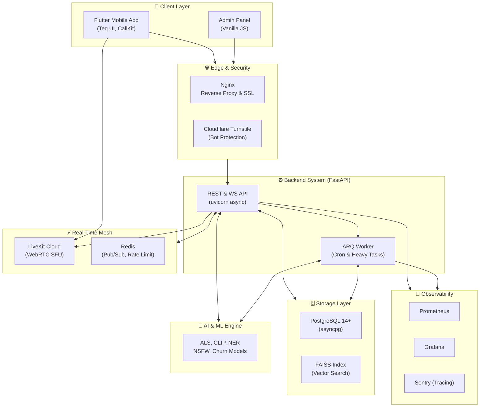

### The Ultimate Live-Streaming C2C Marketplace & Real-Time Auction Engine

 

---

> **Note:** This is the comprehensive **ARC42 End-to-End Architectural Documentation** of the Teqlif Platform, detailing everything from the UI layer down to the Database, AI engines, and Observability infrastructure.

## 1. Introduction and Vision

**Teqlif** is a hyper-scalable, multi-platform C2C marketplace tailored for the Turkish ecosystem. It bridges the gap between traditional e-commerce and interactive entertainment by integrating **low-latency live streaming, real-time auctions, 1-on-1 VoIP calls, and an embedded virtual economy (Tuci).** 

The system relies heavily on an asynchronous event-driven architecture and uses bespoke Machine Learning algorithms to automate curation, security, and search, delivering a seamless experience across iOS, Android, and Web.

---

## 2. End-to-End System Architecture

Teqlif operates on a micro-service-inspired monolithic backend with a strict separation of concerns, orchestrated via Nginx and monitored by Prometheus/Grafana and Sentry.

---

## 3. Mobile Client Architecture (Flutter)

The mobile application is built with **Flutter 3.x** and strictly adheres to a reactive, state-driven architecture using **Riverpod**.

### 3.1 Design System: Teq UILibrary
To achieve a premium, unique aesthetic, standard Material UI components were entirely stripped out. The app uses a custom-built design system located in `lib/ui_library/`:
- **Tokens & Themes:** `TeqColors`, `TeqSpacing`, `TeqTypography`, `TeqTheme` (Dark/Light mode).
- **Core Components:** `TeqButton` (micro-animated states), `TeqTextField` (custom validations), `TeqCard`.
- **Overlays:** `TeqSnackbar` (non-blocking, floating notifications), `TeqBottomSheet`, `TeqDialog`.

### 3.2 State Management & Networking
- **Riverpod (`flutter_riverpod`):** Manages local state, caching, and dependency injection.
- **WebSocket Manager (`ws_service.dart`):** Maintains persistent bi-directional communication. Automatically handles reconnects, JWT token refreshes, and routes incoming Redis PubSub events to the `ChatPanel` and `AuctionPanel`.
- **Live Streams (`livekit_client`):** Connects to the WebRTC SFU. Handles camera/mic publishing for hosts, and `TrackSubscribedEvent` rendering for viewers.
- **Swipe UX:** The `SwipeLiveScreen` uses a lazy-loading `PageView` to replicate the vertical swipe discovery feed seen in TikTok.

### 3.3 Background Capabilities
- **VoIP & CallKit (`apns_service.py` + Flutter CallKit):** Uses Apple PushKit for high-priority background wakes. When a 1-on-1 call starts, the app wakes up and displays the native incoming call UI even if the app is fully terminated.
- **Firebase Cloud Messaging (FCM):** Standard push notifications for auction alerts and messages.

---

## 4. Backend Services (Python / FastAPI)

The backend is built on **FastAPI** with `asyncio`, prioritizing non-blocking I/O operations for massive concurrency.

### 4.1 Core Domain Services
- **Auction Engine (`auction_service.py`):** Utilizes **Redis Lua Scripts** to ensure atomic bidding. When a bid arrives, Lua checks the current highest bid in memory and updates it atomically to prevent race conditions, entirely bypassing PostgreSQL row locks for 10x throughput.
- **Wallet & Economy (`wallet.py`, `tcmb_service.py`):** Manages the virtual currency "Tuci". Connects daily to the Central Bank of Turkey (TCMB) to sync fiat exchange rates for precise checkout accounting.
- **Ads & Leads (`ads.py`, `leads.py`):** A self-serve advertising network allowing sellers to promote listings. Generates B2B/C2C leads dynamically.
- **Analytics / Pro Hub (`analytics_processor.py`):** Aggregates complex SQL Window functions to deliver live charts (Competitor Radar, Pricing Trends) to the frontend.

### 4.2 Background Processing (ARQ)
Instead of Celery, the system uses **ARQ** (built on `asyncio` and Redis). 
- Scheduled crons handle: Expiring old listings, syncing exchange rates, rebuilding ML indexes, and processing video compressions without blocking the API loop.

### 4.3 Database Schema (PostgreSQL)
20+ strictly normalized tables managed via **Alembic**.
- Tables include: `users`, `listings`, `auctions`, `bids`, `streams`, `messages`, `analytics_events`, `purchases`, `wallet_transactions`.
- **Soft Deletes:** Enforced via `status` Enum (`'active'`, `'deleted'`) across all tables to preserve referential integrity for ML training and analytics.

---

## 5. Artificial Intelligence & Machine Learning (AI/ML)

Teqlif goes beyond standard CRUD by integrating multiple specialized AI pipelines directly into the backend architecture.

| Model / Algorithm | Location | Purpose & Capability |
|---|---|---|
| **Semantic Search** | `faiss_service.py` `ml_service.py` | Uses `sentence-transformers` (all-MiniLM-L6-v2) to convert listings into dense vectors. **FAISS** is used to query these vectors for sub-millisecond "Similar Listings" and intelligent text search, far outperforming standard SQL `pg_trgm`. |
| **Multimodal Search** | `clip_service.py` | Integrates **OpenAI CLIP**. Allows users to search for listings using an image as input, mapping both text and images into the same embedding space. |
| **Recommendation Feed** | `feed_als_ml.py` | Employs **Alternating Least Squares (ALS)** collaborative filtering. Analyzes user clicks, likes, and bids (Implicit Feedback) to build a highly personalized home feed matrix. |
| **Turkish NLP & NER** | `ner_service.py` `turkish_nlp.py` | A custom Natural Language Processing pipeline that performs Named Entity Recognition specifically tailored for the Turkish language to extract Brands, Locations, and Specs from unstructured listing descriptions. |
| **Churn Prediction** | `churn_ml_service.py` | A predictive model analyzing engagement drops (login frequency, stream views) to flag users at risk of leaving, automatically triggering retention (retargeting) campaigns. |
| **Auto-Moderation** | `nsfw_service.py` `image_mod_service.py` | Automated scanning of uploaded images for NSFW content. Employs perceptual hashing (**pHash**) to instantly block duplicate/spam image uploads across the platform. |
| **Trust Scoring** | `influence_service.py` | Graph-based algorithm evaluating a user's network (followers, ratings, successful sales) to assign an "Influence/Trust Score". |

---

## 6. Observability, Monitoring, & Security

A robust system is blind without observability. Teqlif incorporates a full DevOps monitoring suite.

### 6.1 Observability Stack
- **Prometheus & Grafana (`prometheus_fastapi_instrumentator`):** Middleware intercepts all API requests to expose `/metrics`. Grafana dashboards track Request Latency, 4xx/5xx Error Rates, WebSocket Connection Counts, and LiveKit active rooms.
- **Sentry (`sentry-sdk`):** Integrated both in Flutter and FastAPI. Captures unhandled exceptions, provides Exception Group Tracebacks, and traces API bottlenecks (Performance Tracing).
- **Logging:** Structured JSON logging (`logger=teqlif`) output to Systemd journal and files for ELK/Loki ingestion.

### 6.2 Security Layers
- **Rate Limiting (`slowapi`):** Strict Redis-backed IP rate limits (e.g., 2 bids per second per user).
- **Bot Mitigation:** Cloudflare Turnstile validates human interaction during Login and Registration.
- **XSS & Content Sanitization:** The `SecurityMiddleware` and `Sanitizer` pass all string inputs through `bleach` to strip malicious HTML/JS. `better-profanity` censors harmful words in live chats.
- **Authentication:** Standard JWT (HMAC-SHA256) via `python-jose`. Passwords hashed with `bcrypt`.

---

## 7. Deployment & DevOps

### 7.1 Infrastructure (VPS)
Deployed on dedicated Ubuntu instances:
- **Nginx:** Handles SSL Termination (Let's Encrypt), static file serving, and reverse proxying to Uvicorn.
- **Systemd:** Manages daemon services (`teqlif-backend.service`, `teqlif-worker.service`).
- **LiveKit Cloud:** WebRTC Selective Forwarding Unit (SFU) is delegated to LiveKit Cloud for global edge distribution, keeping the VPS bandwidth strictly for API data.

### 7.2 CI/CD
- **Fastlane:** Automates the Flutter build process (APK/AAB/IPA generation), increments version numbers, and pushes artifacts to App Store Connect and Google Play Console.
- **Git / Alembic:** Schema migrations are strictly version-controlled. `alembic upgrade head` is baked into the deployment pipeline to prevent schema drift.

---

## 8. Summary of Third-Party Libraries

- **Backend (Python):** `fastapi`, `uvicorn`, `sqlalchemy`, `asyncpg`, `alembic`, `redis`, `arq`, `livekit-api`, `firebase-admin`, `sentry-sdk`, `slowapi`, `bleach`, `faiss-cpu`, `sentence-transformers`, `torch`.
- **Frontend (Flutter):** `flutter_riverpod`, `livekit_client`, `web_socket_channel`, `firebase_messaging`, `sentry_flutter`, `shimmer`, `wakelock_plus`.

---

*End of ARC42 Documentation.*
