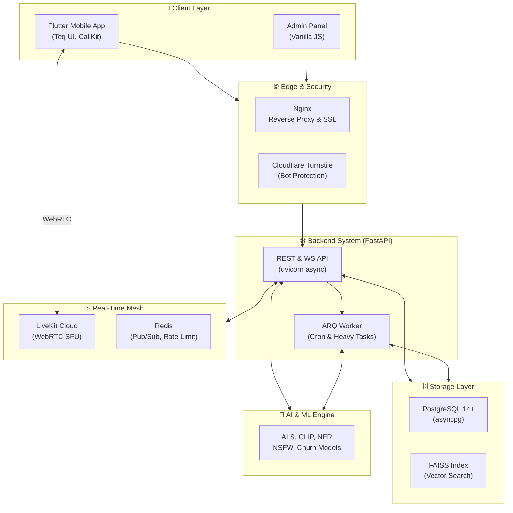
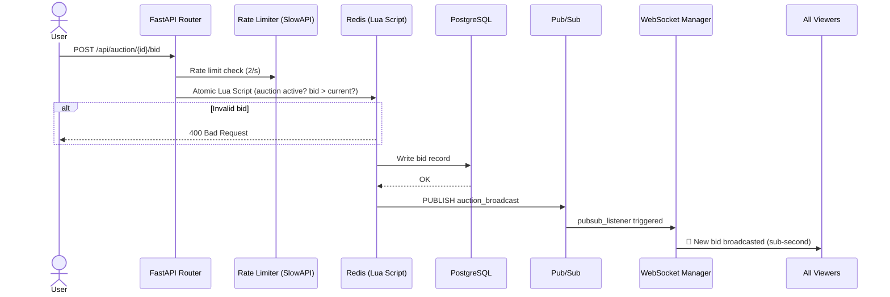
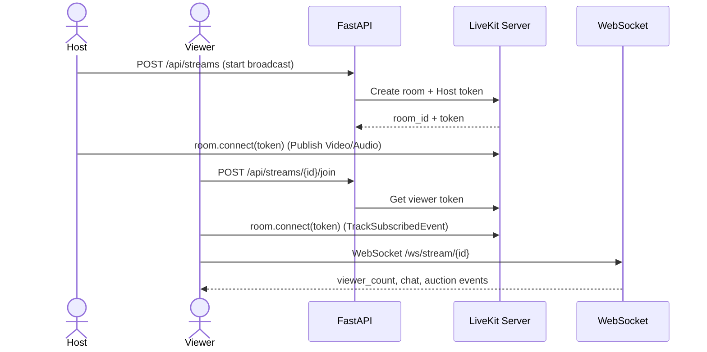
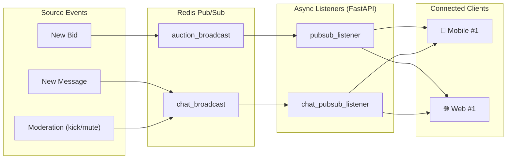
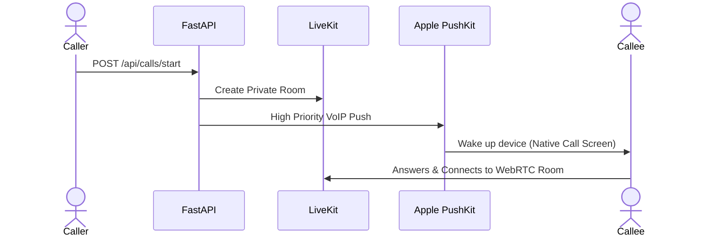
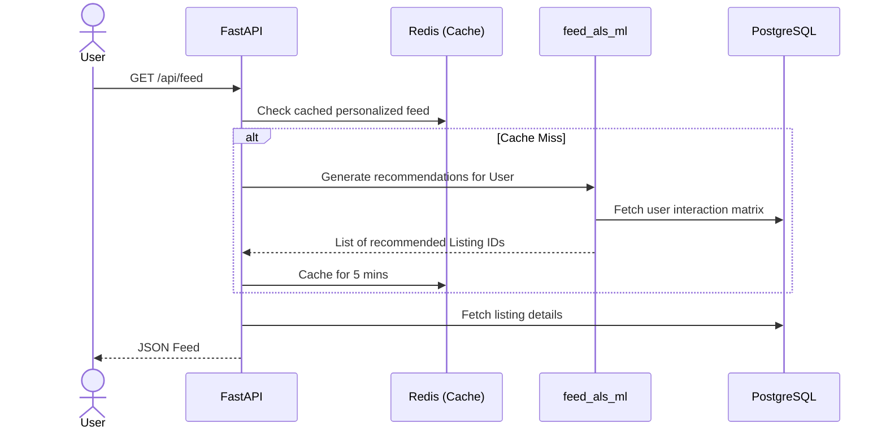
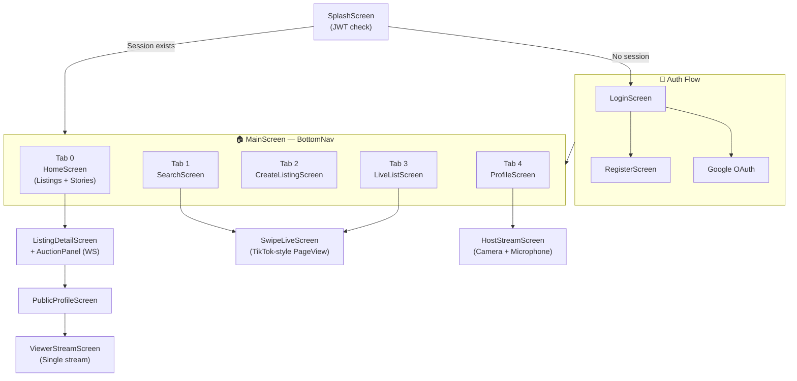

<div align="center">


### The Ultimate Live-Streaming C2C Marketplace & Real-Time Auction Engine

<br/>

[](https://fastapi.tiangolo.com)
[](https://flutter.dev)
[](https://postgresql.org)
[](https://redis.io)
[](https://livekit.io)
[](https://grafana.com)
[](https://sentry.io)

</div>

---

> **Note:** This is the comprehensive **ARC42 End-to-End Architectural Documentation** of the Teqlif Platform, enhanced with GitHub-native Mermaid diagrams, ER schemas, and data flow visuals.

## 1. Introduction and Vision

**Teqlif** is a hyper-scalable, multi-platform C2C marketplace tailored for the Turkish ecosystem. It bridges the gap between traditional e-commerce and interactive entertainment by integrating **low-latency live streaming, real-time auctions, 1-on-1 VoIP calls, and an embedded virtual economy (Tuci).** 

---

## 2. End-to-End System Architecture

Teqlif operates on a micro-service-inspired monolithic backend with a strict separation of concerns, orchestrated via Nginx and monitored by Prometheus/Grafana and Sentry.



---

## 3. Data Flow & Core Processes

<details>
<summary><strong>🔨 Real-time Auction — Bid Flow</strong></summary>


</details>

<details>
<summary><strong>🔴 Live Stream Connection Flow</strong></summary>


</details>

<details>
<summary><strong>💬 WebSocket Broadcast Architecture</strong></summary>


</details>

<details>
<summary><strong>📞 VoIP 1-on-1 Call Signaling</strong></summary>


</details>

---

## 4. Artificial Intelligence & Machine Learning (AI/ML)

Teqlif goes beyond standard CRUD by integrating multiple specialized AI pipelines natively into the Python backend.

| Model / Algorithm | Purpose & Capability |
|---|---|
| **Semantic Search (FAISS)** | Uses `sentence-transformers` (all-MiniLM-L6-v2) to convert listings into dense vectors for L2 distance similarity queries, far outperforming standard SQL. |
| **Multimodal Search (CLIP)** | Integrates **OpenAI CLIP** allowing users to search via images (image-to-text / text-to-image). |
| **Recommendation Engine (ALS)** | Employs **Alternating Least Squares (ALS)** for collaborative filtering to personalize the user's home feed based on implicit feedback (clicks, bids). |
| **Turkish NLP & NER** | Custom pipeline to extract Brands, Locations, and Specs from unstructured Turkish listing texts. |
| **Churn Prediction** | Analyzes engagement drops to predict which users might leave, triggering retention campaigns. |
| **Image Moderation (pHash & NSFW)** | Automated scanning for NSFW content and perceptual hashing to instantly block spam duplicate uploads. |
| **Trust Scoring** | Graph-based algorithm evaluating a user's network to assign a public Trust/Influence Score. |

<details>
<summary><strong>🧠 ML Feed Generation (ALS + FAISS)</strong></summary>


</details>

---

## 5. Mobile Client Architecture (Flutter)

The mobile application relies on **Flutter 3.x** and **Riverpod** for state management, entirely powered by the custom **Teq UILibrary**.

<details>
<summary><strong>🧭 Navigation Map</strong></summary>


</details>

<details>
<summary><strong>🎨 Teq UILibrary & Structure</strong></summary>

```text
mobile/lib/
├── config/                 # theme.dart (TeqColors, TeqTypography)
├── models/                 # 17+ strongly-typed Dart models (Listing, StreamOut)
├── services/               # API logic (auth_service, ws_service, auction_service)
├── providers/              # Riverpod State Providers
├── screens/                # Flutter UI Screens (SwipeLiveScreen, HostStreamScreen)
└── ui_library/             # 🛠 THE TEQ DESIGN SYSTEM
    ├── teq_button.dart     # Micro-animated interactions
    ├── teq_snackbar.dart   # Non-blocking overlays
    └── teq_card.dart       # Standardized premium containers
```
</details>

---

## 6. Database Schema (PostgreSQL)

The system utilizes an advanced, strictly normalized PostgreSQL schema with over 20 tables. All relationships are managed asynchronously via `asyncpg` and SQLAlchemy 2.0. Soft deletes are enforced using the `status` Enum (`'active'`, `'deleted'`) to protect ML integrity.

```mermaid
erDiagram
    users {
        int id PK
        string username UK
        string email UK
        string hashed_password
        bool is_verified
        datetime created_at
    }

    listings {
        int id PK
        int user_id FK
        decimal price
        string status "Enum: active, deleted"
        bool is_live
        vector embedding "FAISS/pgvector"
    }

    auctions {
        int id PK
        int listing_id FK
        decimal current_price
        int current_winner_id FK
        datetime end_time
    }

    bids {
        int id PK
        int auction_id FK
        int user_id FK
        decimal amount
    }

    streams {
        int id PK
        int host_id FK
        string livekit_room_id
        int viewer_count
    }
    
    analytics {
        int id PK
        int user_id FK
        string event_type
        json metadata
    }
    
    wallet_transactions {
        int id PK
        int user_id FK
        decimal tuci_amount
        decimal fiat_amount
    }

    users ||--o{ listings : "creates"
    users ||--o{ streams : "broadcasts"
    users ||--o{ bids : "places"
    users ||--o{ wallet_transactions : "owns"
    listings ||--o| auctions : "hosts"
    auctions ||--o{ bids : "receives"
    users ||--o{ analytics : "generates"
```

<details>
<summary><strong>🗄 View Entity-Relationship (ER) Diagram</strong></summary>


</details>

---

## 7. Global API Map

<details>
<summary><strong>🌐 View Core Endpoints</strong></summary>

| Category | Method | Endpoint | Description |
|---|---|---|---|
| **Auth** | `POST` | `/api/auth/register` | Register (Cloudflare Turnstile CAPTCHA required) |
| | `POST` | `/api/auth/login` | Retrieve JWT |
| **Listings** | `GET` | `/api/listings` | Fetch feed (Uses FAISS / ALS if authenticated) |
| | `POST` | `/api/listings/{id}/offer` | Submit a direct price offer |
| **Auctions** | `POST` | `/api/auction/{id}/bid` | **Place bid** (Redis Lua script, Rate Limit: 2/s) |
| | `WS` | `/ws/auction/{stream_id}` | Live bid broadcast stream |
| **Streams** | `POST` | `/api/streams` | Start broadcast (Provisions LiveKit token) |
| | `WS` | `/ws/stream/{id}` | Chat & Viewer count syncing |
| **Calls** | `POST` | `/api/calls/start` | Initiates 1-on-1 VoIP call (APNs PushKit) |
| **Wallet** | `GET` | `/api/wallet/sync` | Sync Tuci/Fiat rates via TCMB |

</details>

---

## 8. Observability, Security & Deployment

### 8.1 Observability Stack
- **Prometheus & Grafana:** Middleware intercepts all FastAPI requests. Grafana dashboards track Request Latency, Error Rates, WebSocket loads, and LiveKit active rooms.
- **Sentry (`sentry-sdk`):** Integrated in both Flutter and FastAPI for distributed error tracing and performance bottleneck tracking.

### 8.2 Security Guardrails
- **Rate Limiting (`slowapi`):** Strict Redis-backed IP rate limits.
- **XSS Mitigation (`bleach`):** `SecurityMiddleware` passes all inputs through Bleach to strip malicious scripts. `better-profanity` cleans live chat streams.
- **Access Control:** Role-Based Access Control via JWT. Ownership checks (e.g., *does this user own this listing?*) enforce multi-tenant isolation.

### 8.3 Deployment (CI/CD)
- **Infrastructure:** Dedicated Ubuntu VPS running Nginx (SSL), Systemd for FastAPI & ARQ Worker.
- **CI/CD:** `fastlane` automates Flutter iOS/Android builds and store submissions. `alembic upgrade head` secures DB drift.

---
*End of ARC42 Documentation.*
