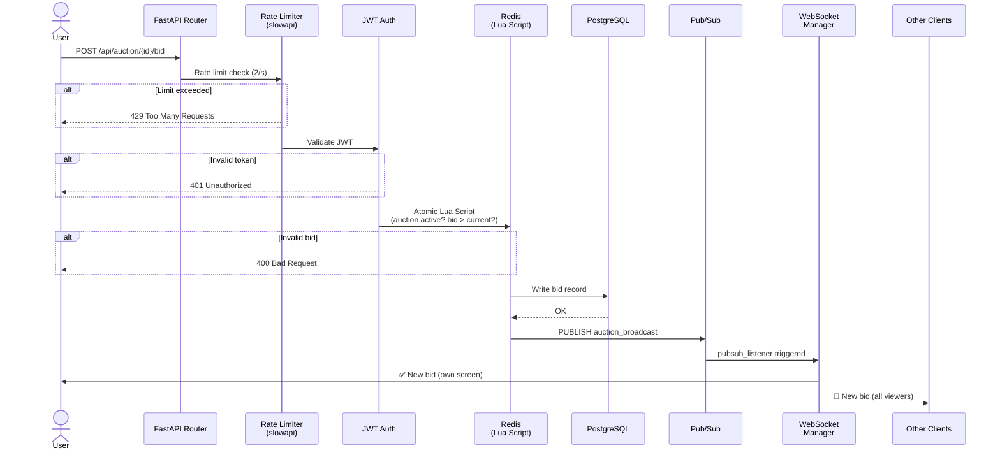
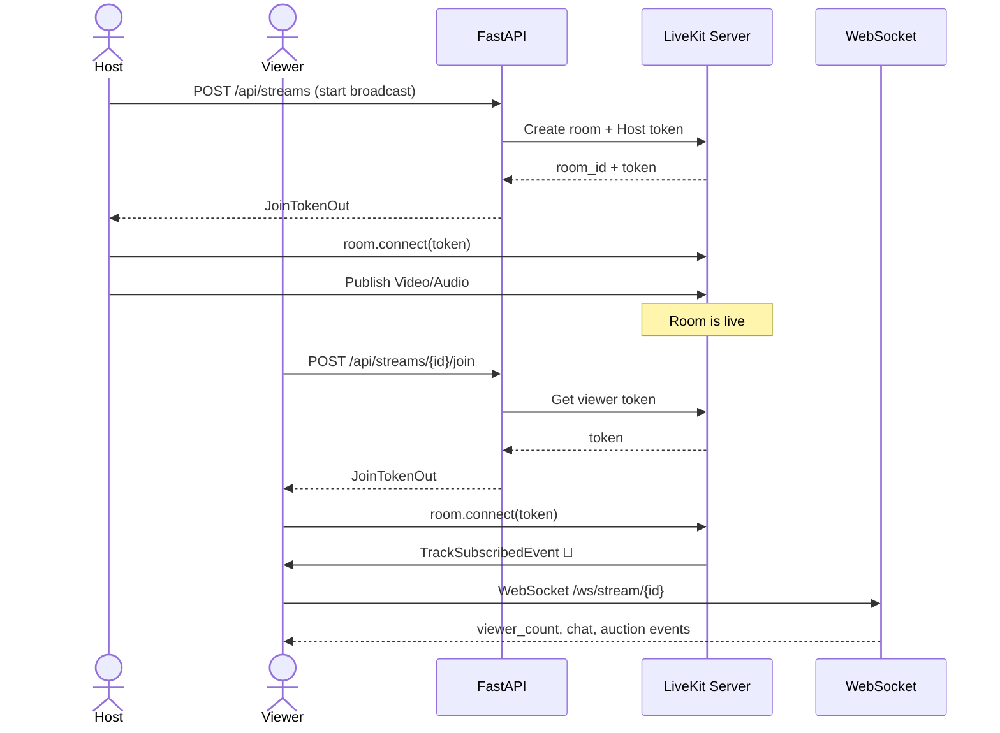
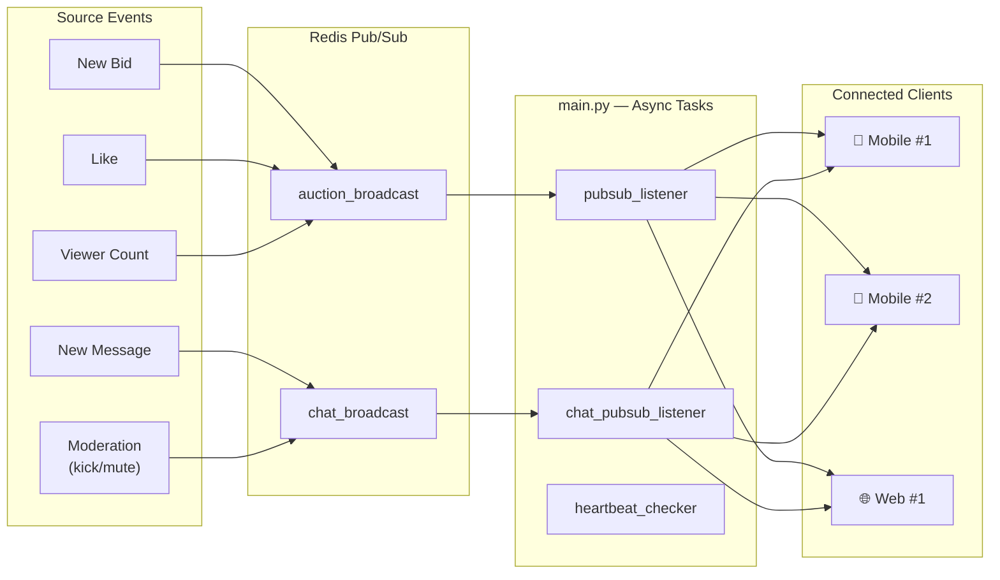
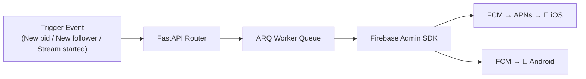
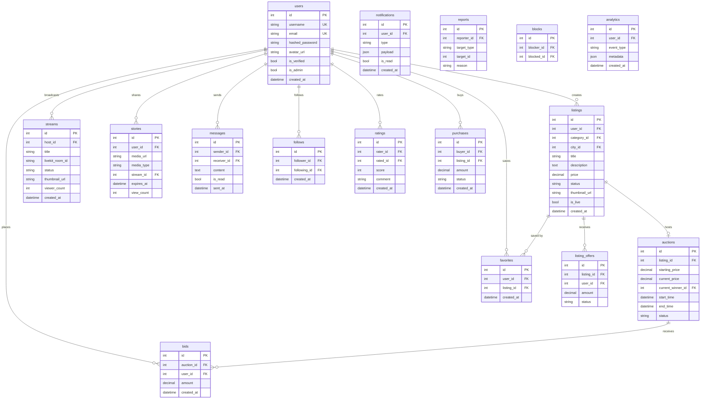
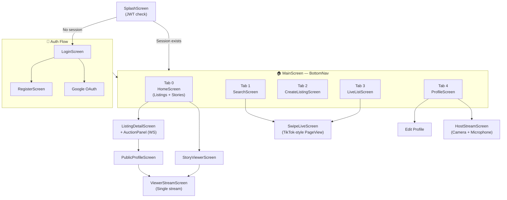
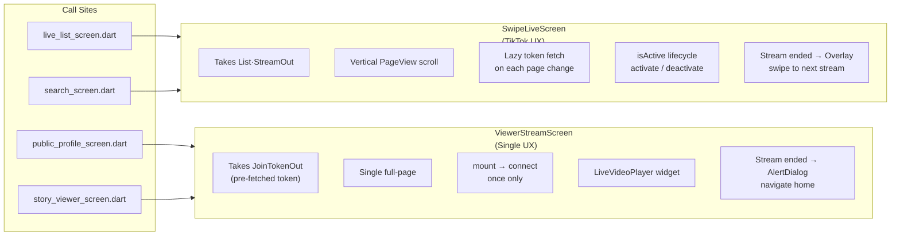
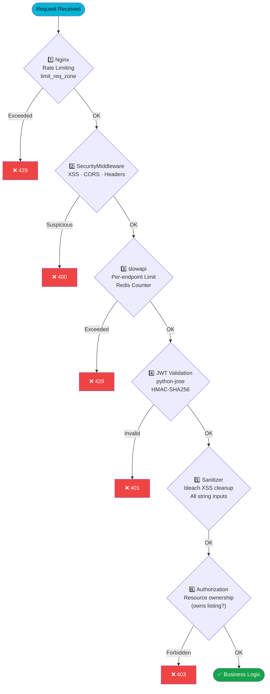
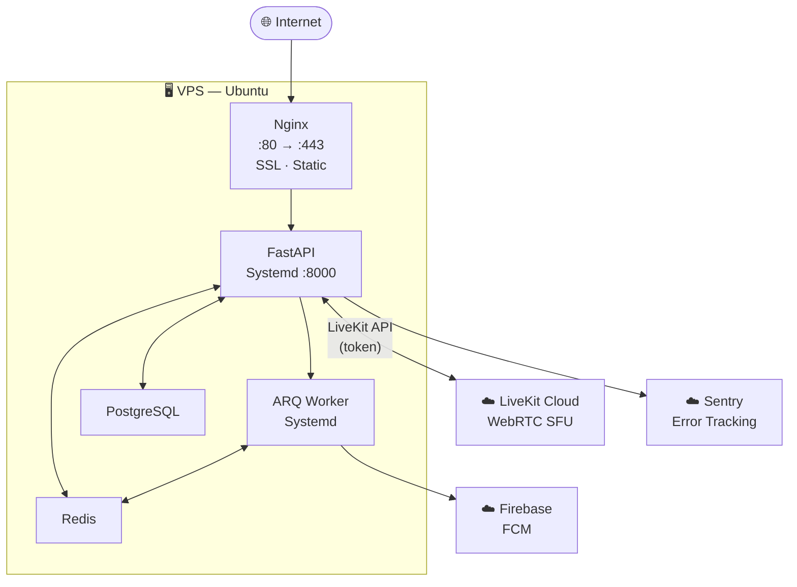

<div align="center">


### Live-streaming · Real-time auctions · Marketplace platform

<br/>

[](https://fastapi.tiangolo.com)
[](https://flutter.dev)
[](https://postgresql.org)
[](https://redis.io)
[](https://livekit.io)
[](https://firebase.google.com)
[](https://sentry.io)
[](.)

<br/>

**[📱 Mobile Architecture](#-mobile-app-architecture) · [🏗 System Architecture](#️-system-architecture) · [🗄 Database](#-database-schema) · [🔒 Security](#-security-layers) · [⚙️ Setup](#️-setup)**

</div>

---

## 🎯 What is Teqlif?

**Teqlif** is a multi-platform **C2C marketplace** that merges social live-streaming with commerce, focused on the Turkish market. Users can list items, buy directly, or compete in real-time auctions. Sellers can showcase products during live broadcasts and launch instant auctions — turning shopping into entertainment.

| | Feature | Description |
|---|---|---|
| 📢 | **Listing Management** | Category/city-based listings, image upload, direct offer system |
| 🔴 | **Live Streaming** | Low-latency host + viewer streams via WebRTC / LiveKit |
| 🔨 | **Real-time Auctions** | Live bidding, countdown timer, winner notification over WebSocket |
| 💬 | **Live Chat** | Moderated real-time messaging within streams |
| 👥 | **Social Layer** | Follow, story, likes, ratings, blocking |
| 🛡 | **Moderation** | Co-host assignment, mute, kick |
| 🔔 | **Push Notifications** | Instant alerts via Firebase FCM |
| 🌐 | **Web Interface** | Lightweight, SEO-friendly Vanilla JS web panel |

---

## 🏗️ System Architecture


---

## 📊 Data Flow Diagrams

<details>
<summary><strong>🔨 Real-time Auction — Bid Flow</strong></summary>



</details>

<details>
<summary><strong>🔴 Live Stream Connection Flow</strong></summary>



</details>

<details>
<summary><strong>💬 WebSocket Broadcast Architecture</strong></summary>



</details>

<details>
<summary><strong>🔔 Push Notification Flow</strong></summary>



</details>

---

## 🗄 Database Schema



---

## 📱 Mobile App Architecture

<details>
<summary><strong>Navigation Map</strong></summary>



</details>

<details>
<summary><strong>Live Stream Screens — UX Differences</strong></summary>



</details>

<details>
<summary><strong>Flutter Folder Structure</strong></summary>

```
mobile/lib/
│
├── 📄 main.dart                    # App entry, Riverpod, Firebase init
│
├── 📁 config/
│   ├── api.dart                    # Base URL, endpoint constants
│   └── theme.dart                  # kPrimary (#06B6D4), dark/light tokens
│
├── 📁 models/                      # JSON → Dart (17 models)
│   ├── stream.dart                 # StreamOut, JoinTokenOut
│   ├── listing.dart                # ListingOut, ListingOffer
│   ├── auction.dart                # AuctionOut, BidOut
│   └── user.dart, story.dart ...
│
├── 📁 services/                    # API calls + business logic (17 services)
│   ├── auth_service.dart           # JWT, login, register, refresh
│   ├── stream_service.dart         # Stream CRUD + join/leave/like
│   ├── auction_service.dart        # Bid endpoints
│   ├── story_service.dart          # Story upload/view/delete
│   ├── ws_service.dart             # WebSocket connection manager
│   ├── storage_service.dart        # SharedPreferences (token, user)
│   └── push_notification_service.dart
│
├── 📁 providers/                   # Riverpod state providers
│
├── 📁 screens/
│   ├── main_screen.dart            # BottomNav
│   ├── home_screen.dart            # Main feed
│   ├── listing_detail_screen.dart  # Listing detail + offer form
│   ├── search_screen.dart          # Search + SwipeLiveScreen
│   ├── profile_screen.dart         # Own profile
│   ├── public_profile_screen.dart  # Other user profile + watch stream
│   ├── messages_screen.dart        # DM conversations
│   ├── live/
│   │   ├── host_stream_screen.dart      # Broadcaster view
│   │   ├── viewer_stream_screen.dart    # Single-stream viewer
│   │   ├── swipe_live_screen.dart       # TikTok-style PageView
│   │   └── live_list_screen.dart        # Active streams list
│   └── story/
│       └── story_viewer_screen.dart
│
└── 📁 widgets/
    ├── auction_panel.dart           # Bid input + live auction UI
    ├── chat_panel.dart              # Real-time chat (WebSocket)
    ├── global_keyboard_accessory.dart
    └── live/
        ├── floating_hearts.dart     # Floating hearts animation
        ├── live_video_player.dart   # Video render wrapper
        └── viewer_top_bar.dart      # LIVE badge + viewer counter
```

</details>

---

## 🛠 Tech Stack

<details>
<summary><strong>Backend (Python)</strong></summary>

| Layer | Package | Version | Purpose |
|---|---|---|---|
| **Framework** | FastAPI | 0.115.0 | Async REST API + WebSocket |
| **Server** | Uvicorn (standard) | 0.30.6 | ASGI runtime |
| **ORM** | SQLAlchemy (asyncio) | 2.0.35 | Async database operations |
| **DB Driver** | asyncpg | 0.30.0 | PostgreSQL async driver |
| **Migration** | Alembic | 1.13.3 | Schema versioning |
| **Cache** | fastapi-cache2 (Redis) | 0.2.2 | Endpoint caching |
| **Pub/Sub** | redis | 5.1.1 | Real-time message broadcasting |
| **Job Queue** | ARQ | 0.25.0 | Async background jobs |
| **Auth** | python-jose + passlib | 3.3.0 / 1.7.4 | JWT + Bcrypt |
| **Media** | livekit-api | 0.8.2 | Live stream token management |
| **Push** | firebase-admin | 6.5.0 | FCM notifications |
| **Monitoring** | sentry-sdk[fastapi] | 2.0.0 | Error tracking |
| **Rate Limiting** | slowapi | 0.1.9 | Per-endpoint rate limits |
| **XSS Protection** | bleach | 6.1.0 | Input sanitization |
| **Captcha** | itsdangerous + CF | 2.2.0 | Turnstile validation |
| **Content Filter** | better-profanity | 0.7.0 | Profanity filtering |
| **Template** | Jinja2 | 3.1.4 | Admin panel templates |
| **Image** | Pillow | 10.4.0 | Image processing |

</details>

<details>
<summary><strong>Mobile (Flutter / Dart)</strong></summary>

| Package | Version | Purpose |
|---|---|---|
| `livekit_client` | ^2.3.0 | WebRTC live streaming |
| `web_socket_channel` | ^3.0.0 | Real-time WebSocket |
| `flutter_riverpod` | ^2.4.9 | State management |
| `firebase_messaging` | ^16.1.2 | Push notifications |
| `local_auth` | ^2.3.0 | Biometric login |
| `sentry_flutter` | ^9.14.0 | Mobile error tracking |
| `cached_network_image` | ^3.3.1 | Image caching |
| `image_picker` | ^1.1.0 | Camera / Gallery |
| `video_compress` | ^3.1.3 | Pre-upload compression |
| `connectivity_plus` | ^6.1.4 | Network status |
| `cloudflare_turnstile` | ^1.2.0 | CAPTCHA integration |
| `shimmer` | ^3.0.0 | Loading skeleton effect |
| `wakelock_plus` | ^1.2.10 | Keep screen on during stream |
| `intl` | ^0.20.0 | i18n / Localization |
| `app_badge_plus` | ^1.1.0 | App icon badge |
| `url_launcher` | ^6.3.0 | Open external links |

</details>

<details>
<summary><strong>Infrastructure</strong></summary>

| Component | Technology | Role |
|---|---|---|
| **Web Server** | Nginx | Reverse proxy, SSL termination, static file serving |
| **Process Manager** | Systemd | `teqlif-backend.service`, `teqlif-worker.service` |
| **Database** | PostgreSQL 14+ | Primary persistent storage (20 tables) |
| **Cache** | Redis 7+ | Pub/Sub, rate limit counters, session cache |
| **Media Server** | LiveKit Cloud | WebRTC SFU — video/audio track management |
| **Push** | Firebase FCM | iOS (via APNs) + Android notifications |
| **Error Tracking** | Sentry | Dual-side monitoring (backend + Flutter) |
| **Bot Protection** | Cloudflare Turnstile | Registration / login CAPTCHA |
| **Deployment** | Fastlane | Android build + deploy automation |

</details>

---

## 🌐 API Map

<details>
<summary><strong>View all endpoints (50+)</strong></summary>

### 🔐 Auth
| Method | Endpoint | Description |
|---|---|---|
| `POST` | `/api/auth/register` | Register (Turnstile CAPTCHA required) |
| `POST` | `/api/auth/login` | Get JWT token |
| `POST` | `/api/auth/refresh` | Refresh token |
| `POST` | `/api/auth/logout` | Log out |
| `POST` | `/api/auth/google` | Google OAuth |
| `GET` | `/api/auth/me` | Current session info |

### 📢 Listings
| Method | Endpoint | Description |
|---|---|---|
| `GET` | `/api/listings` | Listing feed (filterable, paginated) |
| `POST` | `/api/listings` | Create listing |
| `GET` | `/api/listings/{id}` | Listing detail |
| `PUT` | `/api/listings/{id}` | Update listing |
| `DELETE` | `/api/listings/{id}` | Delete listing |
| `POST` | `/api/listings/{id}/offer` | Submit price offer |
| `GET` | `/api/listings/{id}/offers` | Incoming offers |

### 🔨 Auctions
| Method | Endpoint | Description |
|---|---|---|
| `GET` | `/api/auction/{id}` | Active auction info |
| `POST` | `/api/auction/{id}/bid` | **Place bid** (rate limited: 2/s) |
| `WS` | `/ws/auction/{stream_id}` | Live bid stream |

### 🔴 Streams
| Method | Endpoint | Description |
|---|---|---|
| `GET` | `/api/streams` | Active streams |
| `POST` | `/api/streams` | Start a stream |
| `GET` | `/api/streams/{id}` | Stream detail |
| `DELETE` | `/api/streams/{id}` | End stream |
| `POST` | `/api/streams/{id}/join` | Get viewer token |
| `POST` | `/api/streams/{id}/leave` | Leave stream |
| `POST` | `/api/streams/{id}/like` | Like stream |
| `WS` | `/ws/stream/{id}` | Chat + viewer count |

### 👥 Social
| Method | Endpoint | Description |
|---|---|---|
| `GET` | `/api/users/{username}` | User profile |
| `POST` | `/api/follows/{username}` | Follow user |
| `DELETE` | `/api/follows/{username}` | Unfollow user |
| `GET` | `/api/search` | Search (listings + users) |
| `POST` | `/api/favorites/{id}` | Save to favorites |
| `GET` | `/api/favorites` | My favorites |
| `GET` | `/api/stories` | Stories from followed users |
| `POST` | `/api/stories` | Share a story |
| `POST` | `/api/ratings/{username}` | Rate a user |
| `POST` | `/api/reports` | Report content |

### 💬 Messaging
| Method | Endpoint | Description |
|---|---|---|
| `GET` | `/api/messages` | Conversation list |
| `POST` | `/api/messages/{username}` | Send message |
| `WS` | `/ws/messages` | Real-time messaging |

### 🛡 Moderation
| Method | Endpoint | Description |
|---|---|---|
| `POST` | `/api/moderation/{stream_id}/mute` | Mute user |
| `POST` | `/api/moderation/{stream_id}/unmute` | Unmute user |
| `POST` | `/api/moderation/{stream_id}/kick` | Kick from stream |
| `POST` | `/api/moderation/{stream_id}/promote` | Assign co-host |
| `POST` | `/api/moderation/{stream_id}/demote` | Remove co-host |

</details>

---

## 🔒 Security Layers



> [!NOTE]
> Additional layers: **Cloudflare Turnstile** (bot protection) · **better-profanity** (content filter) · **Bcrypt** (password hash, cost:12) · **SSL/TLS** (Let's Encrypt via Nginx) · **Sentry** (all exceptions including security events)

---

## 🚀 Deployment Architecture



**Systemd Services:**

| Service | Description |
|---|---|
| `teqlif-backend.service` | FastAPI (uvicorn async) |
| `teqlif-worker.service` | ARQ async job worker |
| `postgresql.service` | Database |
| `redis.service` | Cache + Pub/Sub |
| `nginx.service` | Reverse proxy + SSL |

---

## ⚙️ Setup

> [!IMPORTANT]
> PostgreSQL 14+, Redis 7+ and Python 3.11+ are required.

<details>
<summary><strong>Backend Setup</strong></summary>

```bash
cd teqlif/backend

# Virtual environment
python -m venv .venv && source .venv/bin/activate

# Install dependencies
pip install -r requirements.txt

# Configure environment
cp .env.example .env
# Fill in: DATABASE_URL, REDIS_URL, LIVEKIT_*, JWT_SECRET, FIREBASE_*, SENTRY_DSN

# Run migrations
alembic upgrade head

# Start backend
uvicorn main:app --reload --host 0.0.0.0 --port 8000

# Start worker (separate terminal)
arq app.worker.WorkerSettings
```

</details>

<details>
<summary><strong>Mobile Setup</strong></summary>

```bash
cd teqlif/mobile

# Install dependencies
flutter pub get

# Generate localization files
flutter gen-l10n

# iOS
flutter run -d ios

# Android
flutter run -d android

# Android release build
fastlane android build
```

</details>

<details>
<summary><strong>Database Commands</strong></summary>

```bash
# Create new migration (REQUIRED after every model change)
alembic revision --autogenerate -m "description"

# Apply migrations
alembic upgrade head

# Rollback one step
alembic downgrade -1

# View migration history
alembic history --verbose
```

> [!WARNING]
> Always run `alembic revision --autogenerate` after every model file change. Skipping this will cause schema mismatch in production.

</details>

---

## 📐 Developer Guidelines

> [!TIP]
> These rules are binding for both backend and mobile. PRs containing violations will not be merged.

<details>
<summary><strong>Backend Rules</strong></summary>

- ✅ **Full async** — All I/O must use `async/await`; `time.sleep()` is forbidden
- ✅ **Modular routers** — Never bloat `main.py`; new domain → new file under `/app/routers/`
- ✅ **Input sanitization** — `sanitizer.py` must be applied to all user-provided strings
- ✅ **ENV management** — All secrets through `config.py` (Pydantic Settings); hard-coded secrets are forbidden
- ✅ **Error logging** — Unexpected exceptions must be forwarded via `sentry_sdk.capture_exception()`
- ✅ **Migration required** — Every model change requires an Alembic migration; zero exceptions

</details>

<details>
<summary><strong>Mobile Rules</strong></summary>

- ✅ **Service layer** — All API calls go through `/services/*.dart`; HTTP calls inside widgets are forbidden
- ✅ **Widget splitting** — Screens exceeding 300 lines must be broken into sub-widgets
- ✅ **Color management** — Use `Theme.of(context)` or `kPrimary`; hard-coded `Colors.white` is forbidden
- ✅ **Keyboard handling** — All form screens must handle keyboard via `global_keyboard_accessory.dart` or `resizeToAvoidBottomInset`
- ✅ **Performance** — Prefer `StreamBuilder` / localized state over full-screen `setState` for list updates

</details>

<details>
<summary><strong>Web Rules</strong></summary>

- ✅ **No frameworks** — React, Vue, and Tailwind are not allowed; Vanilla JS + plain CSS only
- ✅ **DOM performance** — Update only the changed element; never wipe and recreate the entire list
- ✅ **Mobile-first** — Responsive with `grid` + `flexbox` + `media queries`
- ✅ **WebSocket reconnect** — Auto-reconnect on disconnect with user-facing indicator

</details>

---

## 🎨 Design System

| Token | Color | Hex | Usage |
|---|---|:---:|---|
| `kPrimary` | 🟦 Cyan-500 | `#06B6D4` | Primary button, accent, active icons |
| `Dark BG` | ⬛ Slate-900 | `#0F172A` | Page background |
| `Surface` | ⬛ Slate-800 | `#1E293B` | Cards, panels, bottom sheets |
| `Border` | ⬛ Slate-700 | `#334155` | Dividers |
| `Text Primary` | ⬜ Slate-100 | `#F1F5F9` | Main text |
| `Text Secondary` | 🔘 Slate-400 | `#94A3B8` | Secondary / caption text |
| `Success` | 🟩 Green-600 | `#16A34A` | Success messages, co-host promotion |
| `Warning` | 🟧 Amber-600 | `#D97706` | Warnings, mute notification |
| `Error` | 🟥 Red-500 | `#EF4444` | Errors, kick notification |
| `Live` | 🟥 Red-500 | `#EF4444` | LIVE badge |
| `CoHost` | 🌊 Cyan-400 | `#22D3EE` | Co-host username highlight |

---

<div align="center">

**⚡ Teqlif** — Live. Real. Instant.

*Made with ❤️ in Turkey*

</div>
