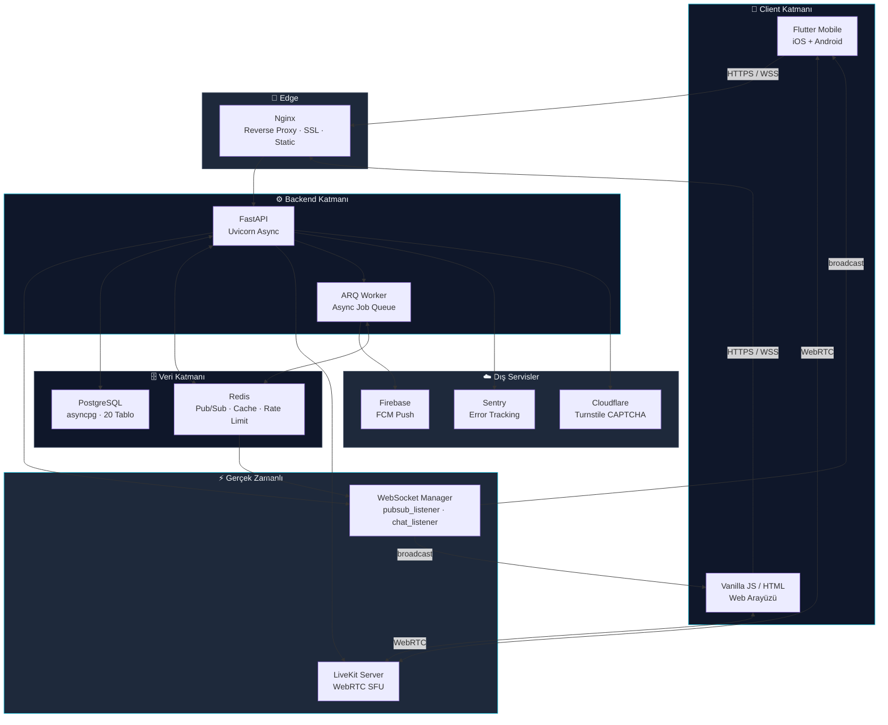
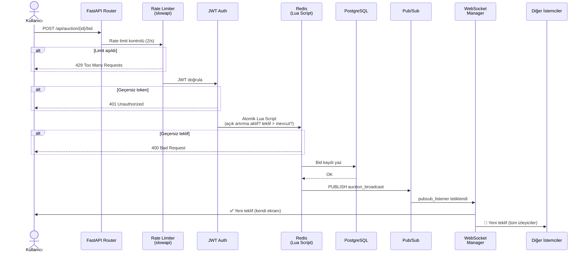
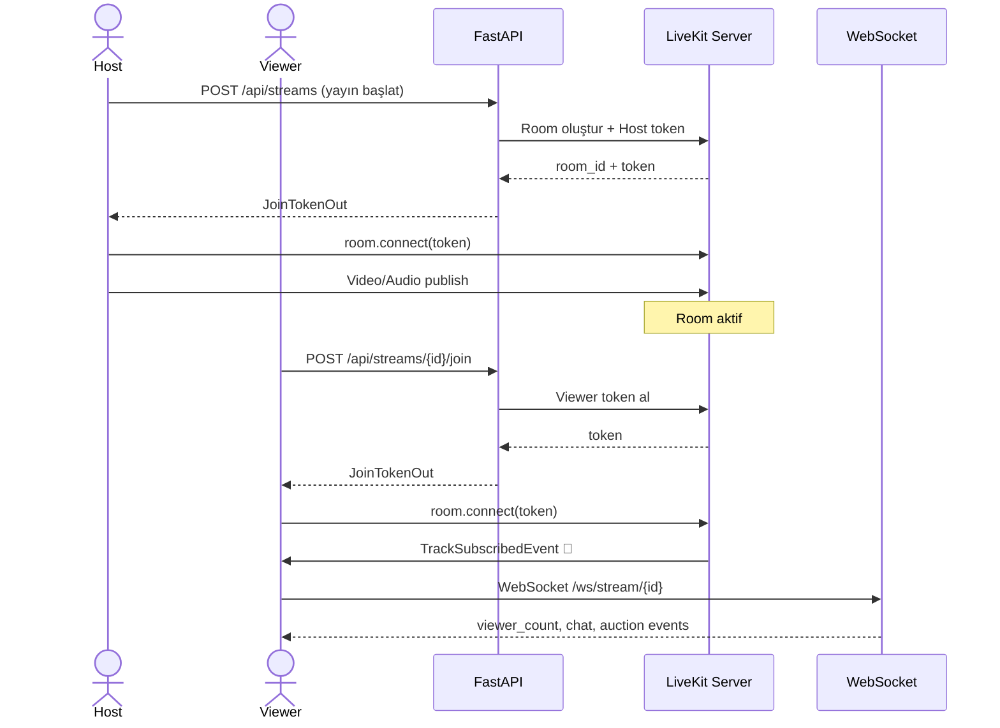
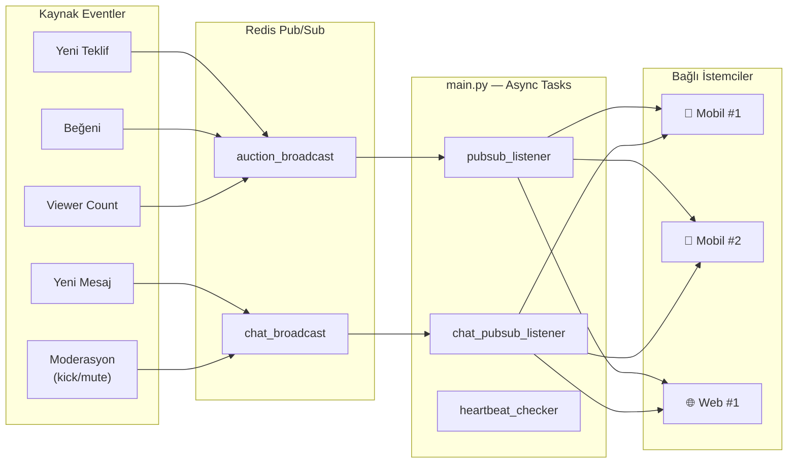
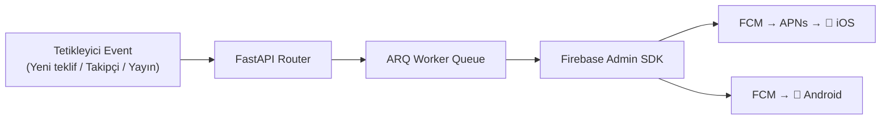
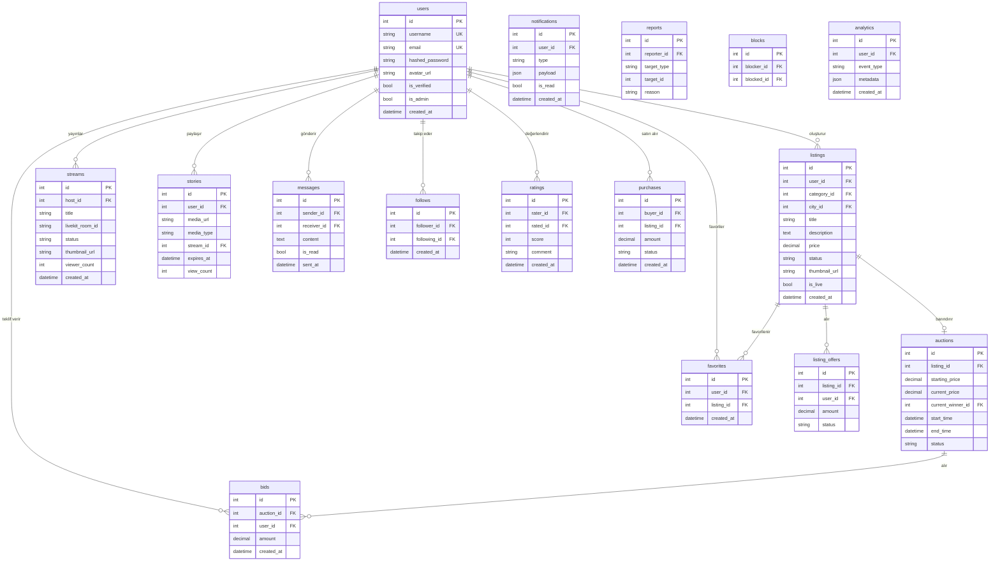
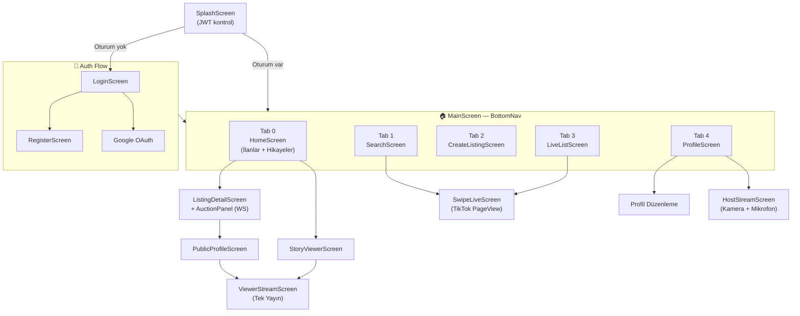
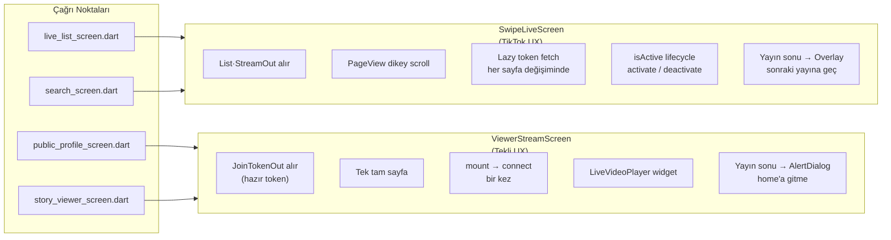
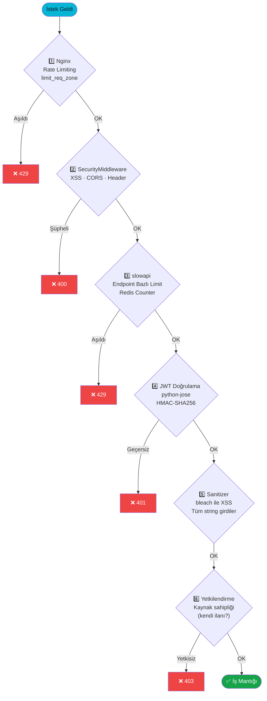

<div align="center">


### Canlı yayın destekli · Gerçek zamanlı açık artırma · İlan platformu

<br/>

[](https://fastapi.tiangolo.com)
[](https://flutter.dev)
[](https://postgresql.org)
[](https://redis.io)
[](https://livekit.io)
[](https://firebase.google.com)
[](https://sentry.io)
[](.)

<br/>

**[📱 Mobil Mimari](#-mobil-uygulama-mimarisi) · [🏗 Sistem Mimarisi](#️-sistem-mimarisi) · [🗄 Veritabanı](#-veritabanı-şeması) · [🔒 Güvenlik](#-güvenlik-katmanları) · [⚙️ Kurulum](#️-kurulum)**

</div>

---

## 🎯 Teqlif Nedir?

**Teqlif**, alışverişi canlı yayın deneyimiyle birleştiren Türkiye odaklı çok platformlu bir **C2C ticaret uygulamasıdır.** Kullanıcılar ilan açar, doğrudan satın alabilir ya da gerçek zamanlı açık artırmayla rekabetçi teklifler verebilir. Satıcılar canlı yayınları sırasında ürünlerini tanıtıp anlık açık artırma başlatabilir.

| | Özellik | Açıklama |
|---|---|---|
| 📢 | **İlan Yönetimi** | Kategori/şehir bazlı ilan, görsel yükleme, doğrudan teklif alma |
| 🔴 | **Canlı Yayın** | WebRTC/LiveKit ile host + izleyici full-duplex |
| 🔨 | **Gerçek Zamanlı Açık Artırma** | WebSocket üzerinden anlık teklif, sayaç, kazanan bildirimi |
| 💬 | **Canlı Sohbet** | Yayın içi moderasyonlu mesajlaşma |
| 👥 | **Sosyal Katman** | Takip, hikaye (story), beğeni, değerlendirme, engelleme |
| 🛡 | **Moderasyon** | Co-host atama, susturma, yayından atma |
| 🔔 | **Push Bildirim** | Firebase FCM anlık bildirimler |
| 🌐 | **Web Arayüzü** | Vanilla JS hafif, SEO-uyumlu web paneli |

---

## 🏗️ Sistem Mimarisi



---

## 📊 Veri Akışı Diyagramları

<details>
<summary><strong>🔨 Gerçek Zamanlı Açık Artırma — Teklif Akışı</strong></summary>



</details>

<details>
<summary><strong>🔴 Canlı Yayın Bağlantı Akışı</strong></summary>



</details>

<details>
<summary><strong>💬 WebSocket Mesaj Dağıtım Mimarisi</strong></summary>



</details>

<details>
<summary><strong>🔔 Push Bildirim Akışı</strong></summary>



</details>

---

## 🗄 Veritabanı Şeması



---

## 📱 Mobil Uygulama Mimarisi

<details>
<summary><strong>Navigasyon Haritası</strong></summary>



</details>

<details>
<summary><strong>Canlı Yayın Ekranları — UX Farkları</strong></summary>



</details>

<details>
<summary><strong>Flutter Klasör Yapısı</strong></summary>

```
mobile/lib/
│
├── 📄 main.dart                    # App entry, Riverpod, Firebase init
│
├── 📁 config/
│   ├── api.dart                    # Base URL, endpoint sabitleri
│   └── theme.dart                  # kPrimary (#06B6D4), dark/light tokens
│
├── 📁 models/                      # JSON → Dart (17 model)
│   ├── stream.dart                 # StreamOut, JoinTokenOut
│   ├── listing.dart                # ListingOut, ListingOffer
│   ├── auction.dart                # AuctionOut, BidOut
│   └── user.dart, story.dart ...
│
├── 📁 services/                    # API çağrıları + iş mantığı (17 servis)
│   ├── auth_service.dart           # JWT, login, register, refresh
│   ├── stream_service.dart         # Yayın CRUD + join/leave/like
│   ├── auction_service.dart        # Teklif endpoint'leri
│   ├── story_service.dart          # Hikaye yükle/izle/sil
│   ├── ws_service.dart             # WebSocket bağlantı yöneticisi
│   ├── storage_service.dart        # SharedPreferences (token, user)
│   └── push_notification_service.dart
│
├── 📁 providers/                   # Riverpod state provider'ları
│
├── 📁 screens/
│   ├── main_screen.dart            # BottomNav
│   ├── home_screen.dart            # Ana akış
│   ├── listing_detail_screen.dart  # İlan detayı + teklif formu
│   ├── search_screen.dart          # Arama + SwipeLiveScreen
│   ├── profile_screen.dart         # Kendi profil
│   ├── public_profile_screen.dart  # Başka profil + Yayın izle
│   ├── messages_screen.dart        # DM konuşmaları
│   ├── live/
│   │   ├── host_stream_screen.dart      # Yayıncı ekranı
│   │   ├── viewer_stream_screen.dart    # Tekli izleme
│   │   ├── swipe_live_screen.dart       # TikTok-stili PageView
│   │   └── live_list_screen.dart        # Aktif yayınlar listesi
│   └── story/
│       └── story_viewer_screen.dart
│
└── 📁 widgets/
    ├── auction_panel.dart           # Teklif girişi + aktif artırma UI
    ├── chat_panel.dart              # Gerçek zamanlı sohbet (WS)
    ├── global_keyboard_accessory.dart
    └── live/
        ├── floating_hearts.dart     # Uçuşan kalpler animasyonu
        ├── live_video_player.dart   # Video render wrapper
        └── viewer_top_bar.dart      # CANLI etiketi + izleyici sayacı
```

</details>

---

## 🛠 Teknoloji Yığını

<details>
<summary><strong>Backend (Python)</strong></summary>

| Katman | Paket | Versiyon | Kullanım |
|---|---|---|---|
| **Framework** | FastAPI | 0.115.0 | Async REST API + WebSocket |
| **Server** | Uvicorn (standard) | 0.30.6 | ASGI runtime |
| **ORM** | SQLAlchemy (asyncio) | 2.0.35 | Async DB operasyonları |
| **DB Driver** | asyncpg | 0.30.0 | PostgreSQL async sürücüsü |
| **Migration** | Alembic | 1.13.3 | Şema versiyonlama |
| **Cache** | fastapi-cache2 (Redis) | 0.2.2 | Endpoint önbellekleme |
| **Pub/Sub** | redis | 5.1.1 | Gerçek zamanlı mesaj dağıtımı |
| **Job Queue** | ARQ | 0.25.0 | Async iş kuyruğu |
| **Auth** | python-jose + passlib | 3.3.0 / 1.7.4 | JWT + Bcrypt |
| **Media** | livekit-api | 0.8.2 | Canlı yayın token yönetimi |
| **Push** | firebase-admin | 6.5.0 | FCM bildirimleri |
| **Monitoring** | sentry-sdk[fastapi] | 2.0.0 | Hata izleme |
| **Rate Limit** | slowapi | 0.1.9 | Endpoint bazlı limit |
| **XSS Koruma** | bleach | 6.1.0 | Input sanitizasyonu |
| **Captcha** | itsdangerous + CF | 2.2.0 | Turnstile doğrulama |
| **Content Filter** | better-profanity | 0.7.0 | Küfür filtreleme |
| **Template** | Jinja2 | 3.1.4 | Admin panel |
| **Image** | Pillow | 10.4.0 | Görsel işleme |

</details>

<details>
<summary><strong>Mobil (Flutter / Dart)</strong></summary>

| Paket | Versiyon | Kullanım |
|---|---|---|
| `livekit_client` | ^2.3.0 | WebRTC canlı yayın |
| `web_socket_channel` | ^3.0.0 | Gerçek zamanlı WebSocket |
| `flutter_riverpod` | ^2.4.9 | State yönetimi |
| `firebase_messaging` | ^16.1.2 | Push notification |
| `local_auth` | ^2.3.0 | Biyometrik giriş |
| `sentry_flutter` | ^9.14.0 | Mobil hata izleme |
| `cached_network_image` | ^3.3.1 | Görsel önbellekleme |
| `image_picker` | ^1.1.0 | Kamera / Galeri |
| `video_compress` | ^3.1.3 | Yükleme öncesi sıkıştırma |
| `connectivity_plus` | ^6.1.4 | Ağ durumu takibi |
| `cloudflare_turnstile` | ^1.2.0 | Captcha entegrasyonu |
| `shimmer` | ^3.0.0 | Yükleme iskelet efekti |
| `wakelock_plus` | ^1.2.10 | Yayın sırasında ekran aktif |
| `intl` | ^0.20.0 | i18n / Lokalizasyon |
| `app_badge_plus` | ^1.1.0 | Uygulama rozeti |
| `url_launcher` | ^6.3.0 | Dış link açma |

</details>

<details>
<summary><strong>Altyapı</strong></summary>

| Bileşen | Teknoloji | Rol |
|---|---|---|
| **Web Sunucu** | Nginx | Reverse proxy, SSL termination, static dosya servisi |
| **Süreç Yöneticisi** | Systemd | `teqlif-backend.service`, `teqlif-worker.service` |
| **Veritabanı** | PostgreSQL 14+ | Ana kalıcı depolama (20 tablo) |
| **Önbellek** | Redis 7+ | Pub/Sub, rate limit counter, session cache |
| **Medya Sunucusu** | LiveKit Cloud | WebRTC SFU — video/audio track yönetimi |
| **Push** | Firebase FCM | iOS (APNs üzerinden) + Android bildirim |
| **Hata Takibi** | Sentry | Backend + Flutter çift taraflı izleme |
| **Bot Koruması** | Cloudflare Turnstile | Kayıt / giriş captcha |
| **Dağıtım** | Fastlane | Android build + deploy otomasyonu |

</details>

---

## 🌐 API Haritası

<details>
<summary><strong>Tüm endpointleri göster (50+)</strong></summary>

### 🔐 Auth
| Method | Endpoint | Açıklama |
|---|---|---|
| `POST` | `/api/auth/register` | Kayıt (Turnstile captcha zorunlu) |
| `POST` | `/api/auth/login` | JWT token al |
| `POST` | `/api/auth/refresh` | Token yenile |
| `POST` | `/api/auth/logout` | Çıkış |
| `POST` | `/api/auth/google` | Google OAuth |
| `GET` | `/api/auth/me` | Oturum bilgisi |

### 📢 İlanlar
| Method | Endpoint | Açıklama |
|---|---|---|
| `GET` | `/api/listings` | İlan listesi (filtreli, sayfalama) |
| `POST` | `/api/listings` | İlan oluştur |
| `GET` | `/api/listings/{id}` | İlan detayı |
| `PUT` | `/api/listings/{id}` | İlan güncelle |
| `DELETE` | `/api/listings/{id}` | İlan sil |
| `POST` | `/api/listings/{id}/offer` | Fiyat teklifi gönder |
| `GET` | `/api/listings/{id}/offers` | Gelen teklifler |

### 🔨 Açık Artırma
| Method | Endpoint | Açıklama |
|---|---|---|
| `GET` | `/api/auction/{id}` | Aktif açık artırma bilgisi |
| `POST` | `/api/auction/{id}/bid` | **Teklif ver** (rate limited: 2/s) |
| `WS` | `/ws/auction/{stream_id}` | Canlı teklif akışı |

### 🔴 Yayın (Stream)
| Method | Endpoint | Açıklama |
|---|---|---|
| `GET` | `/api/streams` | Aktif yayınlar |
| `POST` | `/api/streams` | Yayın başlat |
| `GET` | `/api/streams/{id}` | Yayın detayı |
| `DELETE` | `/api/streams/{id}` | Yayını bitir |
| `POST` | `/api/streams/{id}/join` | İzleyici token al |
| `POST` | `/api/streams/{id}/leave` | Yayından ayrıl |
| `POST` | `/api/streams/{id}/like` | Beğen |
| `WS` | `/ws/stream/{id}` | Sohbet + izleyici sayısı |

### 👥 Sosyal
| Method | Endpoint | Açıklama |
|---|---|---|
| `GET` | `/api/users/{username}` | Kullanıcı profili |
| `POST` | `/api/follows/{username}` | Takip et |
| `DELETE` | `/api/follows/{username}` | Takibi bırak |
| `GET` | `/api/search` | Arama (ilan + kullanıcı) |
| `POST` | `/api/favorites/{id}` | Favoriye ekle |
| `GET` | `/api/favorites` | Favorilerim |
| `GET` | `/api/stories` | Takip edilen hikayeler |
| `POST` | `/api/stories` | Hikaye paylaş |
| `POST` | `/api/ratings/{username}` | Değerlendir |
| `POST` | `/api/reports` | Şikayet et |

### 💬 Mesajlaşma
| Method | Endpoint | Açıklama |
|---|---|---|
| `GET` | `/api/messages` | Konuşma listesi |
| `POST` | `/api/messages/{username}` | Mesaj gönder |
| `WS` | `/ws/messages` | Gerçek zamanlı mesaj |

### 🛡 Moderasyon
| Method | Endpoint | Açıklama |
|---|---|---|
| `POST` | `/api/moderation/{stream_id}/mute` | Sustur |
| `POST` | `/api/moderation/{stream_id}/unmute` | Susturmayı kaldır |
| `POST` | `/api/moderation/{stream_id}/kick` | Yayından at |
| `POST` | `/api/moderation/{stream_id}/promote` | Co-host ata |
| `POST` | `/api/moderation/{stream_id}/demote` | Co-host indir |

</details>

---

## 🔒 Güvenlik Katmanları



> [!NOTE]
> Ek katmanlar: **Cloudflare Turnstile** (bot koruması) · **better-profanity** (içerik filtresi) · **Bcrypt** (şifre hash, cost:12) · **SSL/TLS** (Let's Encrypt via Nginx) · **Sentry** (güvenlik istisnaları dahil tüm exception izleme)

---

## 🚀 Deployment Mimarisi


**Systemd Servisleri:**

| Servis | Açıklama |
|---|---|
| `teqlif-backend.service` | FastAPI (uvicorn async) |
| `teqlif-worker.service` | ARQ async job worker |
| `postgresql.service` | Veritabanı |
| `redis.service` | Cache + Pub/Sub |
| `nginx.service` | Ters proxy + SSL |

---

## ⚙️ Kurulum

> [!IMPORTANT]
> PostgreSQL 14+, Redis 7+ ve Python 3.11+ gereklidir.

<details>
<summary><strong>Backend Kurulumu</strong></summary>

```bash
cd teqlif/backend

# Virtual environment
python -m venv .venv && source .venv/bin/activate

# Bağımlılıklar
pip install -r requirements.txt

# Ortam değişkenleri
cp .env.example .env
# .env içinde: DATABASE_URL, REDIS_URL, LIVEKIT_*, JWT_SECRET, FIREBASE_*, SENTRY_DSN

# Migration
alembic upgrade head

# Backend başlat
uvicorn main:app --reload --host 0.0.0.0 --port 8000

# Worker başlat (ayrı terminal)
arq app.worker.WorkerSettings
```

</details>

<details>
<summary><strong>Mobil Kurulumu</strong></summary>

```bash
cd teqlif/mobile

# Bağımlılıklar
flutter pub get

# Lokalizasyon dosyalarını oluştur
flutter gen-l10n

# iOS
flutter run -d ios

# Android
flutter run -d android

# Release build (Android)
fastlane android build
```

</details>

<details>
<summary><strong>Veritabanı Komutları</strong></summary>

```bash
# Yeni migration oluştur (model değişikliği sonrası ZORUNLU)
alembic revision --autogenerate -m "aciklama"

# Migration uygula
alembic upgrade head

# Bir adım geri al
alembic downgrade -1

# Migration geçmişini gör
alembic history --verbose
```

> [!WARNING]
> Model dosyasındaki her değişiklikten sonra mutlaka `alembic revision --autogenerate` çalıştırın. Aksi hâlde canlı ortamda şema uyumsuzluğu oluşur.

</details>

---

## 📐 Geliştirici Kuralları

> [!TIP]
> Bu kurallar hem backend hem mobil için bağlayıcıdır. PR'larda bu kurallara aykırı değişiklikler kabul edilmez.

<details>
<summary><strong>Backend Kuralları</strong></summary>

- ✅ **Tam asenkronluk** — Tüm I/O `async/await` ile yazılmalıdır; `time.sleep()` yasaktır
- ✅ **Modüler router** — `main.py` şişirilmez; yeni domain → `/app/routers/` altına yeni dosya
- ✅ **Girdi sanitizasyonu** — `sanitizer.py` tüm kullanıcı girdilerine uygulanmalıdır
- ✅ **ENV yönetimi** — Gizli anahtarlar `config.py` (Pydantic Settings) üzerinden; hard-code yasaktır
- ✅ **Hata loglama** — Beklenmedik hatalar `sentry_sdk.capture_exception()` ile iletilmeli
- ✅ **Migration zorunluluğu** — Model değişikliği = Alembic migration; sıfır istisna

</details>

<details>
<summary><strong>Mobil Kuralları</strong></summary>

- ✅ **Servis katmanı** — Tüm API çağrıları `/services/*.dart` üzerinden; widget içinden HTTP yasaktır
- ✅ **Widget bölme** — 300 satırı geçen ekranlar alt widget'lara bölünür
- ✅ **Renk yönetimi** — `Theme.of(context)` veya `kPrimary` kullanılır; `Colors.white` hard-code yasaktır
- ✅ **Klavye** — Tüm form ekranlarında `global_keyboard_accessory.dart` veya `resizeToAvoidBottomInset` yapısına dikkat
- ✅ **Performans** — Liste güncellemelerinde `StreamBuilder` / localized state tercih edilir; tüm ekranı `setState` ile yeniden çizmekten kaçınılır

</details>

<details>
<summary><strong>Web Kuralları</strong></summary>

- ✅ **Framework yok** — React, Vue, Tailwind eklenmez; Vanilla JS + saf CSS
- ✅ **DOM performansı** — Tüm listeyi yeniden oluşturmak yerine sadece değişen element güncellenir
- ✅ **Mobile-first** — `grid` + `flexbox` + `media queries` ile responsive tasarım
- ✅ **WebSocket reconnect** — Bağlantı kesildiğinde otomatik yeniden bağlanma + kullanıcı uyarısı

</details>

---

## 🎨 Tasarım Sistemi

| Token | Renk | Hex | Kullanım |
|---|---|:---:|---|
| `kPrimary` | 🟦 Cyan-500 | `#06B6D4` | Ana buton, vurgu, aktif ikonlar |
| `Dark BG` | ⬛ Slate-900 | `#0F172A` | Sayfa arka planı |
| `Surface` | ⬛ Slate-800 | `#1E293B` | Kart, panel, bottom sheet |
| `Border` | ⬛ Slate-700 | `#334155` | Ayırıcı çizgiler |
| `Text Primary` | ⬜ Slate-100 | `#F1F5F9` | Ana metin |
| `Text Secondary` | 🔘 Slate-400 | `#94A3B8` | İkincil, açıklama metni |
| `Success` | 🟩 Green-600 | `#16A34A` | Başarı mesajı, moderatör atama |
| `Warning` | 🟧 Amber-600 | `#D97706` | Uyarı, susturma bildirimi |
| `Error` | 🟥 Red-500 | `#EF4444` | Hata, kick bildirimi |
| `Live` | 🟥 Red-500 | `#EF4444` | CANLI etiketi |
| `CoHost` | 🌊 Cyan-400 | `#22D3EE` | Co-host kullanıcı adı vurgusu |

---

<div align="center">

**⚡ Teqlif** — Canlı. Gerçek. Anlık.

*Made with ❤️ in Turkey*

</div>
