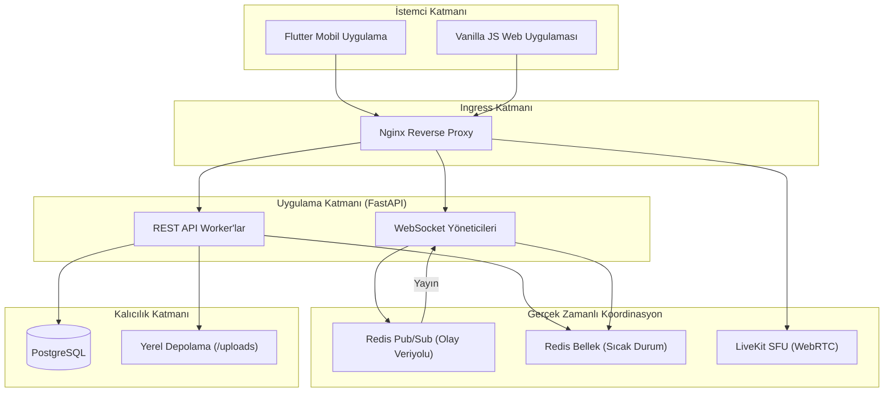
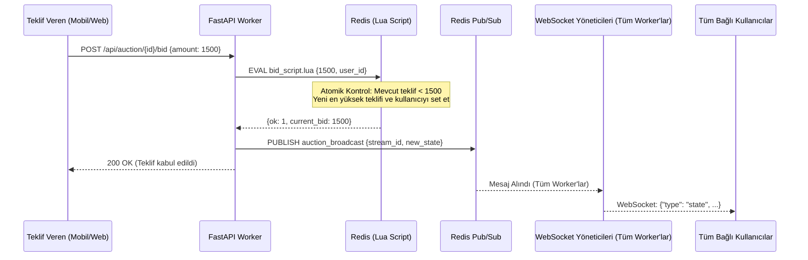
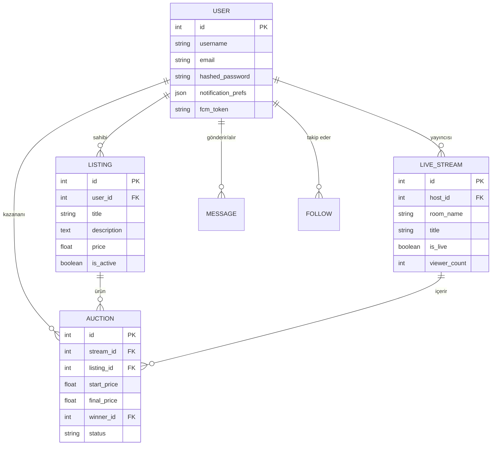
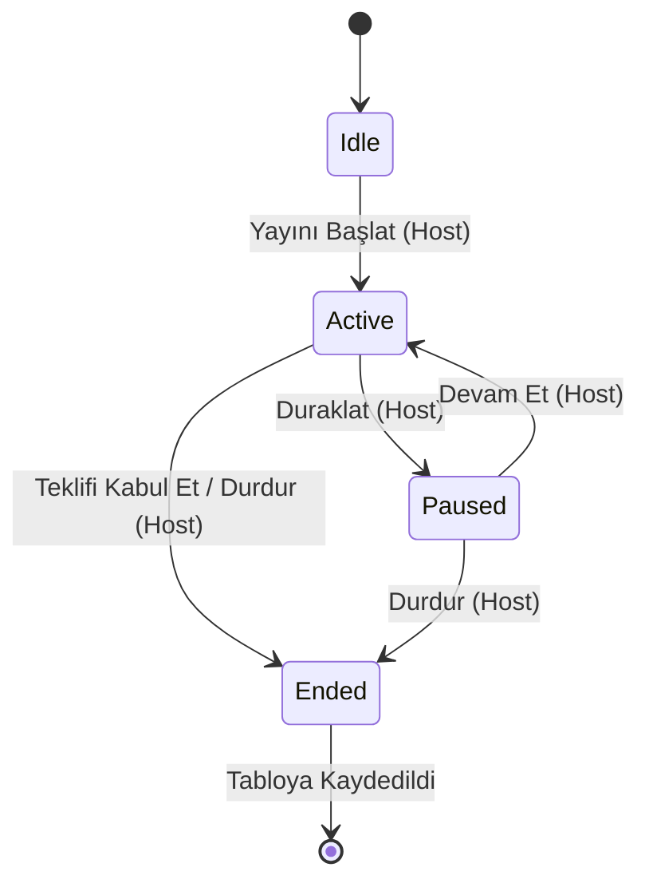

# Teqlif — İlan Ver, Sat, Kazan

Teqlif, düşük gecikmeli etkileşim ve yüksek ölçeklenebilirlik odaklı tasarlanmış, modern bir gerçek zamanlı açık artırma ve ilan platformudur. Sistem, güçlü bir asenkron backend, hafif bir web frontend ve çok platformlu bir mobil uygulama (Flutter) arasında bölünmüştür.

## 🏗 Sistem Mimarisi

Teqlif, kullanıcı etkileşimi, gerçek zamanlı koordinasyon ve kalıcı veri depolama arasındaki sorumlulukları ayıran modern bir yığın kullanır.

---

## ⚡ Gerçek Zamanlı Açık Artırma Akışı

Aşağıdaki diyagram, bir kullanıcının mobil cihazından gelen bir teklifin, Redis'teki atomik doğrulamadan geçerek tüm istemcilere eşzamanlı olarak nasıl yayıldığını göstermektedir.

---

## 📊 Veri Tabanı Şeması (ER Diyagramı)

İlişkisel şema; kullanıcıların, ilanların ve gerçek zamanlı yayınların sıkı bir şekilde entegre olduğu bir sosyal ticaret yapısını desteklemek üzere tasarlanmıştır.

---

## 🔄 Açık Artırma Durum Makinesi

Durum geçişleri Redis'te yönetilir ve canlı oturum sırasında hiçbir verinin kaybolmaması için PostgreSQL'de kalıcı hale getirilir.

---

## 🚀 Kurulum ve Dağıtım

Teqlif, standart bir Linux ortamında aşağıdaki bileşenlerle çalışır:

- **Backend**: FastAPI + Uvicorn (Systemd ile yönetilir).
- **Frontend**: Vanilla JS (Nginx tarafından sunulur).
- **Real-time**: Redis (Pub/Sub & Cache) + LiveKit SFU.
- **Veri Tabanı**: PostgreSQL.
- **Edge**: Nginx (SSL Sertifikası ve Proxy).
