

# teqlif

**Canlı yayın tabanlı C2C pazar yeri ve gerçek zamanlı açık artırma motoru**

*ARC42 Mimari Belgesi — Scale V1.3*

---

## İçindekiler

| # | Bölüm |
|---|---|
| 1 | [Giriş ve Hedefler](#1-giriş-ve-hedefler) |
| 2 | [Kısıtlar](#2-kısıtlar) |
| 3 | [Sistem Bağlamı ve Kapsam](#3-sistem-bağlamı-ve-kapsam) |
| 4 | [Çözüm Stratejisi](#4-çözüm-stratejisi) |
| 5 | [Yapı Taşları](#5-yapı-taşları) |
| 6 | [Çalışma Zamanı Görünümü](#6-çalışma-zamanı-görünümü) |
| 7 | [Dağıtım Görünümü](#7-dağıtım-görünümü) |
| 8 | [Kesişen Kavramlar](#8-kesişen-kavramlar) |
| 9 | [Mimari Kararlar](#9-mimari-kararlar) |
| 10 | [Kalite Gereksinimleri](#10-kalite-gereksinimleri) |
| 11 | [Riskler ve Teknik Borç](#11-riskler-ve-teknik-borç) |
| 12 | [Sözlük](#12-sözlük) |

---

## 1. Giriş ve Hedefler

teqlif, Türkiye pazarına yönelik bir C2C e-ticaret platformudur. TikTok tarzı canlı yayınları, gerçek zamanlı açık artırmaları, birebir görüntülü aramaları, hikâyeleri, doğrudan satışları ve sanal para birimi (Tuci) ile bir sanal ekonomiyi tek bir mobil uygulamada birleştirir.

### Temel Özellikler

| Özellik | Açıklama |
|---|---|
| **Canlı Yayın Açık Artırması** | Satıcı kamerası açıkken izleyiciler gerçek zamanlı teklif verir; her teklif tüm izleyicilere WebSocket ile yayınlanır |
| **SwipeLive** | TikTok-benzeri dikey kaydırma arayüzü ile canlı akışlar arasında geçiş; ML sıralaması |
| **Birebir Görüntülü Arama** | WebRTC tabanlı VoIP (LiveKit SFU); iOS CallKit / Android ConnectionService entegrasyonu |
| **Tuci Ekonomisi** | Platform içi sanal para; hediye, bahşiş, teklif ve premium içerik için kullanılır |
| **AI Açıklama Üretimi** | İlan başlığından otomatik açıklama; Groq/Gemini API üzerinden ABD IP'li proxy zinciri |
| **OTA Yerelleştirme** | tr / en / ar / ru — çeviriler Redis üzerinden canlı güncellenir, uygulama güncellemesi gerekmez |

### Kalite Hedefleri

| Öncelik | Hedef | Senaryo |
|---|---|---|
| 1 | **Erişilebilirlik** | gateway çöküşünde cf-failover 30 saniye içinde DNS A kaydını node1'e yönlendirir |
| 2 | **Düşük Gecikme** | Teklif → tüm izleyicilere yayın < 100 ms (Redis pub/sub + WebSocket) |
| 3 | **Güvenlik** | Ağ katmanı: Cloudflare → nginx → WireGuard; uygulama katmanı: JWT + CAPTCHA + antibot |
| 4 | **Ölçeklenebilirlik** | ~5.000 eşzamanlı pasif kullanıcı, ~4.000 aktif WebSocket bağlantısı, ~1.500 aktif teklif verici |
| 5 | **Gözlemlenebilirlik** | Prometheus + Loki + Grafana + Sentry; tüm node'larda promtail → merkezi Loki |

---

## 2. Kısıtlar

### Teknik Kısıtlar

| Kısıt | Gerekçe |
|---|---|
| Python 3.13 / FastAPI | Mevcut codebase; async-native ekosistemi |
| Flutter 3.x | iOS + Android tek codebase; LiveKit Flutter SDK gerekliliği |
| PostgreSQL (asyncpg) | ACID gerekliliği; açık artırma row-lock semantiği |
| Redis (pub/sub + cache) | WebSocket fan-out için low-latency message broker; FastAPICache backend |
| VPS tabanlı altyapı | Kubernetes yok; systemd + WireGuard mesh ile koordinasyon |
| Cloudflare önünde | DDoS koruması ve SSL offloading zorunlu; gateway nginx Cloudflare IP'leri ile kısıtlı |

### Organizasyonel Kısıtlar

| Kısıt | Gerekçe |
|---|---|
| WireGuard private key'leri git'e girmez | Her node'da `/etc/wireguard/` içinde yerel — git şablonlarda placeholder |
| `.env` değerleri git'e girmez | Şablon dosyaları boş; prod değerleri VPS'te manuel girilir |
| `AI_PROXY_INTERNAL_TOKEN` node1/2/3 aynı değer | Token rotasyonu tüm proxy node'larında eş zamanlı yapılmalı |
| 4 VPS node — sabit altyapı | node3 (Zap-Hosting) 90 günde bir panel girişi zorunlu |

---

## 3. Sistem Bağlamı ve Kapsam

teqlif platformunun dış sistemlerle ilişkisi:

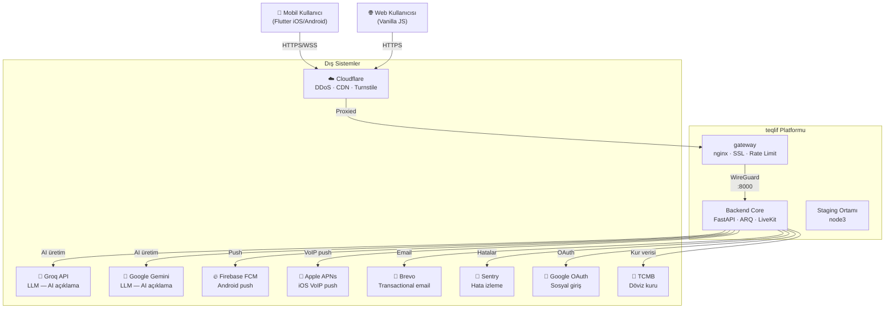
```mermaid
flowchart TB
    MOB["📱 Mobil Kullanıcı\n(Flutter iOS/Android)"]
    WEB["🌐 Web Kullanıcısı\n(Vanilla JS)"]

    subgraph TEQLIF["teqlif Platformu"]
        direction TB
        GW["gateway\nnginx · SSL · Rate Limit"]
        CORE["Backend Core\nFastAPI · ARQ · LiveKit"]
        STAGING["Staging Ortamı\nnode3"]
    end

    subgraph EXT["Dış Sistemler"]
        CF["☁️ Cloudflare\nDDoS · CDN · Turnstile"]
        GROQ["🤖 Groq API\nLLM — AI açıklama"]
        GEM["🤖 Google Gemini\nLLM — AI açıklama"]
        FCM["🔥 Firebase FCM\nAndroid push"]
        APNS["🍎 Apple APNs\niOS VoIP push"]
        BREVO["📧 Brevo\nTransactional email"]
        SENTRY["🚨 Sentry\nHata izleme"]
        GOOGLE["🔑 Google OAuth\nSosyal giriş"]
        TCMB["🏦 TCMB\nDöviz kuru"]
    end

    MOB -->|"HTTPS/WSS"| CF
    WEB -->|"HTTPS"| CF
    CF -->|"Proxied"| GW
    GW -->|"WireGuard\n:8000"| CORE
    CORE -->|"AI üretim"| GROQ
    CORE -->|"AI üretim"| GEM
    CORE -->|"Push"| FCM
    CORE -->|"VoIP push"| APNS
    CORE -->|"Email"| BREVO
    CORE -->|"Hatalar"| SENTRY
    CORE -->|"OAuth"| GOOGLE
    CORE -->|"Kur verisi"| TCMB
```

### Dış Sistem Tablosu

| Sistem | Tür | Kullanım | Not |
|---|---|---|---|
| Cloudflare | Edge / CDN | DDoS, SSL, Turnstile CAPTCHA | Tüm trafiğin ön kapısı |
| Groq API | LLM | İlan açıklama üretimi — birincil | ABD IP node2 üzerinden |
| Google Gemini | LLM | İlan açıklama üretimi — ikincil | ABD IP node3 üzerinden |
| Firebase FCM | Push | Android bildirimler | |
| Apple APNs PushKit | Push | iOS VoIP araması push | CallKit entegrasyonu için PushKit |
| Brevo | Email | Doğrulama, bildirim emailleri | |
| Sentry | Observability | Backend + Flutter hata izleme | |
| Google OAuth | Auth | Sosyal giriş | |
| TCMB | Finans | Anlık döviz kuru | Tuci değerleme |
| LiveKit Cloud (opsiyonel) | WebRTC | Fallback SFU | Self-hosted node1/node3 birincil |

---

## 4. Çözüm Stratejisi

| Karar Alanı | Seçilen Yaklaşım | Gerekçe |
|---|---|---|
| Backend mimarisi | **FastAPI monolith + CQRS iç yapı** | Modülerlik + async-native + tek deploy birimi |
| Gerçek zamanlı iletişim | **Redis pub/sub → WebSocket fan-out** | N kullanıcıya tek serialize, horizontal'dan bağımsız |
| Veritabanı eşzamanlılığı | **PostgreSQL row-lock + Unit of Work** | Açık artırma tutarlılığı; ACID garantisi |
| Arka plan işler | **ARQ (iki kuyruk: genel + kritik)** | Python-native async; priority isolation |
| Mobil istemci | **Flutter MVVM + Riverpod** | iOS/Android tek codebase; reaktif state |
| AI metin üretimi | **ABD IP proxy zinciri (node2→node3→node1)** | Groq/Gemini coğrafi kısıtlarını aşar |
| Node'lar arası ağ | **WireGuard 4-node mesh** | Şifreli overlay; her node diğer üçe peer |
| Yüksek erişilebilirlik | **Cloudflare failover + cf-failover daemon** | gateway çöküşünde otomatik DNS geçişi |
| Gözlemlenebilirlik | **Prometheus + Loki + Grafana (node3)** | Self-hosted; tüm node'lardan merkezi toplama |

---

## 5. Yapı Taşları

### Seviye 1 — Sistem Bileşenleri

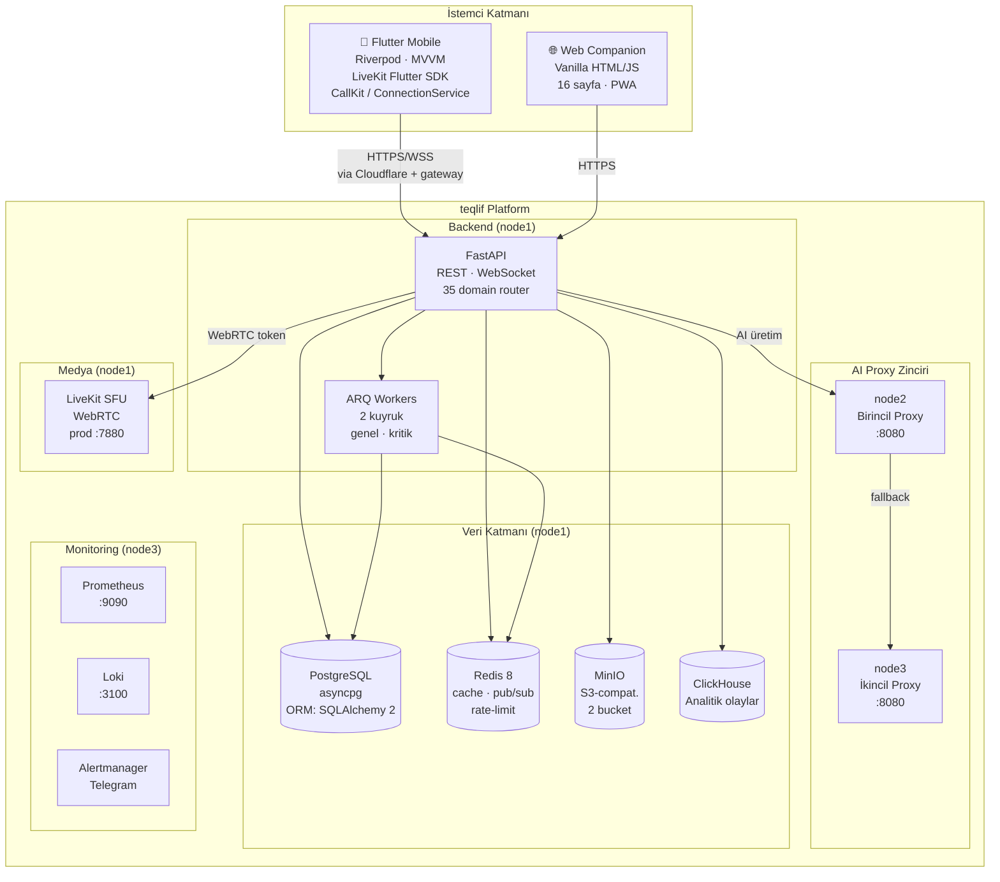
```mermaid
flowchart TB
    subgraph CLIENT["İstemci Katmanı"]
        MOB["📱 Flutter Mobile\nRiverpod · MVVM\nLiveKit Flutter SDK\nCallKit / ConnectionService"]
        WEB["🌐 Web Companion\nVanilla HTML/JS\n16 sayfa · PWA"]
    end

    subgraph PLATFORM["teqlif Platform"]
        subgraph BACKEND["Backend (node1)"]
            API["FastAPI\nREST · WebSocket\n35 domain router"]
            WORKER["ARQ Workers\n2 kuyruk\ngenel · kritik"]
        end
        subgraph AIPROXY["AI Proxy Zinciri"]
            N2P["node2\nBirincil Proxy\n:8080"]
            N3P["node3\nİkincil Proxy\n:8080"]
        end
        subgraph DATA["Veri Katmanı (node1)"]
            PG[("PostgreSQL\nasyncpg\nORM: SQLAlchemy 2")]
            RD[("Redis 8\ncache · pub/sub\nrate-limit")]
            MN[("MinIO\nS3-compat.\n2 bucket")]
            CH[("ClickHouse\nAnalitik olaylar")]
        end
        subgraph MEDIA["Medya (node1)"]
            LK["LiveKit SFU\nWebRTC\nprod :7880"]
        end
        subgraph MONITORING["Monitoring (node3)"]
            PROM["Prometheus\n:9090"]
            LOKI["Loki\n:3100"]
            ALERT["Alertmanager\nTelegram"]
        end
    end

    MOB -->|"HTTPS/WSS\nvia Cloudflare + gateway"| API
    WEB -->|"HTTPS"| API
    API --> WORKER
    API -->|"AI üretim"| N2P
    N2P -->|"fallback"| N3P
    API --> PG
    API --> RD
    API --> MN
    API --> CH
    API -->|"WebRTC token"| LK
    WORKER --> PG
    WORKER --> RD
```

### Seviye 2 — Backend İç Yapısı

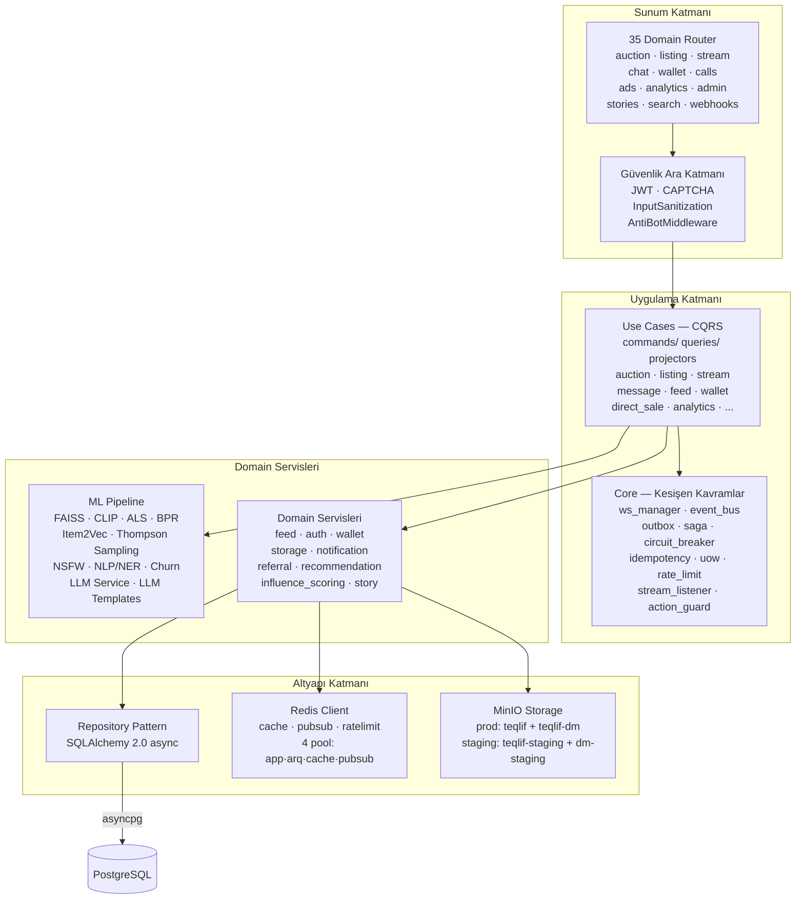
```mermaid
flowchart TB
    subgraph PRES["Sunum Katmanı"]
        ROUTERS["35 Domain Router\nauction · listing · stream\nchat · wallet · calls\nads · analytics · admin\nstories · search · webhooks"]
        SEC["Güvenlik Ara Katmanı\nJWT · CAPTCHA\nInputSanitization\nAntiBotMiddleware"]
    end

    subgraph APP["Uygulama Katmanı"]
        UC["Use Cases — CQRS\ncommands/ queries/ projectors\nauction · listing · stream\nmessage · feed · wallet\ndirect_sale · analytics · ..."]
        CORE["Core — Kesişen Kavramlar\nws_manager · event_bus\noutbox · saga · circuit_breaker\nidempotency · uow · rate_limit\nstream_listener · action_guard"]
    end

    subgraph DOM["Domain Servisleri"]
        ML["ML Pipeline\nFAISS · CLIP · ALS · BPR\nItem2Vec · Thompson Sampling\nNSFW · NLP/NER · Churn\nLLM Service · LLM Templates"]
        SVC["Domain Servisleri\nfeed · auth · wallet\nstorage · notification\nreferral · recommendation\ninfluence_scoring · story"]
    end

    subgraph INFRA["Altyapı Katmanı"]
        REPO["Repository Pattern\nSQLAlchemy 2.0 async"]
        REDIS_C["Redis Client\ncache · pubsub · ratelimit\n4 pool: app·arq·cache·pubsub"]
        STORE["MinIO Storage\nprod: teqlif + teqlif-dm\nstaging: teqlif-staging + dm-staging"]
    end

    ROUTERS --> SEC
    SEC --> UC
    UC --> CORE
    UC --> ML
    UC --> SVC
    SVC --> REPO
    SVC --> REDIS_C
    SVC --> STORE
    REPO -->|"asyncpg"| PG[("PostgreSQL")]
```

### Backend Modül Özeti

35 Router — tam liste

| Modül | Router Dosyası | Temel Sorumluluk |
|---|---|---|
| Auction | `auction.py` | Teklif akışı, açık artırma başlatma/bitirme, winner |
| Listing | `listings.py` | İlan CRUD, AI açıklama, görüntülenme |
| Stream | `streams.py` | Canlı yayın başlatma/bitirme, izleyici yönetimi |
| Chat | `chat.py` | Canlı yayın içi sohbet |
| Messages | `messages.py` | Birebir DM thread'leri |
| Wallet | `wallet.py` | Tuci bakiye, işlem geçmişi |
| Calls | `calls.py` | VoIP arama başlatma/kabul/ret, sinyal |
| Direct Sale | `direct_sales.py` | Teklif/kabul/ret akışı |
| Stories | `stories.py` | Hikaye oluşturma/görüntüleme |
| Feed | `feed.py` | Kişiselleştirilmiş ilan akışı |
| Analytics | `analytics.py` | Satıcı dashboard metrikleri |
| Ads | `ads.py` | Reklam kampanyası yönetimi |
| Auth | `auth.py` | Kayıt, giriş, refresh, OAuth |
| Admin | `admin_data.py`, `admin_auth.py` | Moderasyon, içerik onayı |
| Search | `search.py` | Tam metin + vektör arama |
| Webhooks | `webhooks.py` | LiveKit room event hook'ları |

---

## 6. Çalışma Zamanı Görünümü

### 6.1 Gerçek Zamanlı Teklif Akışı

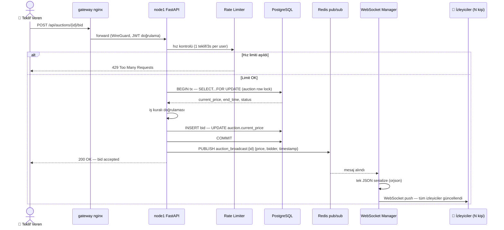
```mermaid
sequenceDiagram
    actor Bidder as 📱 Teklif Veren
    participant GW as gateway nginx
    participant API as node1 FastAPI
    participant DEF as Rate Limiter
    participant PG as PostgreSQL
    participant RD as Redis pub/sub
    participant WS as WebSocket Manager
    participant Viewers as 📱 İzleyiciler (N kişi)

    Bidder->>GW: POST /api/auctions/{id}/bid
    GW->>API: forward (WireGuard, JWT doğrulama)
    API->>DEF: hız kontrolü (1 teklif/3s per user)
    alt Hız limiti aşıldı
        DEF-->>Bidder: 429 Too Many Requests
    else Limit OK
        API->>PG: BEGIN tx — SELECT...FOR UPDATE (auction row lock)
        PG-->>API: current_price, end_time, status
        API->>API: iş kuralı doğrulaması
        API->>PG: INSERT bid — UPDATE auction.current_price
        API->>PG: COMMIT
        API->>RD: PUBLISH auction_broadcast:{id} {price, bidder, timestamp}
        API-->>Bidder: 200 OK — bid accepted
        RD-->>WS: mesaj alındı
        WS->>WS: tek JSON serialize (orjson)
        WS->>Viewers: WebSocket push — tüm izleyiciler güncellendi
    end
```

### 6.2 AI Açıklama Üretimi — Fallback Zinciri

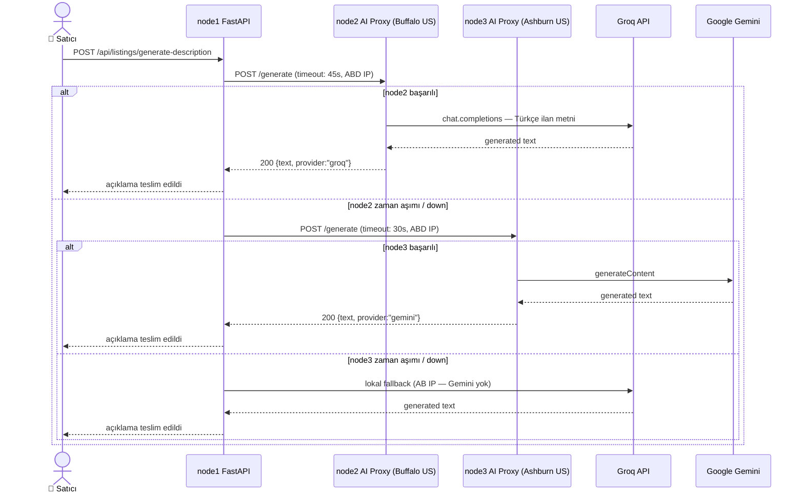
```mermaid
sequenceDiagram
    actor User as 📱 Satıcı
    participant API as node1 FastAPI
    participant N2 as node2 AI Proxy (Buffalo US)
    participant N3 as node3 AI Proxy (Ashburn US)
    participant GROQ as Groq API
    participant GEM as Google Gemini

    User->>API: POST /api/listings/generate-description
    API->>N2: POST /generate (timeout: 45s, ABD IP)
    alt node2 başarılı
        N2->>GROQ: chat.completions — Türkçe ilan metni
        GROQ-->>N2: generated text
        N2-->>API: 200 {text, provider:"groq"}
        API-->>User: açıklama teslim edildi
    else node2 zaman aşımı / down
        API->>N3: POST /generate (timeout: 30s, ABD IP)
        alt node3 başarılı
            N3->>GEM: generateContent
            GEM-->>N3: generated text
            N3-->>API: 200 {text, provider:"gemini"}
            API-->>User: açıklama teslim edildi
        else node3 zaman aşımı / down
            API->>GROQ: lokal fallback (AB IP — Gemini yok)
            GROQ-->>API: generated text
            API-->>User: açıklama teslim edildi
        end
    end
```

### 6.3 WebSocket Yayın Fan-out

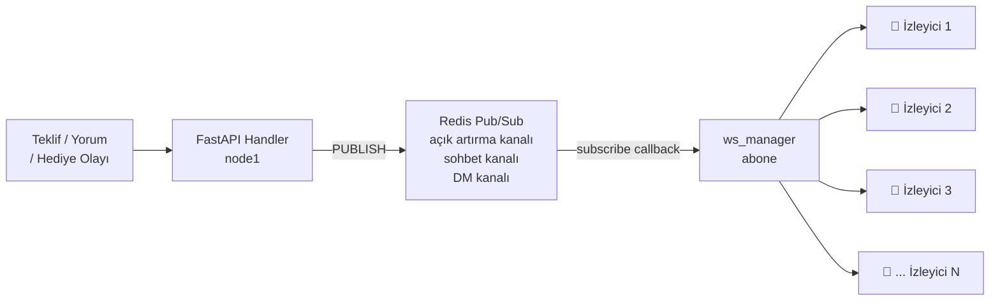
```mermaid
flowchart LR
    BID["Teklif / Yorum\n/ Hediye Olayı"]
    API["FastAPI Handler\nnode1"]
    CH["Redis Pub/Sub\naçık artırma kanalı\nsohbet kanalı\nDM kanalı"]
    WS["ws_manager\nabone"]

    BID --> API
    API -->|"PUBLISH"| CH
    CH -->|"subscribe callback"| WS
    WS --> V1["📱 İzleyici 1"]
    WS --> V2["📱 İzleyici 2"]
    WS --> V3["📱 İzleyici 3"]
    WS --> VN["📱 ... İzleyici N"]
```

> **Not:** Her broadcast için JSON tek kez üretilir (`orjson`) ve tüm WebSocket bağlantılarına ham bytes olarak gönderilir. Kanallar: `auction_broadcast:{id}`, `chat:{stream_id}`, `dm:{thread_id}`, `moderation:{stream_id}`.

### 6.4 Kullanıcı Kimlik Doğrulama Akışı

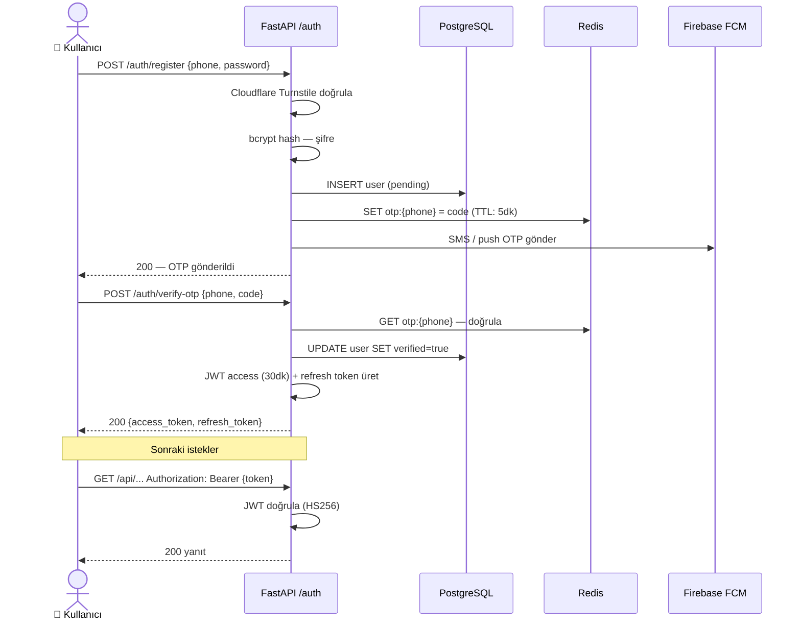
```mermaid
sequenceDiagram
    actor User as 📱 Kullanıcı
    participant API as FastAPI /auth
    participant PG as PostgreSQL
    participant RD as Redis
    participant FCM as Firebase FCM

    User->>API: POST /auth/register {phone, password}
    API->>API: Cloudflare Turnstile doğrula
    API->>API: bcrypt hash — şifre
    API->>PG: INSERT user (pending)
    API->>RD: SET otp:{phone} = code (TTL: 5dk)
    API->>FCM: SMS / push OTP gönder
    API-->>User: 200 — OTP gönderildi

    User->>API: POST /auth/verify-otp {phone, code}
    API->>RD: GET otp:{phone} — doğrula
    API->>PG: UPDATE user SET verified=true
    API->>API: JWT access (30dk) + refresh token üret
    API-->>User: 200 {access_token, refresh_token}

    Note over User,API: Sonraki istekler
    User->>API: GET /api/... Authorization: Bearer {token}
    API->>API: JWT doğrula (HS256)
    API-->>User: 200 yanıt
```

---

## 7. Dağıtım Görünümü

### 7.1 Dört Node WireGuard Mesh (Scale V1.3)

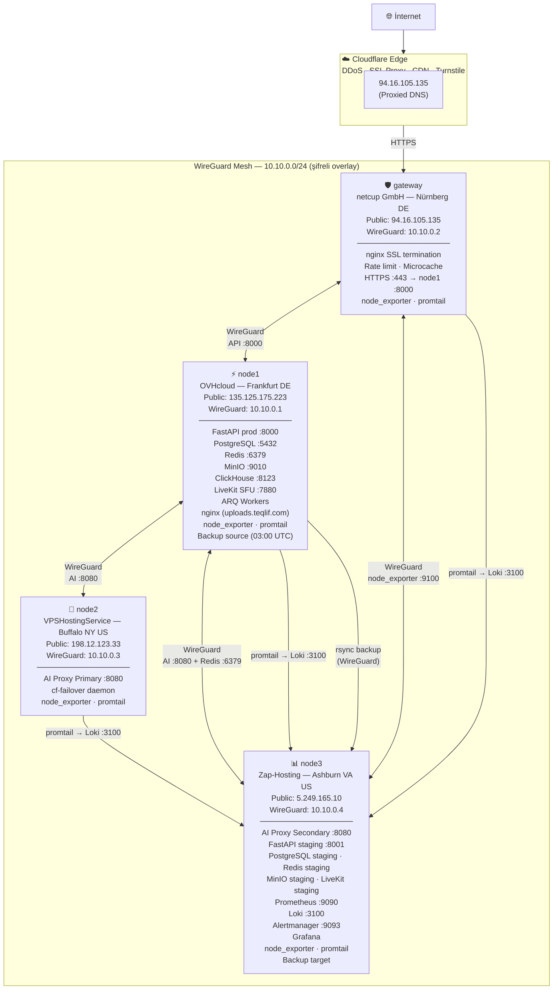
```mermaid
flowchart TB
    INET["🌐 İnternet"]

    subgraph CF_EDGE["☁️ Cloudflare Edge\nDDoS · SSL Proxy · CDN · Turnstile"]
        CF_NODE["94.16.105.135\n(Proxied DNS)"]
    end

    subgraph WG_MESH["WireGuard Mesh — 10.10.0.0/24 (şifreli overlay)"]
        GW["🛡️ gateway\nnetcup GmbH — Nürnberg DE\nPublic: 94.16.105.135\nWireGuard: 10.10.0.2\n─────────────────\nnginx SSL termination\nRate limit · Microcache\nHTTPS :443 → node1 :8000\nnode_exporter · promtail"]

        N1["⚡ node1\nOVHcloud — Frankfurt DE\nPublic: 135.125.175.223\nWireGuard: 10.10.0.1\n─────────────────\nFastAPI prod :8000\nPostgreSQL :5432\nRedis :6379\nMinIO :9010\nClickHouse :8123\nLiveKit SFU :7880\nARQ Workers\nnginx (uploads.teqlif.com)\nnode_exporter · promtail\nBackup source (03:00 UTC)"]

        N2["🤖 node2\nVPSHostingService — Buffalo NY US\nPublic: 198.12.123.33\nWireGuard: 10.10.0.3\n─────────────────\nAI Proxy Primary :8080\ncf-failover daemon\nnode_exporter · promtail"]

        N3["📊 node3\nZap-Hosting — Ashburn VA US\nPublic: 5.249.165.10\nWireGuard: 10.10.0.4\n─────────────────\nAI Proxy Secondary :8080\nFastAPI staging :8001\nPostgreSQL staging · Redis staging\nMinIO staging · LiveKit staging\nPrometheus :9090\nLoki :3100\nAlertmanager :9093\nGrafana\nnode_exporter · promtail\nBackup target"]
    end

    INET --> CF_EDGE
    CF_EDGE -->|"HTTPS"| GW
    GW <-->|"WireGuard\nAPI :8000"| N1
    N1 <-->|"WireGuard\nAI :8080"| N2
    N1 <-->|"WireGuard\nAI :8080 + Redis :6379"| N3
    GW <-->|"WireGuard\nnode_exporter :9100"| N3
    N1 -->|"promtail → Loki :3100"| N3
    N2 -->|"promtail → Loki :3100"| N3
    GW -->|"promtail → Loki :3100"| N3
    N1 -->|"rsync backup\n(WireGuard)"| N3
```

### 7.2 Trafik Akışı

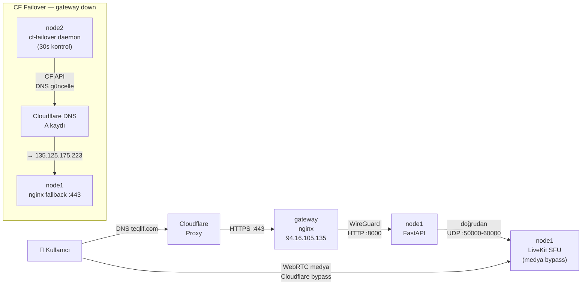
```mermaid
flowchart LR
    USER["📱 Kullanıcı"] -->|"DNS teqlif.com"| CF["Cloudflare\nProxy"]
    CF -->|"HTTPS :443"| GW_NGINX["gateway\nnginx\n94.16.105.135"]

    GW_NGINX -->|"WireGuard\nHTTP :8000"| API["node1\nFastAPI"]
    API -->|"doğrudan\nUDP :50000-60000"| LK["node1\nLiveKit SFU\n(medya bypass)"]

    USER -->|"WebRTC medya\nCloudflare bypass"| LK

    subgraph FAILOVER["CF Failover — gateway down"]
        CF_DNS["Cloudflare DNS\nA kaydı"]
        DAEMON["node2\ncf-failover daemon\n(30s kontrol)"]
        DAEMON -->|"CF API\nDNS güncelle"| CF_DNS
        CF_DNS -->|"→ 135.125.175.223"| NODE1_FB["node1\nnginx fallback :443"]
    end
```

### 7.3 Servis Dağılımı

| Servis | node1 | gateway | node2 | node3 |
|---|---|---|---|---|
| FastAPI prod (:8000) | ✅ | — | — | — |
| FastAPI staging (:8001) | — | — | — | ✅ |
| PostgreSQL (prod) | ✅ | — | — | — |
| PostgreSQL (staging) | — | — | — | ✅ |
| Redis (prod) | ✅ | — | — | — |
| Redis (staging) | — | — | — | ✅ |
| MinIO (prod) | ✅ | — | — | — |
| MinIO (staging) | — | — | — | ✅ |
| ClickHouse | ✅ | — | — | — |
| LiveKit SFU (prod) | ✅ | — | — | — |
| LiveKit SFU (staging) | — | — | — | ✅ |
| ARQ Workers | ✅ | — | — | ✅ (staging) |
| AI Proxy | — | — | ✅ (birincil) | ✅ (ikincil) |
| nginx (edge proxy) | — | ✅ | — | — |
| nginx (uploads) | ✅ | — | — | ✅ (staging) |
| nginx (fallback :443) | ✅ | — | — | — |
| cf-failover daemon | — | — | ✅ | — |
| Prometheus | — | — | — | ✅ |
| Loki | — | — | — | ✅ |
| Alertmanager | — | — | — | ✅ |
| Grafana | — | — | — | ✅ |
| node_exporter | ✅ | ✅ | ✅ | ✅ |
| promtail | ✅ | ✅ | ✅ | ✅ |
| WireGuard | 10.10.0.1 | 10.10.0.2 | 10.10.0.3 | 10.10.0.4 |

### 7.4 Donanım Özeti

| Node | Sağlayıcı | Konum | CPU | RAM | Disk | Ağ |
|---|---|---|---|---|---|---|
| node1 | OVHcloud | Frankfurt DE | 6 çekirdek @ 3.09 GHz | 11.4 GB | 98 GB NVMe | 2 Gbps / Unlimited |
| gateway | netcup GmbH | Nürnberg DE | 2 vCore | 2 GB | 60 GB SSD | 1 Gbps / Unlimited* |
| node2 | VPSHostingService | Buffalo NY US | 1 vCore | 1 GB | 25 GB SSD | 1 Gbps Shared |
| node3 | Zap-Hosting | Ashburn VA US | 2 vCore | 3.2 GB + 4 GB Swap | 50 GB SSD | 1 Gbps / 33 TB/ay |

> *gateway: 24h ortalaması 100 Mbps aşılırsa geçici throttle.

---

## 8. Kesişen Kavramlar

### 8.1 Güvenlik Katmanları

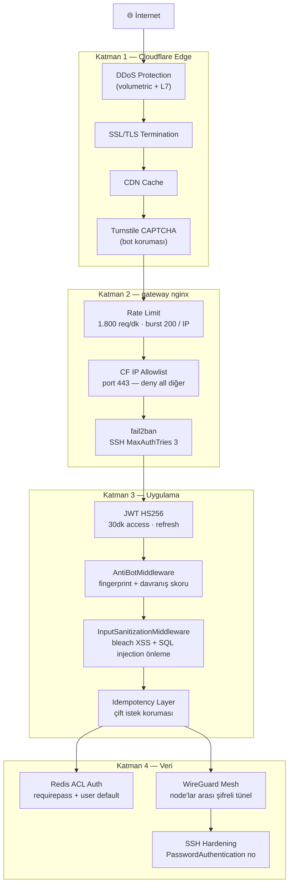
```mermaid
flowchart TB
    INTERNET["🌐 İnternet"]

    subgraph L1["Katman 1 — Cloudflare Edge"]
        CF_DDOS["DDoS Protection\n(volumetric + L7)"]
        CF_SSL["SSL/TLS Termination"]
        CF_CDN["CDN Cache"]
        CF_CAP["Turnstile CAPTCHA\n(bot koruması)"]
    end

    subgraph L2["Katman 2 — gateway nginx"]
        RATE_LIM["Rate Limit\n1.800 req/dk · burst 200 / IP"]
        CF_IP["CF IP Allowlist\nport 443 — deny all diğer"]
        FAIL2BAN_GW["fail2ban\nSSH MaxAuthTries 3"]
    end

    subgraph L3["Katman 3 — Uygulama"]
        JWT_AUTH["JWT HS256\n30dk access · refresh"]
        ANTIBOT["AntiBotMiddleware\nfingerprint + davranış skoru"]
        SANITIZE["InputSanitizationMiddleware\nbleach XSS + SQL injection önleme"]
        IDEM["Idempotency Layer\nçift istek koruması"]
    end

    subgraph L4["Katman 4 — Veri"]
        REDIS_AUTH["Redis ACL Auth\nrequirepass + user default"]
        WG_NET["WireGuard Mesh\nnode'lar arası şifreli tünel"]
        SSH_HARD["SSH Hardening\nPasswordAuthentication no"]
    end

    INTERNET --> CF_DDOS --> CF_SSL --> CF_CDN --> CF_CAP
    CF_CAP --> RATE_LIM --> CF_IP --> FAIL2BAN_GW
    FAIL2BAN_GW --> JWT_AUTH --> ANTIBOT --> SANITIZE --> IDEM
    IDEM --> REDIS_AUTH
    IDEM --> WG_NET
    WG_NET --> SSH_HARD
```

### 8.2 Gözlemlenebilirlik Yığını

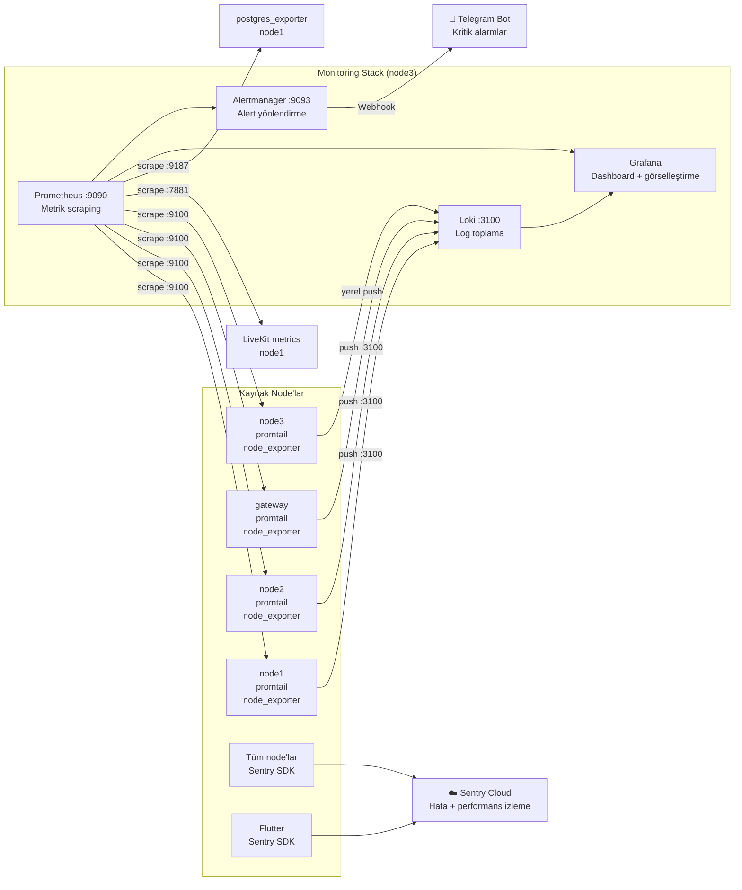
```mermaid
flowchart LR
    subgraph SOURCES["Kaynak Node'lar"]
        N1_LOGS["node1\npromtail\nnode_exporter"]
        N2_LOGS["node2\npromtail\nnode_exporter"]
        GW_LOGS["gateway\npromtail\nnode_exporter"]
        N3_SELF["node3\npromtail\nnode_exporter"]
        APP_SENTRY["Tüm node'lar\nSentry SDK"]
        FLUTTER_S["Flutter\nSentry SDK"]
    end

    subgraph NODE3["Monitoring Stack (node3)"]
        LOKI["Loki :3100\nLog toplama"]
        PROM["Prometheus :9090\nMetrik scraping"]
        ALERT["Alertmanager :9093\nAlert yönlendirme"]
        GRAFANA["Grafana\nDashboard + görselleştirme"]
    end

    SENTRY_CLOUD["☁️ Sentry Cloud\nHata + performans izleme"]
    TELEGRAM["📲 Telegram Bot\nKritik alarmlar"]

    N1_LOGS -->|"push :3100"| LOKI
    N2_LOGS -->|"push :3100"| LOKI
    GW_LOGS -->|"push :3100"| LOKI
    N3_SELF -->|"yerel push"| LOKI

    PROM -->|"scrape :9100"| N1_LOGS
    PROM -->|"scrape :9100"| N2_LOGS
    PROM -->|"scrape :9100"| GW_LOGS
    PROM -->|"scrape :9100"| N3_SELF
    PROM -->|"scrape :7881"| LIVEKIT["LiveKit metrics\nnode1"]
    PROM -->|"scrape :9187"| PG_EXP["postgres_exporter\nnode1"]

    LOKI --> GRAFANA
    PROM --> GRAFANA
    PROM --> ALERT
    ALERT -->|"Webhook"| TELEGRAM

    APP_SENTRY --> SENTRY_CLOUD
    FLUTTER_S --> SENTRY_CLOUD
```

### 8.3 Hata İşleme

teqlif'te hata işleme çok katmanlıdır:

| Katman | Pattern | Uygulama |
|---|---|---|
| **Mobil** | `Result<T, AppException>` | Her servis çağrısı `Result` döner; ViewModel'de `when(success/error)` |
| **API** | `HTTPException` + `AppException` | Global exception handler; her hata lokalize edilen mesaj içerir |
| **Arka plan iş** | ARQ retry + dead-letter | `max_tries=3`, `retry_on` whitelist; kritik iş kritik kuyruğa yönlenir |
| **WebSocket** | Yeniden bağlanma mantığı | Flutter'da exponential backoff; heartbeat timeout sonrası otomatik reconnect |
| **AI Proxy** | Fallback zinciri | node2 → node3 → node1 lokal; her timeout bağımsız |
| **Veri tabanı** | UoW + circuit breaker | `circuit_breaker.py` art arda hatalarda DB erişimini devre dışı bırakır |

### 8.4 Önbellekleme Stratejisi

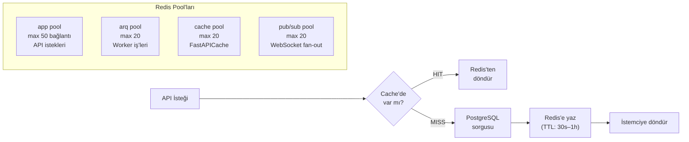
```mermaid
flowchart LR
    REQ["API İsteği"] --> CHECK{"Cache'de\nvar mı?"}
    CHECK -->|"HIT"| RET["Redis'ten\ndöndür"]
    CHECK -->|"MISS"| DB["PostgreSQL\nsorgusu"]
    DB --> WRITE["Redis'e yaz\n(TTL: 30s–1h)"]
    WRITE --> RET2["İstemciye döndür"]

    subgraph POOLS["Redis Pool'ları"]
        APP_P["app pool\nmax 50 bağlantı\nAPI istekleri"]
        ARQ_P["arq pool\nmax 20\nWorker iş'leri"]
        CACHE_P["cache pool\nmax 20\nFastAPICache"]
        PUBSUB_P["pub/sub pool\nmax 20\nWebSocket fan-out"]
    end
```

| Cache Türü | TTL | Kullanım |
|---|---|---|
| İlan listesi | 5s (nginx microcache) | Pasif tarama — gateway seviyesinde |
| Kullanıcı profili | 30s | FastAPICache + Redis |
| Feed önerileri | 1 saat | `foryou_worker.py` mget pipeline |
| i18n çeviri paketleri | Kalıcı (OTA güncelleme'ye kadar) | `sync_translations.py` ile sıfırlanır |
| Rate limit sayaçları | pencere süresince | Redis atomic INCR |

### 8.5 OTA Yerelleştirme

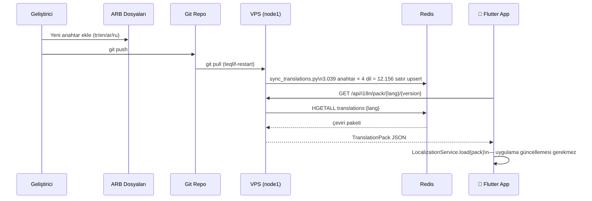
```mermaid
sequenceDiagram
    participant DEV as Geliştirici
    participant ARB as ARB Dosyaları
    participant GIT as Git Repo
    participant VPS as VPS (node1)
    participant RD as Redis
    participant APP as 📱 Flutter App

    DEV->>ARB: Yeni anahtar ekle (tr/en/ar/ru)
    DEV->>GIT: git push
    GIT->>VPS: git pull (teqlif-restart)
    VPS->>RD: sync_translations.py\n3.039 anahtar × 4 dil = 12.156 satır upsert
    APP->>VPS: GET /api/i18n/pack/{lang}/{version}
    VPS->>RD: HGETALL translations:{lang}
    RD-->>VPS: çeviri paketi
    VPS-->>APP: TranslationPack JSON
    APP->>APP: LocalizationService.load(pack)\n— uygulama güncellemesi gerekmez
```

---

## 9. Mimari Kararlar

| # | Karar | Seçilen | Reddedilen | Gerekçe |
|---|---|---|---|---|
| ADR-01 | Backend framework | **FastAPI** | Django REST, Flask | Async-native; otomatik OpenAPI; tip güvenliği |
| ADR-02 | Görev kuyruğu | **ARQ** | Celery, RQ | Python async; Redis üzerinde çalışır (ekstra broker yok); iki öncelik kuyruğu |
| ADR-03 | WebSocket dağıtımı | **Redis pub/sub** | Kafka, NATS | Düşük gecikme; zaten Redis kullanılıyor; fan-out karmaşıklığı yönetilebilir |
| ADR-04 | Mobil framework | **Flutter** | React Native | iOS CallKit + Android ConnectionService tam desteği; LiveKit Flutter SDK |
| ADR-05 | WebRTC SFU | **LiveKit (self-hosted)** | Twilio, Agora | Self-hosted → maliyet; ABD + AB sunucusu; açık kaynak |
| ADR-06 | Altyapı koordinasyonu | **WireGuard mesh** | VPN hizmetleri, Tailscale | Kernel seviyesi; düşük overhead; 4 node tam mesh |
| ADR-07 | AI proxy mimarisi | **ABD IP proxy zinciri** | node1 doğrudan çağrı | Groq/Gemini AB IP kısıtlarını aşar; fallback dayanıklılığı |
| ADR-08 | State yönetimi (mobil) | **Riverpod** | Provider, Bloc, GetX | Compile-time güvenli; DI entegrasyonu; kod üretimi |
| ADR-09 | Veritabanı | **PostgreSQL + asyncpg** | MySQL, MongoDB | ACID; row-lock (açık artırma); pgvector (ML arama) |
| ADR-10 | Deploy birimi | **Monolith + systemd** | Kubernetes, Docker Swarm | 4 VPS için aşırı karmaşıklık; `teqlif-restart` tek komut deploy |
| ADR-11 | Analytics | **ClickHouse ayrı** | PostgreSQL aynı tablo | Analitik sorgular OLTP'yi yavaşlatmaz; kolon tabanlı sıkıştırma |
| ADR-12 | Outbox pattern | **auction_outbox + commerce_outbox** | Doğrudan async event | Servis yeniden başlangıcında olay kaybı önlenir |

---

## 10. Kalite Gereksinimleri

### Kalite Ağacı

```mermaid
flowchart TB
    Q["teqlif\nKalite Hedefleri"]

    Q --> AVA["⚡ Erişilebilirlik"]
    Q --> PERF["🚀 Performans"]
    Q --> SEC["🔒 Güvenlik"]
    Q --> OBS["👁️ Gözlemlenebilirlik"]
    Q --> MAINT["🔧 Sürdürülebilirlik"]

    AVA --> A1["CF Failover\n30s DNS geçişi"]
    AVA --> A2["fail2ban\nSSH koruması"]
    AVA --> A3["Redis Sentinel\n(V1.4 adayı)"]

    PERF --> P1["Teklif fan-out\n< 100ms"]
    PERF --> P2["Nginx microcache\n5s — pasif tarama"]
    PERF --> P3["Feed önbelleği\n1h Redis TTL"]
    PERF --> P4["WebSocket\norjson tek serialize"]

    SEC --> S1["Cloudflare DDoS\n+ Turnstile"]
    SEC --> S2["JWT HS256\n+ AntiBotMiddleware"]
    SEC --> S3["Redis ACL Auth\n+ WireGuard"]
    SEC --> S4["CF API Token\nDNS:Edit scope only"]

    OBS --> O1["Prometheus\n4-node scrape"]
    OBS --> O2["Loki\nmerkezi log"]
    OBS --> O3["Alertmanager\nTelegram alarm"]
    OBS --> O4["Sentry\nbackend + Flutter"]

    MAINT --> M1["teqlif-restart\ntek komut deploy"]
    MAINT --> M2["ExecStartPre\nalembic + sync_main"]
    MAINT --> M3["Wants/PartOf/BindsTo\nsistemik restart"]
    MAINT --> M4["Bootstrap scripts\nidempotent kurulum"]
```

### Kalite Senaryoları

| Senaryo | Uyaran | Beklenen Yanıt | Ölçüm |
|---|---|---|---|
| **S1** — gateway çöküşü | VPS erişilemez | cf-failover DNS A → node1 | < 30 saniye |
| **S2** — teklif tüyosu (spike) | 100 eşzamanlı teklif | Rate limit + row-lock; sıralı işleme | 0 yarış koşulu |
| **S3** — node2 AI proxy down | POST /generate timeout | node3'e fallback | < 75 saniye toplam gecikme |
| **S4** — DDoS saldırısı | GB/s volumetric trafik | Cloudflare mitigasyon; gateway etkilenmez | 0 origin hit |
| **S5** — deploy (rolling restart) | `sudo teqlif-restart` | git pull + migration + restart < 60s | < 1 dk kesinti |
| **S6** — disk doldu (node1) | pg_dump büyümesi | node3'e rsync + lokal 3 gün retention | Veri kaybı yok |
| **S7** — yeni dil eklendi | ARB dosyası güncellendi | OTA sync — uygulama güncellemesi yok | < 30s yayılma |

---

## 11. Riskler ve Teknik Borç

| # | Risk / Borç | Etki | Olasılık | Azaltma |
|---|---|---|---|---|
| R-01 | **Redis SPOF — node1** | Cache + pub/sub + rate-limit hepsinin kaybı | Orta | Redis Sentinel replica (V1.4 adayı) |
| R-02 | **node2 1 GB RAM** | AI proxy OOM → servis çöküşü | Düşük-Orta | node3 ikincil proxy; `MemoryMax=768M` systemd limiti |
| R-03 | **node3 panel girişi (90 gün)** | Panel girişi yapılmazsa servis askıya alınabilir | Düşük | Takvim hatırlatıcısı — sonraki: ~2026-12-10 |
| R-04 | **gateway 100 Mbps throttle** | Yüksek trafik döneminde gecikme artışı | Orta (yüksek trafikte) | LiveKit medya direkt node1'den; CloudFront CDN seçeneği |
| R-05 | **Staging alembic migration zinciri** | `alembic upgrade head` fresh DB'de kırık | Yüksek | pg_dump --schema-only + alembic stamp head geçici çözüm |
| R-06 | **FastAPICache key invalidation** | Stale veri gösterimi | Düşük | Manuel invalidation; kısa TTL'ler |
| R-07 | **ClickHouse yedek yok** | Analitik veri kaybı | Orta | Backup timer ekleme (V1.4 adayı) |
| R-08 | **Tek coğrafi bölge (prod)** | Frankfurt DC arızası tüm prod'u etkiler | Çok Düşük | node3'e staging → prod geçiş prosedürü yazılmalı |

---

## 12. Sözlük

| Terim | Açıklama |
|---|---|
| **Tuci** | teqlif'in platform içi sanal para birimi; hediye, teklif ve premium içerik için kullanılır |
| **SwipeLive** | TikTok benzeri dikey kaydırma ile canlı yayınlar arasında geçiş; ML sıralamalı akış |
| **SFU** | Selective Forwarding Unit — WebRTC medya sunucusu; yeniden kodlama yapmadan RTP paketlerini yönlendirir |
| **WireGuard** | UDP tabanlı modern VPN protokolü; teqlif'te node'lar arası şifreli overlay ağı |
| **ARQ** | Python async görev kuyruğu — Redis üzerinde çalışır; teqlif'te iki kuyruk: `default` ve `critical` |
| **CQRS** | Command Query Responsibility Segregation — yazma ve okuma modellerini ayırır; `use_cases/commands/` ve `use_cases/queries/` |
| **UoW** | Unit of Work — tek bir iş birimi içindeki tüm veritabanı değişikliklerini yönetir |
| **Outbox** | Servis yeniden başlangıcında olay kaybını önleyen pattern; `auction_outbox` ve `commerce_outbox` |
| **OTA i18n** | Over-the-Air yerelleştirme — çeviriler uygulama güncellemesi olmadan Redis üzerinden güncellenir |
| **cf-failover** | node2'de çalışan daemon; gateway erişilemez olduğunda Cloudflare DNS A kaydını otomatik günceller |
| **promtail** | Grafana Loki log ajanı; tüm node'larda çalışır, log'ları node3:3100'e push eder |
| **CallKit / ConnectionService** | iOS / Android sistem düzeyinde arama entegrasyonu; VoIP aramaları yerel arama ekranında gösterir |
| **pgvector** | PostgreSQL vektör uzantısı; FAISS'e alternatif ML benzerlik araması için |
| **FAISS** | Facebook AI Similarity Search; ilan öneri ve semantik arama için vektör indeksi |
| **Mesh** | WireGuard'da her node'un diğer tüm node'larla doğrudan peer bağlantısı kurması |
| **Scale V1.3** | node3 eklenmesiyle getirilen mimari sürüm: AI proxy ikincil, monitoring taşıması, staging izolasyonu |

---

*`deploy/scale/V1.3/final.md` — tam kapsamlı mimari belge*

