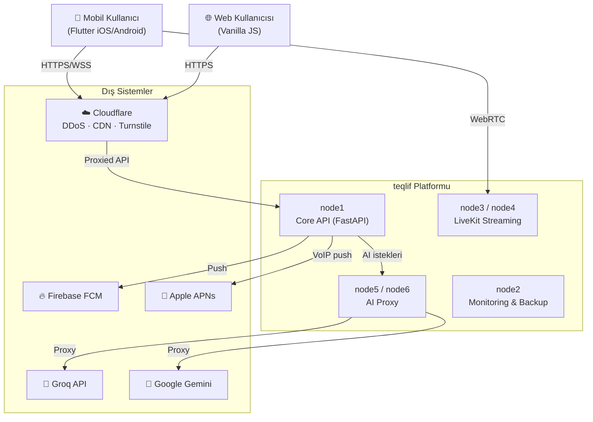
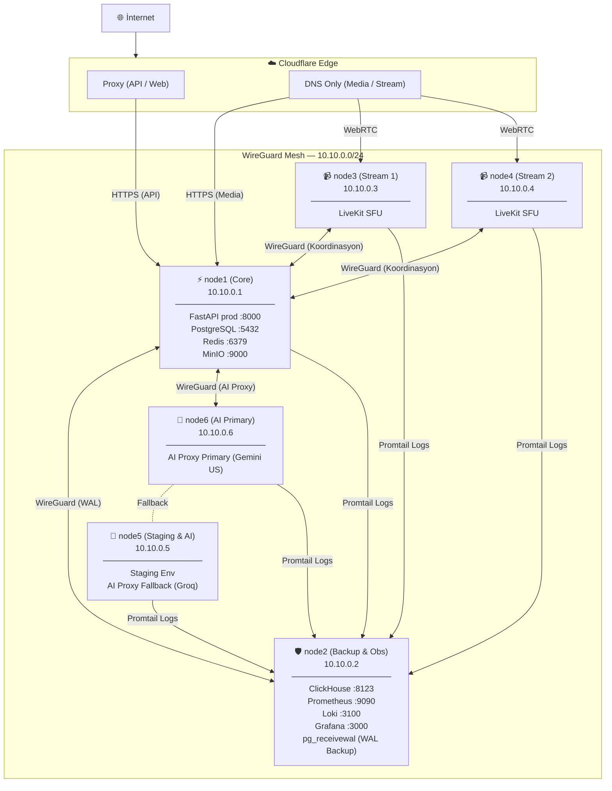
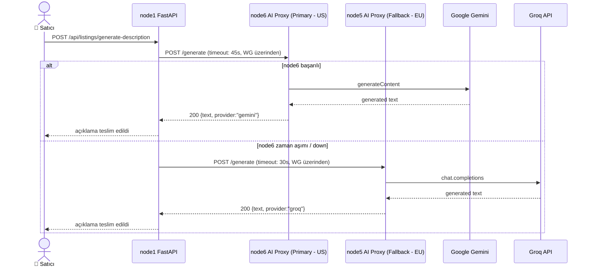

# teqlif

**Canlı yayın tabanlı C2C pazar yeri ve gerçek zamanlı açık artırma motoru**

*ARC42 Mimari Belgesi — Scale V2.1*

---

## İçindekiler

| # | Bölüm |
|---|---|
| 1 | [Giriş ve Hedefler](#1-giriş-ve-hedefler) |
| 2 | [Sistem Bağlamı ve Kapsam](#2-sistem-bağlamı-ve-kapsam) |
| 3 | [Dağıtım Görünümü (V2.1 Topoloji)](#3-dağıtım-görünümü-v21-topoloji) |
| 4 | [Node Envanteri](#4-node-envanteri) |
| 5 | [Çalışma Zamanı Görünümü](#5-çalışma-zamanı-görünümü) |
| 6 | [Ağ ve Güvenlik](#6-ağ-ve-güvenlik) |
| 7 | [Yüksek Erişilebilirlik ve Failover](#7-yüksek-erişilebilirlik-ve-failover) |

---

## 1. Giriş ve Hedefler

teqlif, Türkiye pazarına yönelik bir C2C e-ticaret platformudur. TikTok tarzı canlı yayınları, gerçek zamanlı açık artırmaları, birebir görüntülü aramaları, hikâyeleri, doğrudan satışları ve sanal para birimi (Tuci) ile bir sanal ekonomiyi tek bir mobil uygulamada birleştirir.

### Temel Özellikler

| Özellik | Açıklama |
|---|---|
| **Canlı Yayın Açık Artırması** | Satıcı kamerası açıkken izleyiciler gerçek zamanlı teklif verir; her teklif tüm izleyicilere WebSocket ile yayınlanır |
| **SwipeLive** | TikTok-benzeri dikey kaydırma arayüzü ile canlı akışlar arasında geçiş; ML sıralaması |
| **Birebir Görüntülü Arama** | WebRTC tabanlı VoIP (LiveKit SFU); iOS CallKit / Android ConnectionService entegrasyonu |
| **Tuci Ekonomisi** | Platform içi sanal para; hediye, bahşiş, teklif ve premium içerik için kullanılır |
| **AI Açıklama Üretimi** | İlan başlığından otomatik açıklama; Groq/Gemini API üzerinden ABD IP'li proxy zinciri |
| **OTA Yerelleştirme** | tr / en / ar / ru — çeviriler Redis üzerinden canlı güncellenir, uygulama güncellemesi gerekmez |

---

## 2. Sistem Bağlamı ve Kapsam

teqlif platformunun dış sistemlerle ilişkisi:

```mermaid
flowchart TB
    MOB["📱 Mobil Kullanıcı\n(Flutter iOS/Android)"]
    WEB["🌐 Web Kullanıcısı\n(Vanilla JS)"]

    subgraph TEQLIF["teqlif Platformu"]
        direction TB
        CORE["node1\nCore API (FastAPI)"]
        LK["node3 / node4\nLiveKit Streaming"]
        AI["node5 / node6\nAI Proxy"]
        OBS["node2\nMonitoring & Backup"]
    end

    subgraph EXT["Dış Sistemler"]
        CF["☁️ Cloudflare\nDDoS · CDN · Turnstile"]
        GROQ["🤖 Groq API"]
        GEM["🤖 Google Gemini"]
        FCM["🔥 Firebase FCM"]
        APNS["🍎 Apple APNs"]
    end

    MOB -->|"HTTPS/WSS"| CF
    WEB -->|"HTTPS"| CF
    CF -->|"Proxied API"| CORE
    MOB -->|"WebRTC"| LK
    CORE -->|"AI istekleri"| AI
    AI -->|"Proxy"| GROQ
    AI -->|"Proxy"| GEM
    CORE -->|"Push"| FCM
    CORE -->|"VoIP push"| APNS
```

---

## 3. Dağıtım Görünümü (V2.1 Topoloji)

### 3.1 Altı Node WireGuard Mesh

V2.1 mimarisi, gateway sunucusunu ortadan kaldırarak doğrudan Cloudflare üzerinden Node1'e trafiği yönlendirir ve 6 sunuculuk, her birinin belirli bir rolü olduğu, tam Mesh (WireGuard) bir topoloji kullanır.

```mermaid
flowchart TB
    INET["🌐 İnternet"]

    subgraph CF_EDGE["☁️ Cloudflare Edge"]
        CF_PROXY["Proxy (API / Web)"]
        CF_DNS["DNS Only (Media / Stream)"]
    end

    subgraph WG_MESH["WireGuard Mesh — 10.10.0.0/24"]
        N1["⚡ node1 (Core)\n10.10.0.1\n─────────────────\nFastAPI prod :8000\nPostgreSQL :5432\nRedis :6379\nMinIO :9000"]
        
        N2["🛡️ node2 (Backup & Obs)\n10.10.0.2\n─────────────────\nClickHouse :8123\nPrometheus :9090\nLoki :3100\nGrafana :3000\npg_receivewal (WAL Backup)"]

        N3["📹 node3 (Stream 1)\n10.10.0.3\n─────────────────\nLiveKit SFU"]
        
        N4["📹 node4 (Stream 2)\n10.10.0.4\n─────────────────\nLiveKit SFU"]

        N5["🧪 node5 (Staging & AI)\n10.10.0.5\n─────────────────\nStaging Env\nAI Proxy Fallback (Groq)"]
        
        N6["🤖 node6 (AI Primary)\n10.10.0.6\n─────────────────\nAI Proxy Primary (Gemini US)"]
    end

    INET --> CF_EDGE
    CF_PROXY -->|"HTTPS (API)"| N1
    CF_DNS -->|"HTTPS (Media)"| N1
    CF_DNS -->|"WebRTC"| N3
    CF_DNS -->|"WebRTC"| N4
    
    N1 <-->|"WireGuard (WAL)"| N2
    N1 <-->|"WireGuard (AI Proxy)"| N6
    N6 -.-|"Fallback"| N5
    N3 <-->|"WireGuard (Koordinasyon)"| N1
    N4 <-->|"WireGuard (Koordinasyon)"| N1
    
    N1 -->|"Promtail Logs"| N2
    N3 -->|"Promtail Logs"| N2
    N4 -->|"Promtail Logs"| N2
    N5 -->|"Promtail Logs"| N2
    N6 -->|"Promtail Logs"| N2
```

---

## 4. Node Envanteri

| Node | WG IP | Public IP | Rol | Sağlayıcı / Lokasyon | Donanım |
|------|-------|-----------|-----|----------------------|---------|
| **node1** | 10.10.0.1 | 193.70.46.74 | Core (App, PG, Redis, MinIO) | OVH Bare Metal / FR | 6c/12t, 32GB RAM, 2x512GB NVMe |
| **node2** | 10.10.0.2 | 135.125.223.43 | Backup, Monitoring, Analitik | OVH Bare Metal / DE | 4c/8t, 32GB RAM, 2x4TB HDD |
| **node3** | 10.10.0.3 | 51.75.74.124 | LiveKit Streaming #1 | OVH VPS / DE | 6 vCPU, 12GB RAM, 2 Gbps |
| **node4** | 10.10.0.4 | 135.125.175.223 | LiveKit Streaming #2 | OVH VPS / DE | 6 vCPU, 12GB RAM, 2 Gbps |
| **node5** | 10.10.0.5 | 45.146.252.165 | Staging + AI Secondary | ZAP VPS / DE | 4 vCPU, 8GB RAM |
| **node6** | 10.10.0.6 | 5.249.165.10 | AI Primary (Gemini US proxy) | ZAP VPS / ABD | 4 vCPU, 4GB RAM |

---

## 5. Çalışma Zamanı Görünümü

### 5.1 AI Proxy Fallback Zinciri (V2.1)

```mermaid
sequenceDiagram
    actor User as 📱 Satıcı
    participant API as node1 FastAPI
    participant N6 as node6 AI Proxy (Primary - US)
    participant N5 as node5 AI Proxy (Fallback - EU)
    participant GEM as Google Gemini
    participant GROQ as Groq API

    User->>API: POST /api/listings/generate-description
    API->>N6: POST /generate (timeout: 45s, WG üzerinden)
    alt node6 başarılı
        N6->>GEM: generateContent
        GEM-->>N6: generated text
        N6-->>API: 200 {text, provider:"gemini"}
        API-->>User: açıklama teslim edildi
    else node6 zaman aşımı / down
        API->>N5: POST /generate (timeout: 30s, WG üzerinden)
        N5->>GROQ: chat.completions
        GROQ-->>N5: generated text
        N5-->>API: 200 {text, provider:"groq"}
        API-->>User: açıklama teslim edildi
    end
```

### 5.2 LiveKit Yayın Ölçeklemesi

Kullanıcılar canlı yayın sunucularına DNS round-robin ile bağlanırlar (node3 ve node4). Bu, WebRTC yükünü birden fazla sunucuya dağıtır. Sisteme dilediği zaman 15 dakika içinde yeni bir streaming node (`node7`, `node8`) eklenebilir.

---

## 6. Ağ ve Güvenlik

- **Cloudflare Edge:** Tüm API trafiği Cloudflare CDN ve WAF'ından geçer. Bot koruması (Turnstile) burada yönetilir.
- **WireGuard İzolasyonu:** Node'lar arasındaki veri tabanı, redis ve iç servis iletişimleri (örneğin node1 -> node2 WAL gönderimi) tamamen şifreli WireGuard ağı (`10.10.0.0/24`) üzerinden gerçekleşir. Dışarıya veritabanı portu (5432) veya Redis (6379) kesinlikle açık değildir.
- **Zap-Hosting UDP Filtresi:** Node5 (Staging) üzerindeki ZAP Hosting DDoS kalkanı varsayılan WireGuard UDP paketlerini düşürdüğünden, Node5 üzerinde WireGuard 443 portundan HTTPS kılıfında geçirilir.
- **Güvenlik Katmanları:** UFW Firewall, Fail2Ban, Sadece Key-Based SSH erişimi.

---

## 7. Yüksek Erişilebilirlik ve Failover

| Bileşen | HA Durumu | Felaket Senaryosu (Disaster Recovery) |
|---------|-----------|----------------------------------------|
| **PostgreSQL (node1)** | Tek node | WAL stream ile `node2`'ye (4TB HDD) anlık yedekleniyor. Node1 çökerse, Node2 üzerindeki verilerle 0 veri kaybı (RPO: 0) ve tahmini 30dk içinde (RTO) yeni bir master ayağa kaldırılır. |
| **Redis (node1)** | Tek node | Reboot durumunda RDB yedeğinden başlar. |
| **LiveKit (node3, node4)** | Çift node | Sunuculardan biri düşerse DNS round-robin ile diğer node'dan yayınlar devam eder. İzleyici kesintisi yaşamaz. |
| **AI Proxy (node5, node6)** | Çift node | node6 (US) yanıt vermezse veya rate-limit yerse, FastAPI otomatik olarak node5'e (EU) geçer. |

---

*Bu belge, projeye ait V2.1 güncel mimarisini yansıtmaktadır.*

