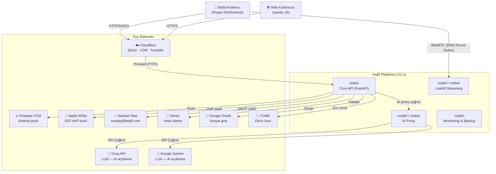
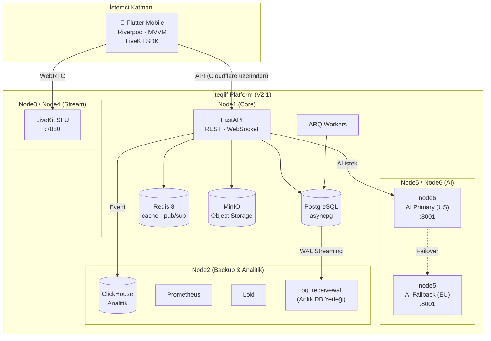
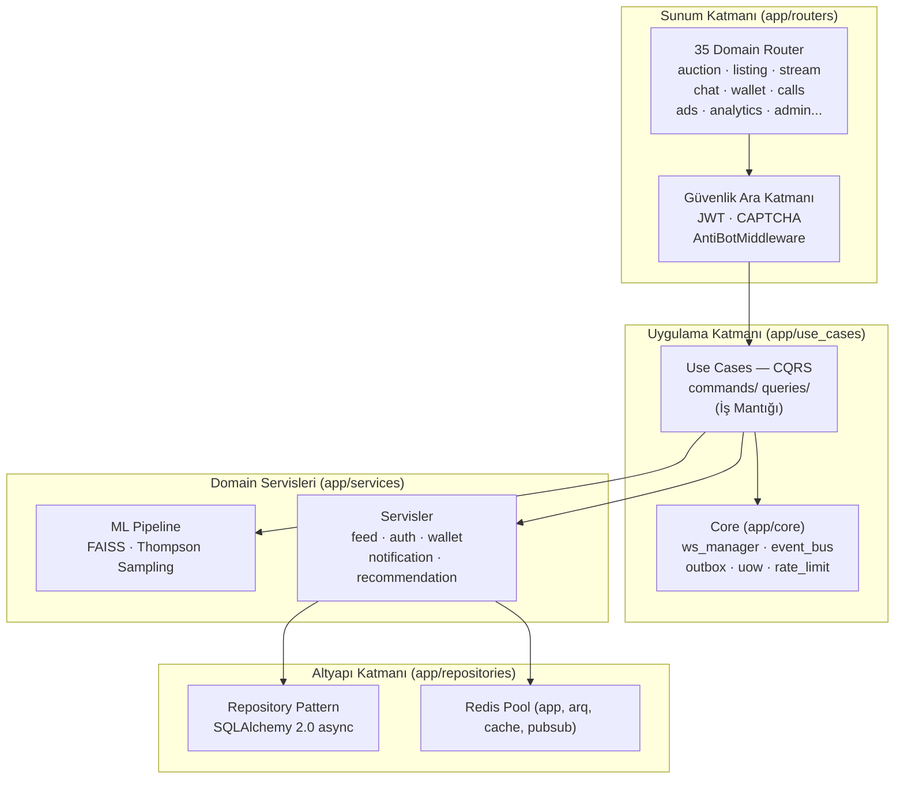
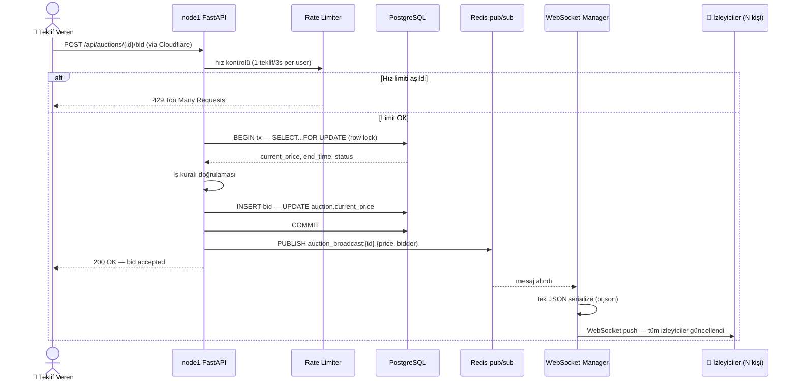
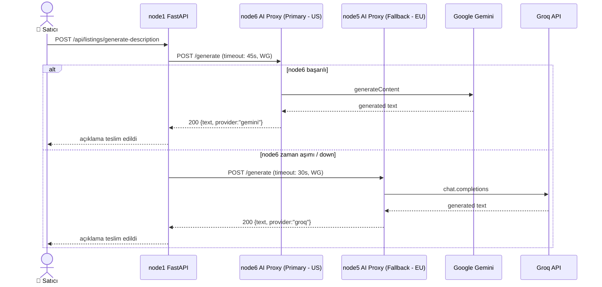
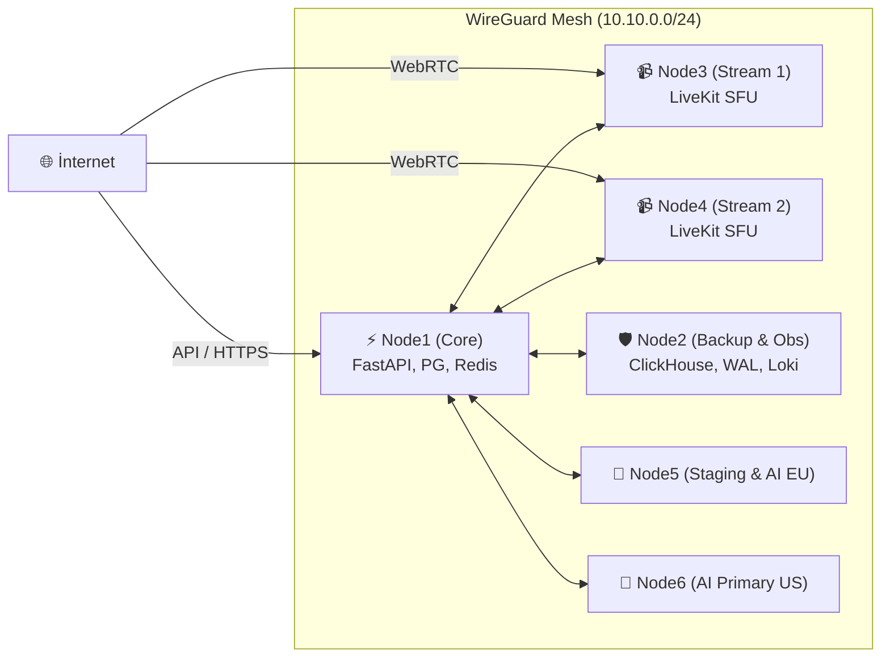
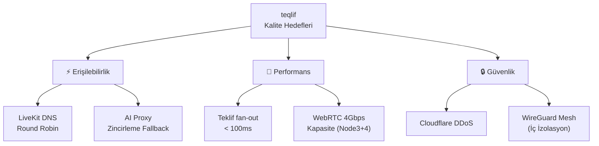

# teqlif

**Canlı yayın tabanlı C2C pazar yeri ve gerçek zamanlı açık artırma motoru**

*ARC42 Mimari Belgesi — Scale V2.1*

---

## İçindekiler

| # | Bölüm |
|---|---|
| 1 | [Giriş ve Hedefler](#1-giriş-ve-hedefler) |
| 2 | [Kısıtlar](#2-kısıtlar) |
| 3 | [Sistem Bağlamı ve Kapsam](#3-sistem-bağlamı-ve-kapsam) |
| 4 | [Çözüm Stratejisi](#4-çözüm-stratejisi) |
| 5 | [Yapı Taşları Görünümü](#5-yapı-taşları-görünümü) |
| 6 | [Çalışma Zamanı Görünümü](#6-çalışma-zamanı-görünümü) |
| 7 | [Dağıtım Görünümü (V2.1 Topoloji)](#7-dağıtım-görünümü-v21-topoloji) |
| 8 | [Kesişen Kavramlar](#8-kesişen-kavramlar) |
| 9 | [Mimari Kararlar](#9-mimari-kararlar) |
| 10 | [Kalite Gereksinimleri](#10-kalite-gereksinimleri) |
| 11 | [Riskler ve Teknik Borç](#11-riskler-ve-teknik-borç) |
| 12 | [Sözlük](#12-sözlük) |

---

## 1. Giriş ve Hedefler

teqlif, Türkiye pazarına yönelik bir C2C e-ticaret platformudur. TikTok tarzı canlı yayınları, gerçek zamanlı açık artırmaları, birebir görüntülü aramaları, hikâyeleri, doğrudan satışları ve sanal para birimi (Tuci) ile bir sanal ekonomiyi tek bir mobil uygulamada birleştirir.

### Temel Özellikler

| Özellik | Açıklama |
|---|---|
| **Canlı Yayın Açık Artırması** | Satıcı kamerası açıkken izleyiciler gerçek zamanlı teklif verir; her teklif tüm izleyicilere WebSocket ile yayınlanır |
| **SwipeLive** | TikTok-benzeri dikey kaydırma arayüzü ile canlı akışlar arasında geçiş; ML sıralaması |
| **Birebir Görüntülü Arama** | WebRTC tabanlı VoIP (LiveKit SFU); iOS CallKit / Android ConnectionService entegrasyonu |
| **Tuci Ekonomisi** | Platform içi sanal para; hediye, bahşiş, teklif ve premium içerik için kullanılır |
| **AI Açıklama Üretimi** | İlan başlığından otomatik açıklama; Groq/Gemini API üzerinden ABD IP'li proxy zinciri |
| **OTA Yerelleştirme** | tr / en / ar / ru — çeviriler Redis üzerinden canlı güncellenir, uygulama güncellemesi gerekmez |

### Kalite Hedefleri (SLA)

| Öncelik | Hedef | Senaryo |
|---|---|---|
| 1 | **Veri Bütünlüğü** | Veritabanı arızasında RPO (Sıfır Veri Kaybı) WAL streaming ile güvence altına alınır. |
| 2 | **Düşük Gecikme** | Teklif → tüm izleyicilere yayın < 100 ms (Redis pub/sub + WebSocket) |
| 3 | **Yüksek Erişilebilirlik** | LiveKit yayın düğümleri DNS Round Robin ile yedeklenir. Biri çökerse yayın akışı devam eder. |

---

## 2. Kısıtlar

### Teknik Kısıtlar

| Kısıt | Gerekçe |
|---|---|
| **Python 3.12+ / FastAPI** | Mevcut codebase; async-native ekosistemi. |
| **Flutter 3.x** | iOS + Android tek codebase; LiveKit Flutter SDK gerekliliği. |
| **PostgreSQL (asyncpg)** | ACID gerekliliği; açık artırma row-lock semantiği. |
| **Altı Node Sabit Altyapı** | V2.1 mimarisinde Kubernetes yerine operasyonel maliyeti düşürmek için 6 bağımsız sunucu ve Systemd kullanılmıştır. |
| **Zap-Hosting UDP Filtresi** | Node5 ve Node6 üzerindeki kurumsal DDoS filtreleri WireGuard'ın varsayılan 51820/UDP portunu kestiği için, tünel 443/UDP üzerinden QUIC maskesiyle çalışır. |

### Organizasyonel Kısıtlar

| Kısıt | Gerekçe |
|---|---|
| **Git Gizliliği** | WireGuard private key'leri ve `.env` şifreleri Git'e girmez, sunucularda (secrets.env) tutulur. |
| **AI Lokasyon Kısıtı** | Gemini gibi hizmetlerin ABD dışı ambargosunu aşmak için birincil AI Proxy (Node6) ABD lokasyonlu olmalıdır. |

---

## 3. Sistem Bağlamı ve Kapsam

teqlif platformunun dış sistemlerle ilişkisi:

```mermaid
flowchart TB
    MOB["📱 Mobil Kullanıcı\n(Flutter iOS/Android)"]
    WEB["🌐 Web Kullanıcısı\n(Vanilla JS)"]

    subgraph TEQLIF["teqlif Platformu (V2.1)"]
        direction TB
        CORE["node1\nCore API (FastAPI)"]
        LK["node3 / node4\nLiveKit Streaming"]
        AI["node5 / node6\nAI Proxy"]
        OBS["node2\nMonitoring & Backup"]
    end

    subgraph EXT["Dış Sistemler"]
        CF["☁️ Cloudflare\nDDoS · CDN · Turnstile"]
        GROQ["🤖 Groq API\nLLM — AI açıklama"]
        GEM["🤖 Google Gemini\nLLM — AI açıklama"]
        FCM["🔥 Firebase FCM\nAndroid push"]
        APNS["🍎 Apple APNs\niOS VoIP push"]
        STALWART["📧 Stalwart Mail\nnoreply@teqlif.com"]
        SENTRY["🚨 Sentry\nHata izleme"]
        GOOGLE["🔑 Google OAuth\nSosyal giriş"]
        TCMB["🏦 TCMB\nDöviz kuru"]
    end

    MOB -->|"HTTPS/WSS"| CF
    WEB -->|"HTTPS"| CF
    CF -->|"Proxied HTTPS"| CORE
    MOB -->|"WebRTC (DNS Round Robin)"| LK
    CORE -->|"AI proxy çağrısı"| AI
    AI -->|"API Çağrısı"| GROQ
    AI -->|"API Çağrısı"| GEM
    CORE -->|"Push"| FCM
    CORE -->|"VoIP push"| APNS
    CORE -->|"SMTP (465)"| STALWART
    CORE -->|"Hatalar"| SENTRY
    CORE -->|"OAuth"| GOOGLE
    CORE -->|"Kur verisi"| TCMB
```

---

## 4. Çözüm Stratejisi

| Karar Alanı | Seçilen Yaklaşım | Gerekçe |
|---|---|---|
| Backend mimarisi | **FastAPI monolith + CQRS iç yapı** | Modülerlik + async-native + tek deploy birimi. Kod tabanında `use_cases`, `repositories` ayrımı sıkı şekilde uygulanır. |
| Canlı Yayın (WebRTC) | **Dual LiveKit Node (DNS Round Robin)** | Ağ darboğazını engellemek için yayın trafiği Node3 ve Node4'e bölünmüştür. Core API'den izole edilmiştir. |
| Gerçek zamanlı iletişim | **Redis pub/sub → WebSocket fan-out** | Binlerce kullanıcıya anlık veri iletimini, N kullanıcıya tek serialize ile yapar. |
| Veritabanı eşzamanlılığı | **PostgreSQL row-lock + Unit of Work** | Açık artırma tekliflerinde tutarlılığı ve ACID garantisini sağlar. (`SELECT FOR UPDATE`) |
| Arka plan işler | **ARQ (iki kuyruk: genel + kritik)** | Python-native async; priority isolation. |
| Mobil istemci | **Flutter MVVM + Riverpod** | iOS/Android tek codebase; asenkron WebRTC state'ini compile-time güvenli yönetir. |
| Yapay Zeka İstekleri | **ABD/EU IP Proxy Zinciri (Node6 → Node5)** | Coğrafi kısıtları aşmak için istekler Node6'ya (ABD) gider; hata anında Node5'e (EU) devredilir. |

---

## 5. Yapı Taşları Görünümü

### 5.1 Seviye 1 — Sistem Bileşenleri

Sistem 4 ana katmandan (İstemci, Core, Akış, Gözlem/AI) oluşur. Tüm iç iletişim `10.10.0.0/24` WireGuard üzerinden şifrelenir.

```mermaid
flowchart TB
    subgraph CLIENT["İstemci Katmanı"]
        MOB["📱 Flutter Mobile\nRiverpod · MVVM\nLiveKit SDK"]
    end

    subgraph PLATFORM["teqlif Platform (V2.1)"]
        subgraph CORE["Node1 (Core)"]
            API["FastAPI\nREST · WebSocket"]
            WORKER["ARQ Workers"]
            PG[("PostgreSQL\nasyncpg")]
            RD[("Redis 8\ncache · pub/sub")]
            MN[("MinIO\nObject Storage")]
        end
        subgraph STREAM["Node3 / Node4 (Stream)"]
            LK["LiveKit SFU\n:7880"]
        end
        subgraph AIPROXY["Node5 / Node6 (AI)"]
            N6P["node6\nAI Primary (US)\n:8001"]
            N5P["node5\nAI Fallback (EU)\n:8001"]
        end
        subgraph OBS["Node2 (Backup & Analitik)"]
            CH[("ClickHouse\nAnalitik")]
            PROM["Prometheus"]
            LOKI["Loki"]
            WAL["pg_receivewal\n(Anlık DB Yedeği)"]
        end
    end

    MOB -->|"API (Cloudflare üzerinden)"| API
    MOB -->|"WebRTC"| LK
    API -->|"AI istek"| N6P
    N6P -.->|"Failover"| N5P
    API --> PG
    API --> RD
    API --> MN
    API -->|"Event"| CH
    WORKER --> PG
    PG -->|"WAL Streaming"| WAL
```

### 5.2 Seviye 2 — Backend İç Yapısı (CQRS)

FastAPI monolitik uygulaması "Clean Architecture" kurallarına göre katmanlandırılmıştır.

```mermaid
flowchart TB
    subgraph PRES["Sunum Katmanı (app/routers)"]
        ROUTERS["35 Domain Router\nauction · listing · stream\nchat · wallet · calls\nads · analytics · admin..."]
        SEC["Güvenlik Ara Katmanı\nJWT · CAPTCHA\nAntiBotMiddleware"]
    end

    subgraph APP["Uygulama Katmanı (app/use_cases)"]
        UC["Use Cases — CQRS\ncommands/ queries/\n(İş Mantığı)"]
        CORE["Core (app/core)\nws_manager · event_bus\noutbox · uow · rate_limit"]
    end

    subgraph DOM["Domain Servisleri (app/services)"]
        ML["ML Pipeline\nFAISS · Thompson Sampling"]
        SVC["Servisler\nfeed · auth · wallet\nnotification · recommendation"]
    end

    subgraph INFRA["Altyapı Katmanı (app/repositories)"]
        REPO["Repository Pattern\nSQLAlchemy 2.0 async"]
        REDIS_C["Redis Pool (app, arq, cache, pubsub)"]
    end

    ROUTERS --> SEC
    SEC --> UC
    UC --> CORE
    UC --> ML
    UC --> SVC
    SVC --> REPO
    SVC --> REDIS_C
```

---

## 6. Çalışma Zamanı Görünümü

### 6.1 Gerçek Zamanlı Teklif Akışı (Bid Flow)

```mermaid
sequenceDiagram
    actor Bidder as 📱 Teklif Veren
    participant API as node1 FastAPI
    participant DEF as Rate Limiter
    participant PG as PostgreSQL
    participant RD as Redis pub/sub
    participant WS as WebSocket Manager
    participant Viewers as 📱 İzleyiciler (N kişi)

    Bidder->>API: POST /api/auctions/{id}/bid (via Cloudflare)
    API->>DEF: hız kontrolü (1 teklif/3s per user)
    alt Hız limiti aşıldı
        DEF-->>Bidder: 429 Too Many Requests
    else Limit OK
        API->>PG: BEGIN tx — SELECT...FOR UPDATE (row lock)
        PG-->>API: current_price, end_time, status
        API->>API: İş kuralı doğrulaması
        API->>PG: INSERT bid — UPDATE auction.current_price
        API->>PG: COMMIT
        API->>RD: PUBLISH auction_broadcast:{id} {price, bidder}
        API-->>Bidder: 200 OK — bid accepted
        RD-->>WS: mesaj alındı
        WS->>WS: tek JSON serialize (orjson)
        WS->>Viewers: WebSocket push — tüm izleyiciler güncellendi
    end
```

### 6.2 AI Proxy Fallback Zinciri

```mermaid
sequenceDiagram
    actor User as 📱 Satıcı
    participant API as node1 FastAPI
    participant N6 as node6 AI Proxy (Primary - US)
    participant N5 as node5 AI Proxy (Fallback - EU)
    participant GEM as Google Gemini
    participant GROQ as Groq API

    User->>API: POST /api/listings/generate-description
    API->>N6: POST /generate (timeout: 45s, WG)
    alt node6 başarılı
        N6->>GEM: generateContent
        GEM-->>N6: generated text
        N6-->>API: 200 {text, provider:"gemini"}
        API-->>User: açıklama teslim edildi
    else node6 zaman aşımı / down
        API->>N5: POST /generate (timeout: 30s, WG)
        N5->>GROQ: chat.completions
        GROQ-->>N5: generated text
        N5-->>API: 200 {text, provider:"groq"}
        API-->>User: açıklama teslim edildi
    end
```

---

## 7. Dağıtım Görünümü (V2.1)

### 7.1 Altı Node WireGuard Mesh ve Rol Dağılımları

V2.1 mimarisi; tüm node'ları birbiriyle (`10.10.0.0/24`) uçtan uca şifreleyen bir Mesh topolojisi kullanır. Sunucular arasındaki trafik ASLA dışarı açılmaz.

```mermaid
flowchart LR
    INET["🌐 İnternet"] -->|"API / HTTPS"| N1
    INET -->|"WebRTC"| N3
    INET -->|"WebRTC"| N4
    
    subgraph WG["WireGuard Mesh (10.10.0.0/24)"]
        N1["⚡ Node1 (Core)\nFastAPI, PG, Redis"] 
        N2["🛡️ Node2 (Backup & Obs)\nClickHouse, WAL, Loki"]
        N3["📹 Node3 (Stream 1)\nLiveKit SFU"]
        N4["📹 Node4 (Stream 2)\nLiveKit SFU"]
        N5["🧪 Node5 (Staging & AI EU)"]
        N6["🤖 Node6 (AI Primary US)"]
        
        N1 <--> N2
        N1 <--> N3
        N1 <--> N4
        N1 <--> N5
        N1 <--> N6
    end
```

### 7.2 Node Envanteri (Donanım Tablosu)

| Node | WG IP | Rol | Sağlayıcı / Lokasyon | CPU | RAM | Disk | Ağ | Aylık |
|---|---|---|---|---|---|---|---|---|
| **node1** | 10.10.0.1 | Core API, DB, Redis, MinIO | OVH Bare Metal / Limburg DE | 6c/12t | 32GB ECC | 2x512GB NVMe | 1 Gbps | $34.2 |
| **node2** | 10.10.0.2 | Backup, ClickHouse, Prometheus | OVH Bare Metal / Limburg DE | 4c/8t | 32GB ECC | 2x4TB HDD | 500 Mbps | $27.3 |
| **node3** | 10.10.0.3 | LiveKit Streaming #1 | OVH VPS / Limburg DE | 6 vCPU | 12GB | 100GB | 2 Gbps | $14.7 |
| **node4** | 10.10.0.4 | LiveKit Streaming #2 | OVH VPS / Limburg DE | 6 vCPU | 12GB | 100GB | 2 Gbps | $14.7 |
| **node5** | 10.10.0.5 | Staging + AI Fallback (Groq) | ZAP VPS / Eygelshoven DE | 4 vCPU | 8GB | 50GB | 1 Gbps | Lifetime |
| **node6** | 10.10.0.6 | AI Primary (Gemini US) | ZAP VPS / Ashburn US | 4 vCPU | 4GB | 50GB | 1 Gbps | Lifetime |

---

## 8. Kesişen Kavramlar

### 8.1 Güvenlik Katmanları
1. **L1 (Cloudflare Edge):** DDoS (Volumetric), CDN cache ve Turnstile bot koruması. (Sadece API).
2. **L2 (Node1 Nginx):** Rate limiting (1.800 req/dk, IP başına 200 burst) ve fail2ban koruması.
3. **L3 (Uygulama):** JWT (HS256) doğrulaması, Bleach ile XSS sanitizasyonu ve AntiBotMiddleware fingerprint kontrolü.
4. **L4 (Ağ):** Veritabanı ve önbellek portlarına internet erişimi kapalı. Sunucular arası iletişim ChaCha20-Poly1305 ile şifreli (WireGuard).

### 8.2 Gözlemlenebilirlik (Observability)
* Tüm node'larda çalışan `promtail` logları toplayıp anlık olarak **Node2:3100** (Loki) portuna push eder.
* **Node2**, merkezi Prometheus üzerinden tüm node'lardan metrik (node_exporter, pg_exporter) toplar. Grafana panelleri Node2 üzerindedir.

### 8.3 OTA Yerelleştirme (i18n)
Çeviriler (tr/en/ar/ru) Redis üzerinden anlık JSON olarak Flutter uygulamasına aktarılır. Yeni dil veya kelime eklendiğinde uygulama (AppStore/PlayStore) güncellemesi gerekmez.

---

## 9. Mimari Kararlar (ADR)

| # | Karar (ADR) | Reddedilen / Eski | Gerekçe |
|---|---|---|---|
| ADR-01 | **Gateway'in Kaldırılması (V2.1)** | Nginx Gateway Sunucusu (V1.3) | Doğrudan Cloudflare -> Node1 yönlendirmesi yapılarak ağ atlaması (latency) ve gereksiz tekil hata noktası (SPOF) ortadan kaldırıldı. |
| ADR-02 | **Canlı Yayın Sunucularının Ayrılması** | Core Node (Node1) içinde çalıştırmak | WebRTC trafiği inanılmaz I/O ve CPU tüketir. Yayın yükü iki bağımsız OVH VPS'ine (Node3 ve Node4) bölünerek izolasyon sağlandı. |
| ADR-03 | **Analitik ve Backup'ın İzole Edilmesi** | Ana veritabanına log/analitik yazmak | Analitik veri (ClickHouse) ve loglar Node2'deki (4TB HDD) depolara yazılarak Node1'in NVMe diskleri korundu. |
| ADR-04 | **WireGuard'ın Port 443 Kullanması** | Varsayılan 51820 UDP portu | ZAP Hosting (Node5/6) DDoS koruması standart UDP'yi blokladığından, WG 443 (HTTPS/QUIC) üzerinden maskelenerek geçirildi. |

---

## 10. Kalite Gereksinimleri

### Kalite Ağacı

```mermaid
flowchart TB
    Q["teqlif\nKalite Hedefleri"]
    
    Q --> AVA["⚡ Erişilebilirlik"]
    Q --> PERF["🚀 Performans"]
    Q --> SEC["🔒 Güvenlik"]
    
    AVA --> A1["LiveKit DNS\nRound Robin"]
    AVA --> A2["AI Proxy\nZincirleme Fallback"]
    
    PERF --> P1["Teklif fan-out\n< 100ms"]
    PERF --> P2["WebRTC 4Gbps\nKapasite (Node3+4)"]
    
    SEC --> S1["Cloudflare DDoS"]
    SEC --> S2["WireGuard Mesh\n(İç İzolasyon)"]
```

### Kalite Senaryoları

| Senaryo | Etki | V2.1 Beklenen Yanıt (Çözüm) |
|---|---|---|
| **S1 — Streaming Node3 çöktü** | O anki yayınlar kopar | DNS Round-Robin ile yeni bağlantılar Node4'e akar. Kullanıcı yayın kopunca "Tekrar Bağlan" ile saniyeler içinde Node4'ten devam eder. |
| **S2 — Node1 Disk Doldu / Yandı** | Tüm sistem durur | Node1 veritabanı, `pg_receivewal` ile Node2'ye anlık olarak senkronizedir. RTO ~30 dk, RPO = 0 (Veri kaybı yok). |
| **S3 — Açık Artırma (Teklif Patlaması)** | Aynı salisede 500 teklif | FastAPI Rate limiter (Redis bazlı) + PG `SELECT FOR UPDATE` satır kilidi yarış koşullarını önler. Sadece başarılı ilk istek işlenir. |
| **S4 — Gemini (US) rate limit yedi** | AI açıklaması üretilemez | Node6, 429 veya timeout aldığında API isteği Node5 üzerinden EU Groq sağlayıcısına kaydırılır. |

---

## 11. Riskler ve Teknik Borç

| Risk / Borç | Etki | Azaltma (V2.1 Çözümü) |
|---|---|---|
| **Node1 SPOF (Tek Nokta Hatası)** | Node1 donanımsal olarak çökerse Core API ve DB durur. HA (High Availability) Postgres replikasyonu yoktur. | Node2 üzerinde anlık WAL yedeği bulunur. Acil durumda Node2'deki PostgreSQL başlatılarak sistem kurtarılır. |
| **Bütçe Odaklı Sunucularda Performans** | ZAP Hosting "Lifetime" VPS'lerinde *noisy-neighbor* (gürültülü komşu) sorunu yaşanabilir. | V2.1'de bu sunucular (Node5, Node6) yalnızca asenkron çalışan AI Proxy ve Staging için izole edildi. Core sisteme etkileri yoktur. |
| **Redis SPOF** | Node1 Redis çökerse cache ve pub/sub durur. | Sentinel yapısı (V2.2 planı) gelene kadar systemd `Restart=always` ile yetinilir. |

---

## 12. Sözlük

| Terim | Açıklama |
|---|---|
| **Tuci** | teqlif platformunun yerel sanal para birimidir. Kullanıcılar bakiye yükleyip yayıncıya hediye atar veya teklif verir. |
| **SwipeLive** | Flutter tarafında uygulanan, TikTok benzeri yukarı kaydırmalı kesintisiz video/canlı yayın deneyimi arayüzü. |
| **WAL Streaming** | PostgreSQL anlık Write-Ahead Log aktarımı. Node1'den Node2'ye kesintisiz veri kurtarma noktası (restore point) sağlar. |
| **LiveKit SFU** | Seçici Yönlendirme Ünitesi (Selective Forwarding Unit); Node3 ve Node4'te çalışan açık kaynaklı WebRTC medya motoru. |
| **CQRS** | Komut ve Sorgu Sorumluluklarının Ayrılması (Command Query Responsibility Segregation). Kod tabanında okuma (`queries`) ve yazma (`commands`) ayrılmıştır. |
| **WireGuard Mesh** | 6 sunucunun internete kapalı olarak kendi aralarında `10.10.0.X` IP blokları ile doğrudan ve şifreli haberleştiği topoloji. |

---

*Bu belge, projeye ait V2.1 güncel mimarisini ARC42 standartlarında yansıtmaktadır.*

