<div align="center">

# teqlif

**Canlı yayın tabanlı C2C pazar yeri ve gerçek zamanlı açık artırma motoru**

[](https://fastapi.tiangolo.com)
[](https://flutter.dev)
[](https://postgresql.org)
[](https://redis.io)
[](https://livekit.io)
[](https://wireguard.com)

*ARC42 Mimari Belgesi — Scale V2.1*

</div>

---

## İçindekiler

| # | Bölüm |
|---|---|
| 1 | [Giriş ve Hedefler](#1-giriş-ve-hedefler) |
| 2 | [Kısıtlar](#2-kısıtlar) |
| 3 | [Sistem Bağlamı ve Kapsam](#3-sistem-bağlamı-ve-kapsam) |
| 4 | [Çözüm Stratejisi](#4-çözüm-stratejisi) |
| 5 | [Yapı Taşları Görünümü](#5-yapı-taşları-görünümü) |
| 6 | [Çalışma Zamanı Görünümü](#6-çalışma-zamanı-görünümü) |
| 7 | [Dağıtım Görünümü (V2.1 Topoloji)](#7-dağıtım-görünümü-v21-topoloji) |
| 8 | [Kesişen Kavramlar](#8-kesişen-kavramlar) |
| 9 | [Mimari Kararlar](#9-mimari-kararlar-adr) |
| 10 | [Kalite Gereksinimleri](#10-kalite-gereksinimleri) |
| 11 | [Riskler ve Teknik Borç](#11-riskler-ve-teknik-borç) |
| 12 | [Sözlük](#12-sözlük) |

---

## 1. Giriş ve Hedefler

### 1.1 Sistem Nedir?

teqlif, Türkiye pazarına yönelik bir C2C e-ticaret platformudur. TikTok tarzı canlı yayınları, gerçek zamanlı açık artırmaları, birebir görüntülü aramaları, hikayeleri, doğrudan satışları ve sanal para birimi (teqlik) ile bir sanal ekonomiyi tek bir mobil uygulamada birleştirir.

### 1.2 Temel Özellikler

#### Ticaret & Pazar Yeri
| Özellik | Açıklama |
|---|---|
| **Canlı Yayın Açık Artırması** | Satıcı kamerası açıkken izleyiciler gerçek zamanlı teklif verir; her teklif tüm izleyicilere WebSocket ile yayınlanır. Hemen Al, Duraklat/Devam, kazanan kabulü akışları tam destekli |
| **Doğrudan Satış (Direct Sale)** | Canlı yayın sırasında veya dışında sabit fiyatlı ürün listeleme; başlat/durdur/devam/bitir durum makinesi |
| **İlan Yönetimi** | Görsel, video, extra alanlar; FAISS tabanlı embedding; kalite skoru; pHash kopya tespiti; NSFW tarama |
| **Fiyat Teklifi (Listing Offer)** | Listelenen ilanlar için alıcı–satıcı müzakere akışı |
| **Presigned Upload (V2.0+)** | İstemci doğrudan MinIO'ya S3 presigned URL ile yükler; API binary almaz |

#### Canlı Yayın & Sosyal
| Özellik | Açıklama |
|---|---|
| **SwipeLive** | TikTok-benzeri dikey kaydırma arayüzü; ML tabanlı sıralama (Thompson Sampling + ALS + FAISS + BPR) |
| **Co-host** | Yayıncıya ikinci host davet etme; davet/kabul/çıkarma/ayrılma akışı |
| **Moderasyon** | Yayın içi sustur/kaldır/at/mod yap/mod'u kaldır; moderatör listesi |
| **Hype Meter** | Kalp akışından beslenen canlı hype göstergesi; balina uyarıları |
| **Hikayeler** | 24 saatlik fotoğraf/video; beğeni, görüntüleme, izleyici listesi |
| **Birebir Görüntülü Arama** | WebRTC (LiveKit SFU); iOS CallKit + Android ConnectionService; VoIP push; arama geçmişi |

#### Keşif & Kişiselleştirme
| Özellik | Açıklama |
|---|---|
| **Kişiselleştirilmiş Besleme** | ClickHouse + PostgreSQL sinyalleri; ALS model; "Senin İçin" önbelleği; 6 saatte bir güncelleme |
| **Arama** | İlan, kullanıcı, keşfet karma; tam metin + embedding benzerliği |
| **Arama Alarmları** | Kategori/fiyat/konum/anahtar kelime bazlı bildirim alarmı; 15 dk kontrol döngüsü |
| **Takip Sistemi** | Özel/açık hesap; takip istekleri; takipçi/takip edilenler listeleri |
| **Önerilen Satıcılar** | Badge skoru bazlı satıcı önerileri |

#### AI & Analitik
| Özellik | Açıklama |
|---|---|
| **AI Açıklama Üretimi** | İlan başlığından otomatik açıklama; Groq/Gemini API; node6 (US) → node5 (EU) → lokal fallback zinciri |
| **AI Fiyat Tahmini** | ClickHouse + pgvector bazlı piyasa verisi; PRO kredi sistemi |
| **PRO İçgörüler** | Satıcı performans göstergeleri, piyasa zekası, rakip radar, talep trendleri |
| **Churn Tahmin & Airdrop** | GradientBoosting churn modeli; risk yüksek kullanıcılara otomatik teqlik hediyesi |

#### Ekonomi & Reklam
| Özellik | Açıklama |
|---|---|
| **teqlik Ekonomisi** | Platform içi sanal para; kayıt bonusu 100 teqlik; hediye, teklif, reklam, AI için kullanılır |
| **Hediye Sistemi** | Canlı yayında teqlik ile hediye; PRO host %95, standart %70 komisyon |
| **Reklam Kampanyaları** | Sponsorlu ilan; tıklama/gösterim takibi (ClickHouse); kampanya raporu |
| **Toplu Bildirim (Blast)** | Hedef kitleye toplu push bildirimi; kitle tahmini; teqlik ile ücretlendirilir |
| **Yeniden Hedefleme** | Tereddütlü alıcılara otomatik retargeting bildirimleri |
| **Sıcak Talep (Lead Gen)** | Alıcı → satıcıya doğrudan sıcak talep bildirimi |

#### Platform Servisleri
| Özellik | Açıklama |
|---|---|
| **OTA Yerelleştirme** | tr / en / ar / ru — ARB → Redis; uygulama güncellemesi gerekmez |
| **Davet Sistemi** | Referral kodu; davet eden + davet edilen teqlik bonusu |
| **Puanlama** | Alıcı↔satıcı 1–5 puan; puan yanıtı; geçmiş; badge etkisi |
| **Bildirim Tercihleri** | Takip/teklif/mesaj/yayın vb. per-type açma/kapama; sessiz saatler |
| **Mesajlaşma** | DM; medya mesajı; mesaj isteği akışı; okunmamış sayacı |
| **İçerik Moderasyonu** | Şikayet (ilan/kullanıcı); NSFW otomatik tarama; shadowban |

### 1.3 Paydaşlar

| Rol | Beklenti |
|---|---|
| **Alıcı** | Canlı yayında güvenli ve hızlı açık artırma deneyimi |
| **Satıcı** | Kolay yayın başlatma, ilan yönetimi, kazanç takibi |
| **Platform Yöneticisi** | Sistem sağlığı, içerik moderasyonu, analitik erişimi |
| **Geliştirici** | Sıfır sürpriz deploy; tek komutla yeniden başlatma (`sudo teqlif-restart`) |

### 1.4 Kalite Hedefleri (SLA)

| Öncelik | Hedef | Ölçüt | Mekanizma |
|---|---|---|---|
| 1 | **Veri Bütünlüğü** | RPO ≈ 0 (WAL lag < 1 dk) | pg_receivewal sürekli stream, günlük pg_dump |
| 2 | **Düşük Gecikme** | Teklif → tüm izleyiciler < 100 ms | Redis pub/sub → WebSocket fan-out (tek serialize) |
| 3 | **Yayın Sürekliliği** | Tek streaming node çöküşünde sıfır yeni bağlantı kaybı | DNS Round Robin — live1/live2 ayrı node |
| 4 | **Cache/Queue Sürekliliği** | Redis node1 çöküşünde < 30 sn otomatik failover | HAProxy + async replica + auto-promote timer |
| 5 | **AI Erişimi** | Gemini (US) çöküşünde < 5 sn geçişle Groq devreye girer | Node6 → Node5 kod-içi retry + fallback |

---

## 2. Kısıtlar

### 2.1 Teknik Kısıtlar

| Kısıt | Gerekçe |
|---|---|
| **Python 3.12+ / FastAPI** | Mevcut codebase; async-native ekosistemi, asyncpg + ARQ uyumu |
| **Flutter 3.x / Dart** | iOS + Android tek codebase; LiveKit Flutter SDK v2.5.4 gerekliliği |
| **PostgreSQL 17 + asyncpg** | ACID gerekliliği; açık artırma `SELECT FOR UPDATE` row-lock semantiği |
| **Systemd (Kubernetes değil)** | V2.1'de operasyonel maliyet ve karmaşıklığı düşürmek için; 8 node single-tenant Systemd ile yönetilir |
| **Zap-Hosting UDP Filtresi** | Node5 ve Node6 kurumsal DDoS filtresi standart WireGuard UDP 51820'yi keser; tünel 443/UDP QUIC maskesiyle çalışır |
| **Presigned Upload Zorunluluğu** | V2.0+ — API binary veri almaz; istemci doğrudan MinIO'ya S3 presigned URL ile yükler |
| **asyncpg multi-statement yasağı** | Her SQL komutu ayrı `op.execute()` — asyncpg tek istekte birden fazla statement kabul etmez |
| **ARQ Delayed Transition Yasağı** | `asyncio.create_task + sleep` yerine `scheduled_at` + poller kullanılır; sistem yeniden başlatmasında kayıp olmaz |

### 2.2 Organizasyonel Kısıtlar

| Kısıt | Gerekçe |
|---|---|
| **Git Gizliliği** | WireGuard private key, `.env` ve `alertmanager.yml` Git'e girmez; `/project/teqlif/config/` altında 600 perm |
| **AI Lokasyon Kısıtı** | Gemini'nin coğrafi kısıtlarını aşmak için birincil AI Proxy (Node6) ABD lokasyonlu olmalı |
| **EU Veri Yerleşimi** | Kullanıcı verisi yalnızca EU node'larında (node1–5) bulunur; Node6 (US) sadece veri-sız AI çağrısı yapar |
| **Multi-Proje İzolasyon** | node1/node2 çok projeli bare metal; her proje ayrı kullanıcı/şifre/port/servis adı ile izole çalışır |
| **Monorepo** | Tüm node'larda `/var/www/teqlif.com` aynı git monorepo — backend, mobile, deploy tek repo |

---

## 3. Sistem Bağlamı ve Kapsam

### 3.1 Dış Sistem Haritası

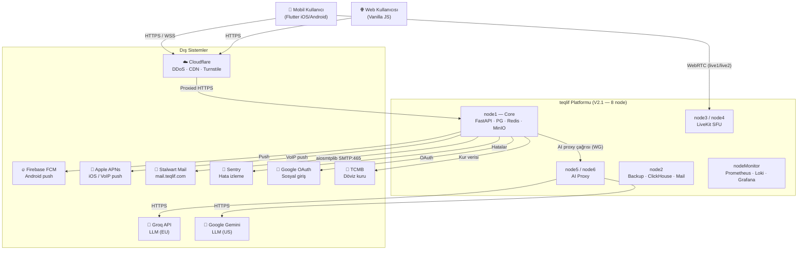
```mermaid
flowchart TB
    MOB["📱 Mobil Kullanıcı\n(Flutter iOS/Android)"]
    WEB["🌐 Web Kullanıcısı\n(Vanilla JS)"]

    subgraph TEQLIF["teqlif Platformu (V2.1 — 8 node)"]
        direction TB
        CORE["node1 — Core\nFastAPI · PG · Redis · MinIO"]
        LK["node3 / node4\nLiveKit SFU"]
        AI["node5 / node6\nAI Proxy"]
        BACK["node2\nBackup · ClickHouse · Mail"]
        MON["nodeMonitor\nPrometheus · Loki · Grafana"]
    end

    subgraph EXT["Dış Sistemler"]
        CF["☁️ Cloudflare\nDDoS · CDN · Turnstile"]
        GROQ["🤖 Groq API\nLLM (EU)"]
        GEM["🤖 Google Gemini\nLLM (US)"]
        FCM["🔥 Firebase FCM\nAndroid push"]
        APNS["🍎 Apple APNs\niOS / VoIP push"]
        STALWART["📧 Stalwart Mail\nmail.teqlif.com"]
        SENTRY["🚨 Sentry\nHata izleme"]
        GOAUTH["🔑 Google OAuth\nSosyal giriş"]
        TCMB["🏦 TCMB\nDöviz kuru"]
    end

    MOB -->|"HTTPS / WSS"| CF
    WEB -->|"HTTPS"| CF
    CF -->|"Proxied HTTPS"| CORE
    MOB -->|"WebRTC (live1/live2)"| LK
    CORE -->|"AI proxy çağrısı (WG)"| AI
    AI -->|"HTTPS"| GROQ
    AI -->|"HTTPS"| GEM
    CORE -->|"Push"| FCM
    CORE -->|"VoIP push"| APNS
    CORE -->|"aiosmtplib SMTP:465"| STALWART
    CORE -->|"Hatalar"| SENTRY
    CORE -->|"OAuth"| GOAUTH
    CORE -->|"Kur verisi"| TCMB
```

### 3.2 Kullanıcı–Sistem Sınırları

| Etkileşim Noktası | Protokol | Açıklama |
|---|---|---|
| REST API | HTTPS → Cloudflare → api.teqlif.com | CRUD işlemleri, JWT auth |
| WebSocket | WSS → api.teqlif.com/ws | Gerçek zamanlı teklif, chat, bildirim |
| Media (yükleme) | HTTPS Presigned PUT → uploads.teqlif.com | Direkt MinIO; API binary almaz |
| Media (okuma) | HTTPS GET → uploads.teqlif.com | CDN-free direkt MinIO |
| Canlı Yayın | WebRTC + TURN → live1/live2.teqlif.com | LiveKit SFU; node3 veya node4 |
| Staging | HTTPS → api-staging.teqlif.com | node5 izole stack |

---

## 4. Çözüm Stratejisi

| Karar Alanı | Seçilen Yaklaşım | Gerekçe |
|---|---|---|
| **Backend mimarisi** | FastAPI monolith + CQRS iç yapı | Modülerlik + async-native + tek deploy birimi; `use_cases/commands` ve `use_cases/queries` sıkı ayrımı |
| **Canlı Yayın** | Dual LiveKit Node (DNS — live1/live2) | WebRTC I/O izolasyonu; Core API'den ayrı; birisi çökünce DNS TTL sonrası trafik diğerine kayar |
| **Gerçek zamanlı fan-out** | Redis pub/sub → WebSocket | N izleyiciye tek serialize ile push; < 100 ms gecikme |
| **Veritabanı eşzamanlılığı** | PostgreSQL `SELECT FOR UPDATE` + Unit of Work | Açık artırma teklifinde ACID + race condition önleme |
| **Cache/Queue HA** | HAProxy + async Redis replica + auto-promote | node1 Redis çöküşünde < 30 sn node2'ye otomatik geçiş |
| **Arka plan işler** | ARQ (iki kuyruk: genel + kritik) | Python-native async; priority isolation; zamanlanmış geçişler `scheduled_at` poller ile |
| **Medya depolama** | MinIO (self-hosted S3) + presigned URL | Veri EU'da kalır; API binary taşımaz; istemci doğrudan yükler |
| **Mobil istemci** | Flutter MVVM + Riverpod | iOS/Android tek codebase; ViewModel'de BuildContext yok; async state compile-time güvenli |
| **AI istekleri** | ABD IP proxy zinciri (node6 → node5) | Coğrafi kısıtları aşmak; node6 çökünce node5'e otomatik retry |
| **OTA Lokalizasyon** | ARB → Redis → istemci çekme | Uygulama güncellemesi gerektirmeden 4 dil canlı güncelleme |
| **Deploy** | Systemd + monorepo + `sudo teqlif-restart` | Sıfır-downtime restart; ExecStartPre alembic + sync_main; tüm node'larda tek komut |
| **İzolasyon** | Multi-proje ayrı kullanıcı/port/servis | node1/node2 bare metal çok projeli; isim çakışması sıfır |

---

## 5. Yapı Taşları Görünümü

### 5.1 Seviye 1 — Sistem Bileşenleri

Sistem 5 ana küme ve 1 izleme node'undan oluşur. Tüm iç iletişim `10.10.0.0/24` WireGuard mesh üzerinden ChaCha20-Poly1305 ile şifrelenir.

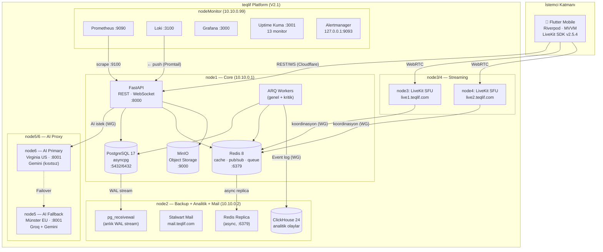
```mermaid
flowchart TB
    subgraph CLIENT["İstemci Katmanı"]
        MOB["📱 Flutter Mobile\nRiverpod · MVVM\nLiveKit SDK v2.5.4"]
    end

    subgraph PLATFORM["teqlif Platform (V2.1)"]
        subgraph CORE["node1 — Core (10.10.0.1)"]
            API["FastAPI\nREST · WebSocket\n:8000"]
            WORKER["ARQ Workers\n(genel + kritik)"]
            PG[("PostgreSQL 17\nasyncpg\n:5432/6432")]
            RD[("Redis 8\ncache · pub/sub · queue\n:6379")]
            MN[("MinIO\nObject Storage\n:9000")]
        end

        subgraph STREAM["node3/4 — Streaming"]
            LK3["node3: LiveKit SFU\nlive1.teqlif.com"]
            LK4["node4: LiveKit SFU\nlive2.teqlif.com"]
        end

        subgraph AIPROXY["node5/6 — AI Proxy"]
            N6P["node6 — AI Primary\nVirginia US · :8001\nGemini (kısıtsız)"]
            N5P["node5 — AI Fallback\nMünster EU · :8001\nGroq + Gemini"]
        end

        subgraph BACKUP["node2 — Backup + Analitik + Mail (10.10.0.2)"]
            CH[("ClickHouse 24\nanalitik olaylar")]
            STALWART["Stalwart Mail\nmail.teqlif.com"]
            WALR["pg_receivewal\n(anlık WAL stream)"]
            RDREP["Redis Replica\n(async, :6379)"]
        end

        subgraph MON["nodeMonitor (10.10.0.99)"]
            PROM["Prometheus :9090"]
            LOKI["Loki :3100"]
            GRAFANA["Grafana :3000"]
            KUMA["Uptime Kuma :3001\n13 monitor"]
            ALERT["Alertmanager\n127.0.0.1:9093"]
        end
    end

    MOB -->|"REST/WS (Cloudflare)"| API
    MOB -->|"WebRTC"| LK3
    MOB -->|"WebRTC"| LK4
    API -->|"AI istek (WG)"| N6P
    N6P -.->|"Failover"| N5P
    API --> PG & RD & MN
    WORKER --> PG & RD
    WORKER -->|"Event log (WG)"| CH
    PG -->|"WAL stream"| WALR
    RD -->|"async replica"| RDREP
    LK3 & LK4 -->|"koordinasyon (WG)"| RD
    PROM -->|"scrape :9100"| API
    LOKI -->|"← push (Promtail)"| API
```

### 5.2 Seviye 2 — Backend İç Yapısı (CQRS)

FastAPI monolitik uygulaması Clean Architecture kurallarına göre katmanlandırılmıştır.

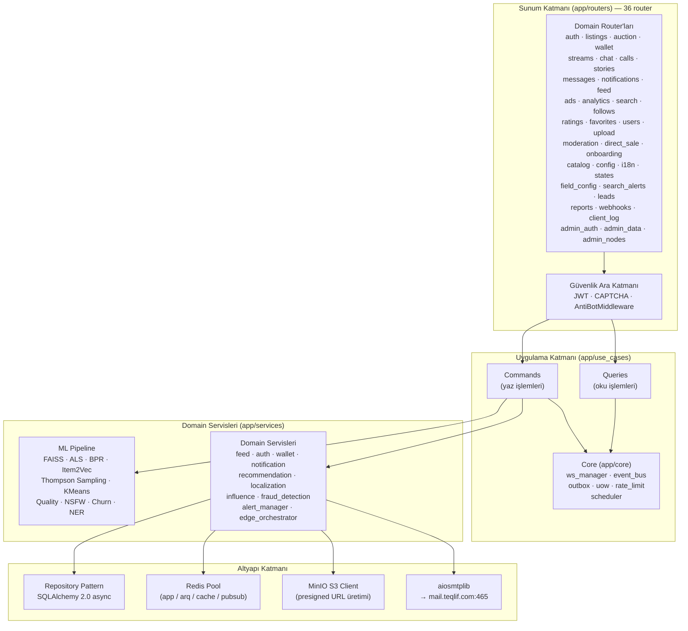
```mermaid
flowchart TB
    subgraph PRES["Sunum Katmanı (app/routers) — 36 router"]
        ROUTERS["Domain Router'ları\nauth · listings · auction · wallet\nstreams · chat · calls · stories\nmessages · notifications · feed\nads · analytics · search · follows\nratings · favorites · users · upload\nmoderation · direct_sale · onboarding\ncatalog · config · i18n · states\nfield_config · search_alerts · leads\nreports · webhooks · client_log\nadmin_auth · admin_data · admin_nodes"]
        SEC["Güvenlik Ara Katmanı\nJWT · CAPTCHA · AntiBotMiddleware"]
    end

    subgraph APP["Uygulama Katmanı (app/use_cases)"]
        UC_CMD["Commands\n(yaz işlemleri)"]
        UC_QRY["Queries\n(oku işlemleri)"]
        CORE_L["Core (app/core)\nws_manager · event_bus\noutbox · uow · rate_limit\nscheduler"]
    end

    subgraph DOM["Domain Servisleri (app/services)"]
        ML["ML Pipeline\nFAISS · ALS · BPR · Item2Vec\nThompson Sampling · KMeans\nQuality · NSFW · Churn · NER"]
        SVC["Domain Servisleri\nfeed · auth · wallet · notification\nrecommendation · localization\ninfluence · fraud_detection\nalert_manager · edge_orchestrator"]
    end

    subgraph INFRA["Altyapı Katmanı"]
        REPO["Repository Pattern\nSQLAlchemy 2.0 async"]
        REDIS_C["Redis Pool\n(app / arq / cache / pubsub)"]
        S3["MinIO S3 Client\n(presigned URL üretimi)"]
        EMAIL["aiosmtplib\n→ mail.teqlif.com:465"]
    end

    ROUTERS --> SEC --> UC_CMD & UC_QRY
    UC_CMD & UC_QRY --> CORE_L
    UC_CMD --> ML & SVC
    SVC --> REPO & REDIS_C & S3 & EMAIL
```

### 5.3 Seviye 3 — Mobil İstemci (Flutter MVVM)

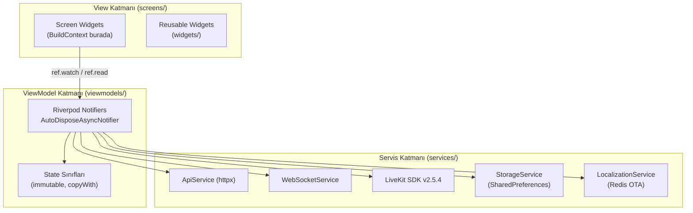
```mermaid
flowchart TB
    subgraph UI["View Katmanı (screens/)"]
        SCR["Screen Widgets\n(BuildContext burada)"]
        WID["Reusable Widgets\n(widgets/)"]
    end

    subgraph VM["ViewModel Katmanı (viewmodels/)"]
        RNOT["Riverpod Notifiers\nAutoDisposeAsyncNotifier"]
        STATE["State Sınıfları\n(immutable, copyWith)"]
    end

    subgraph SVC_M["Servis Katmanı (services/)"]
        API_S["ApiService (httpx)"]
        WS_S["WebSocketService"]
        LK_S["LiveKit SDK v2.5.4"]
        STOR["StorageService\n(SharedPreferences)"]
        LOC["LocalizationService\n(Redis OTA)"]
    end

    SCR -->|"ref.watch / ref.read"| RNOT
    RNOT --> STATE
    RNOT --> API_S & WS_S & LK_S & STOR & LOC
```

**Kural:** ViewModel BuildContext ve UI sınıflarına bağımlı olamaz. Navigasyon kararları View katmanında alınır; ViewModel sadece state yönetir.

### 5.4 API Yüzeyi (Router Özeti)

| Router | Prefix | Endpoint Sayısı | Notlar |
|---|---|---|---|
| `auth` | `/api/auth` | 29 | JWT, refresh cookie, OAuth, cihaz token, KVKK |
| `listings` | `/api/listings` | 21 | CRUD, AI açıklama, kitle bildirimi, fiyat sinyali |
| `auction` | `/api/auction` | 12 + 1 WS | Teklif, Hemen Al, kabul/red, state makinesi |
| `streams` | `/api/streams` | 17 | Yayın CRUD, co-host, kalp, ticaret aktivitesi |
| `direct_sale` | `/api/direct-sales` | 7 | Yayın içi/dışı sabit fiyat satış |
| `wallet` | `/api/wallet` | 5 | Bakiye, transfer, hediye, işlem geçmişi |
| `chat` | `/api/chat` | 1 WS | Yayın sohbet odası |
| `calls` | `/api/calls` | 7 | LiveKit arama, VoIP push, ACK |
| `messages` | `/api/messages` | 13 | DM, medya mesajı, mesaj isteği akışı |
| `notifications` | `/api/notifications` | 4 + 1 WS | Bildirim + gerçek zamanlı WS |
| `feed` | `/api/feed` | 9 | Ana/kişisel/ForYou beslemeler, sinyal kaydı |
| `search` | `/api/search` | 4 | Kullanıcı, ilan, keşfet, tam arama |
| `search_alerts` | `/api/search-alerts` | 3 | Arama alarmları CRUD |
| `stories` | `/api/stories` | 8 | Hikaye yükle/sil/beğen/izle |
| `follows` | `/api/follows` | 6 | Takip et/bırak, istekler, listeler |
| `users` | `/api/users` | 7 | Profil, engel, referral, önerilen satıcılar |
| `ratings` | `/api/ratings` | 8 | Puan ver, yanıt, özet, okundu işareti |
| `favorites` | `/api/favorites` | 4 | Favori ilan CRUD |
| `ads` | `/api/ads` | 6 | Kampanya, tıklama/gösterim, sponsorlu ilanlar |
| `analytics` | `/api/analytics` | 8 | Event, satış raporu, AI fiyat, PRO içgörüler |
| `leads` | `/api/leads` | — | Sıcak talep bildirimi |
| `moderation` | `/api/moderation` | 7 | Yayın içi sustur/at/mod yap |
| `reports` | `/api/reports` | — | İlan/kullanıcı şikayetleri |
| `upload` | `/api/upload` | 2 | Görsel, video (thumbnail otomatik) |
| `catalog` | `/api/catalog` | 2 | Kategori şeması sürümü |
| `config` | `/api/config` | 2 | Sürüm zorunluluk / mağaza URL |
| `onboarding` | `/api/onboarding` | 1 | Kategori tercihi; feed cache temizle |
| `i18n` | `/api/i18n` | — | Çeviri paketi |
| `states` | `/api/states` | — | İl/ilçe listesi |
| `admin_*` | `/api/admin/*` | — | Yönetim paneli (veri, node, auth) |

### 5.5 Mobil Uygulama Ekranları

| Kategori | Ekran | İşlevi |
|---|---|---|
| **Auth** | `splash_screen` | Token kontrolü, yönlendirme |
| | `login_screen` | E-posta/kullanıcı adı + şifre |
| | `register_screen` | Yeni kayıt |
| | `verify_screen` | E-posta kod doğrulama |
| | `forgot/reset_password_screen` | Şifre sıfırlama akışı |
| | `category_onboarding_screen` | Kayıt sonrası kategori tercihi |
| | `force_update_screen` | Zorunlu uygulama güncellemesi |
| **Ana Nav** | `main_screen` | Bottom bar navigasyon |
| | `home_screen` | Ana besleme |
| | `search_screen` | Arama + keşfet (MVVM ViewModel) |
| | `profile_screen` | Kendi profili + teqlik cüzdanı |
| | `public_profile_screen` | Başkasının profili |
| **İlan** | `create_listing_screen` | İlan oluştur |
| | `edit_listing_screen` | İlan düzenle |
| | `listing_detail_screen` | İlan detayı |
| | `listing_analytics_screen` | Performans analitikleri |
| **Canlı Yayın** | `host_stream_screen` | Yayıncı kontrol paneli |
| | `live_list_screen` | Aktif yayınlar listesi |
| | `swipe_live_screen` | TikTok-tarzı kaydırma |
| | `seller_report_screen` | Yayın satış özeti |
| | `live_stream_analytics_screen` | Yayın analitikleri |
| | `live_stream_history_screen` | Geçmiş yayınlar |
| | `pro_stream_analytics_screen` | PRO yayın analitikleri |
| **Ticaret** | `direct_sale_detail_screen` | Direkt satış detayı |
| | `purchases/sales_screen` | Alım/satım listesi |
| | `purchase/sale_detail_screen` | İşlem detayı |
| **Mesaj & Arama** | `messages_screen` | Konuşma listesi |
| | `call_screen` | Aktif görüntülü/sesli arama |
| | `incoming_call_screen` | Gelen arama |
| | `call_history_screen` | Arama geçmişi |
| **Hikaye** | `story_viewer_screen` | Hikaye izleme (swipe) |
| **PRO & AI** | `pro_hub_screen` | PRO özellikler merkezi |
| | `pro_insights_screen` | Satıcı içgörüleri |
| | `market_intelligence_screen` | Piyasa zekası |
| | `competitor_radar_screen` | Rakip radar |
| | `demand_trends_screen` | Talep trendleri |
| | `retargeting_screen` | Yeniden hedefleme yönetimi |
| **Sosyal** | `follow_list/requests_screen` | Takip listesi, bekleyenler |
| | `blocked_users_screen` | Engellenenler |
| | `my_ratings_screen` | Puanlarım |
| **Ayarlar** | `notification_settings_screen` | Bildirim tercihleri |
| | `account_info_screen` | Hesap bilgileri |
| | `faq_screen` | SSS (token bazlı ikon render) |
| | `ad_report_screen` | Reklam raporu |

---

## 6. Çalışma Zamanı Görünümü

### 6.1 Gerçek Zamanlı Teklif Akışı (Bid Flow)

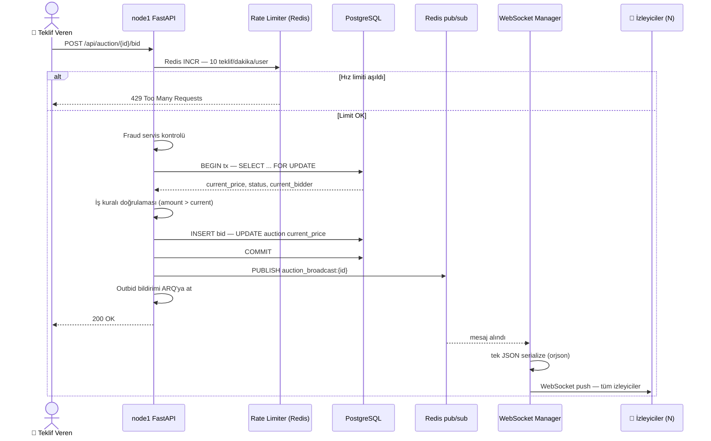
```mermaid
sequenceDiagram
    actor Bidder as 📱 Teklif Veren
    participant API as node1 FastAPI
    participant LIM as Rate Limiter (Redis)
    participant PG as PostgreSQL
    participant RD as Redis pub/sub
    participant WS as WebSocket Manager
    participant Viewers as 📱 İzleyiciler (N)

    Bidder->>API: POST /api/auction/{id}/bid
    API->>LIM: Redis INCR — 10 teklif/dakika/user
    alt Hız limiti aşıldı
        LIM-->>Bidder: 429 Too Many Requests
    else Limit OK
        API->>API: Fraud servis kontrolü
        API->>PG: BEGIN tx — SELECT ... FOR UPDATE
        PG-->>API: current_price, status, current_bidder
        API->>API: İş kuralı doğrulaması (amount > current)
        API->>PG: INSERT bid — UPDATE auction current_price
        API->>PG: COMMIT
        API->>RD: PUBLISH auction_broadcast:{id}
        API->>API: Outbid bildirimi ARQ'ya at
        API-->>Bidder: 200 OK
        RD-->>WS: mesaj alındı
        WS->>WS: tek JSON serialize (orjson)
        WS->>Viewers: WebSocket push — tüm izleyiciler
    end
```

### 6.2 Açık Artırma Durum Makinesi

```
                 start()
[idle] ─────────────────────► [active]
                                  │
              pause()             │         resume()
                  ┌───────────────┤ ◄────────────────┐
                  ▼               │                   │
             [paused] ────────────┘                   │
                  │                                   │
                  │ end() / accept_bid()              │
                  ▼                                   │
             [completed]                              │
                                                      │
[active] ──── request_buy_it_now() ──► [buy_it_now_pending]
                                              │
                      accept_buy_it_now() ────┤──── reject_buy_it_now()
                                              ▼         │
                                         [completed]    ▼
                                                   (active/paused'a dön)
```

### 6.3 Canlı Yayın Başlatma ve Bağlantı Kesme Akışı

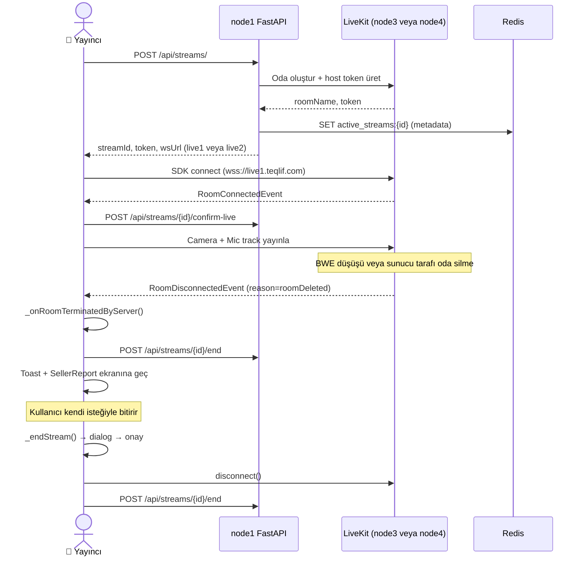
```mermaid
sequenceDiagram
    actor Host as 📱 Yayıncı
    participant API as node1 FastAPI
    participant LK as LiveKit (node3 veya node4)
    participant RD as Redis

    Host->>API: POST /api/streams/
    API->>LK: Oda oluştur + host token üret
    LK-->>API: roomName, token
    API->>RD: SET active_streams:{id} (metadata)
    API-->>Host: streamId, token, wsUrl (live1 veya live2)

    Host->>LK: SDK connect (wss://live1.teqlif.com)
    LK-->>Host: RoomConnectedEvent
    Host->>API: POST /api/streams/{id}/confirm-live
    Host->>LK: Camera + Mic track yayınla

    Note over LK: BWE düşüşü veya sunucu tarafı oda silme
    LK-->>Host: RoomDisconnectedEvent (reason=roomDeleted)
    Host->>Host: _onRoomTerminatedByServer()
    Host->>API: POST /api/streams/{id}/end
    Host->>Host: Toast + SellerReport ekranına geç

    Note over Host: Kullanıcı kendi isteğiyle bitirir
    Host->>Host: _endStream() → dialog → onay
    Host->>LK: disconnect()
    Host->>API: POST /api/streams/{id}/end
```

### 6.4 AI Proxy Fallback Zinciri

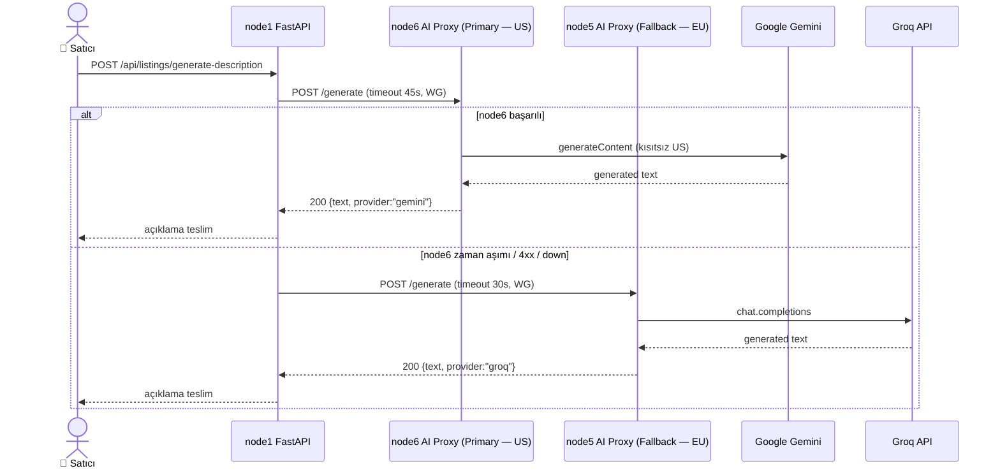
```mermaid
sequenceDiagram
    actor User as 📱 Satıcı
    participant API as node1 FastAPI
    participant N6 as node6 AI Proxy (Primary — US)
    participant N5 as node5 AI Proxy (Fallback — EU)
    participant GEM as Google Gemini
    participant GROQ as Groq API

    User->>API: POST /api/listings/generate-description
    API->>N6: POST /generate (timeout 45s, WG)
    alt node6 başarılı
        N6->>GEM: generateContent (kısıtsız US)
        GEM-->>N6: generated text
        N6-->>API: 200 {text, provider:"gemini"}
        API-->>User: açıklama teslim
    else node6 zaman aşımı / 4xx / down
        API->>N5: POST /generate (timeout 30s, WG)
        N5->>GROQ: chat.completions
        GROQ-->>N5: generated text
        N5-->>API: 200 {text, provider:"groq"}
        API-->>User: açıklama teslim
    end
```

### 6.5 Medya Yükleme Akışı (Presigned Upload — V2.0+)

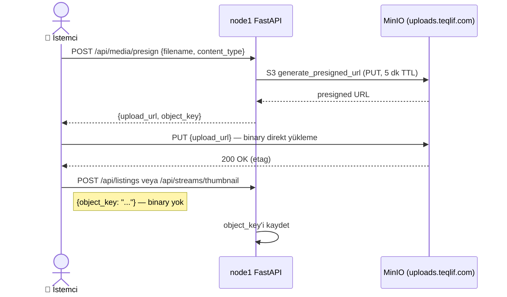
```mermaid
sequenceDiagram
    actor Client as 📱 İstemci
    participant API as node1 FastAPI
    participant MN as MinIO (uploads.teqlif.com)

    Client->>API: POST /api/media/presign {filename, content_type}
    API->>MN: S3 generate_presigned_url (PUT, 5 dk TTL)
    MN-->>API: presigned URL
    API-->>Client: {upload_url, object_key}

    Client->>MN: PUT {upload_url} — binary direkt yükleme
    MN-->>Client: 200 OK (etag)

    Client->>API: POST /api/listings veya /api/streams/thumbnail
    Note right of Client: {object_key: "..."} — binary yok
    API->>API: object_key'i kaydet
```

**Not:** API hiçbir zaman binary data almaz. Tüm medya istemci → MinIO direkt akışıyla gider.

### 6.6 OTA Yerelleştirme Akışı

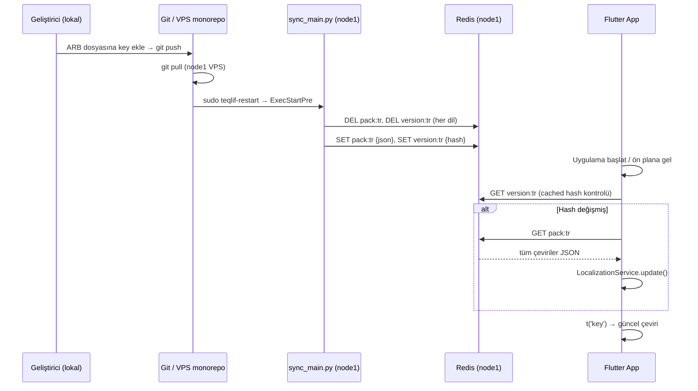
```mermaid
sequenceDiagram
    participant DEV as Geliştirici (lokal)
    participant GIT as Git / VPS monorepo
    participant SYNC as sync_main.py (node1)
    participant RD as Redis (node1)
    participant APP as Flutter App

    DEV->>GIT: ARB dosyasına key ekle → git push
    GIT->>GIT: git pull (node1 VPS)
    GIT->>SYNC: sudo teqlif-restart → ExecStartPre
    SYNC->>RD: DEL pack:tr, DEL version:tr (her dil)
    SYNC->>RD: SET pack:tr {json}, SET version:tr {hash}

    APP->>APP: Uygulama başlat / ön plana gel
    APP->>RD: GET version:tr (cached hash kontrolü)
    alt Hash değişmiş
        APP->>RD: GET pack:tr
        RD-->>APP: tüm çeviriler JSON
        APP->>APP: LocalizationService.update()
    end
    APP->>APP: t('key') → güncel çeviri
```

**Kural:** SQL'e doğrudan çeviri yazılmaz. ARB → push → `sync_main.py` zinciri zorunludur.

### 6.7 Redis HA Failover Akışı

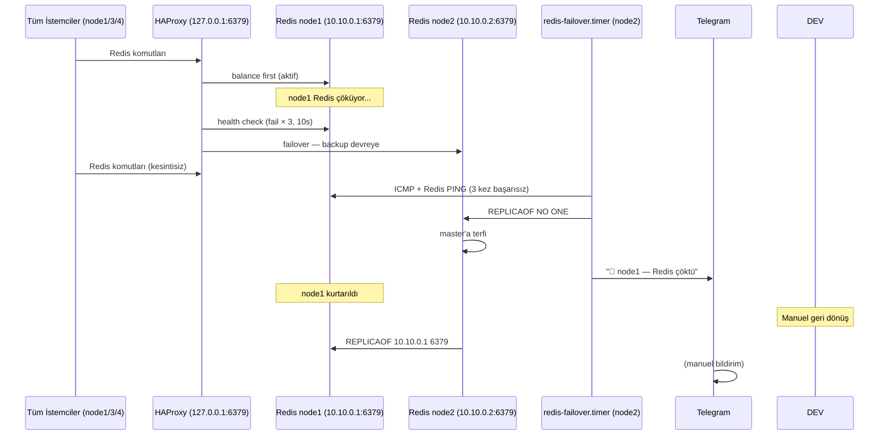
```mermaid
sequenceDiagram
    participant APP as Tüm İstemciler (node1/3/4)
    participant HAP as HAProxy (127.0.0.1:6379)
    participant RD1 as Redis node1 (10.10.0.1:6379)
    participant RD2 as Redis node2 (10.10.0.2:6379)
    participant TIMER as redis-failover.timer (node2)
    participant TG as Telegram

    APP->>HAP: Redis komutları
    HAP->>RD1: balance first (aktif)

    Note over RD1: node1 Redis çöküyor...
    HAP->>RD1: health check (fail × 3, 10s)
    HAP->>RD2: failover — backup devreye
    APP->>HAP: Redis komutları (kesintisiz)

    TIMER->>RD1: ICMP + Redis PING (3 kez başarısız)
    TIMER->>RD2: REPLICAOF NO ONE
    RD2->>RD2: master'a terfi
    TIMER->>TG: "🔴 node1 — Redis çöktü"

    Note over RD1: node1 kurtarıldı
    Note over DEV: Manuel geri dönüş
    RD2->>RD1: REPLICAOF 10.10.0.1 6379
    TG->>TG: (manuel bildirim)
```

---

## 7. Dağıtım Görünümü (V2.1)

### 7.1 Node Envanteri

| Node | WG IP | Public IP | Tip | Sağlayıcı / Lokasyon | CPU | RAM | Disk | Rol |
|---|---|---|---|---|---|---|---|---|
| **node1** | 10.10.0.1 | 193.70.46.74 | Bare metal | OVH Gravelines FR | Xeon E-2236 6c/12t | 32 GB ECC | 2×512 GB NVMe RAID-1 | Core — API, PG, Redis, MinIO |
| **node2** | 10.10.0.2 | 135.125.223.43 | Bare metal | OVH Saarbrücken DE | Xeon D-2123IT 4c/8t | 32 GB ECC | 2×4 TB HDD RAID-1 (~440 IOPS) | Backup + ClickHouse + Mail |
| **node3** | 10.10.0.3 | 51.75.74.124 | KVM VPS | OVH Frankfurt DE | 6 vCPU (Haswell) | 11.4 GB | 98 GB SSD | LiveKit SFU — live1.teqlif.com |
| **node4** | 10.10.0.4 | 135.125.175.223 | KVM VPS | OVH Frankfurt DE | 6 vCPU (Haswell) | 11.4 GB | 98 GB SSD | LiveKit SFU — live2.teqlif.com |
| **node5** | 10.10.0.5 | 45.146.252.165 | KVM VPS | ZAP Münster DE | 4 vCPU EPYC 7763 | 7.8 GB | 49 GB SSD | Staging + AI Fallback |
| **node6** | 10.10.0.6 | 5.249.165.10 | KVM VPS | ZAP Virginia US | 4 vCPU EPYC 7763 | 3.8 GB | 49 GB SSD | AI Primary (Gemini, US) |
| **node7** | 10.10.0.7 | — | KVM VPS | Netcup Nuremberg DE | 2 vCPU QEMU 2294 MHz | 1.9 GB | 59 GB SSD | **Hazırlanıyor** (rol TBD) |
| **nodeMonitor** | 10.10.0.99 | 94.16.105.135 | KVM VPS | Netcup Karlsruhe DE | 2 vCPU | 2 GB | 60 GB SSD | Prometheus · Loki · Grafana · Uptime Kuma |

### 7.2 WireGuard Mesh Topolojisi

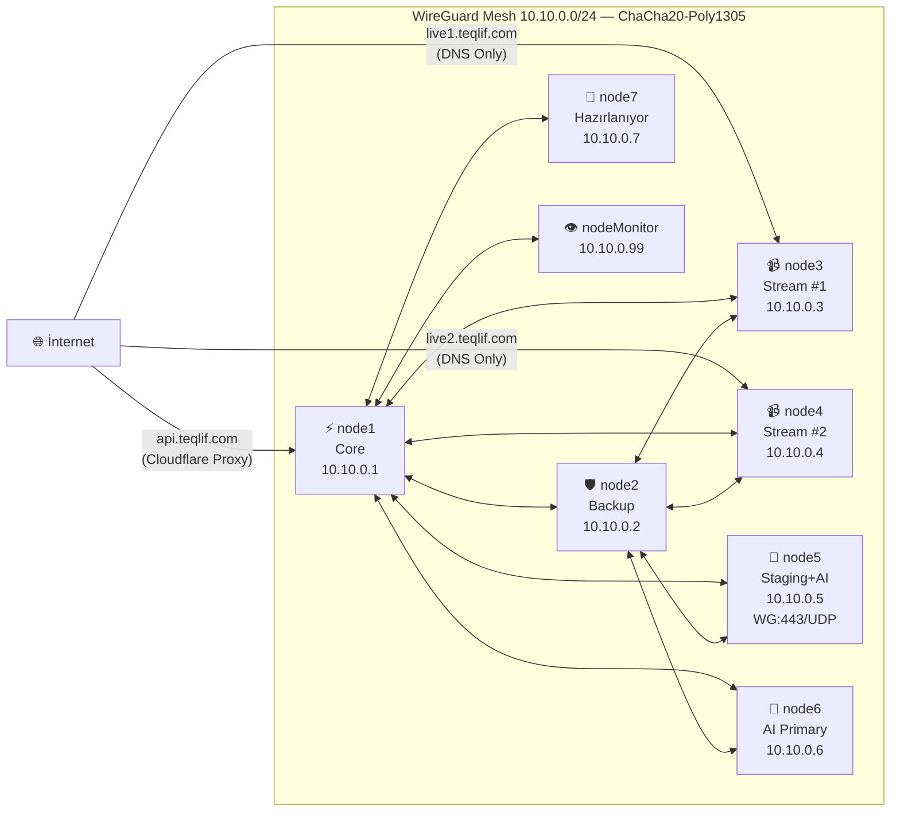
```mermaid
flowchart LR
    INET["🌐 İnternet"]

    INET -->|"api.teqlif.com\n(Cloudflare Proxy)"| N1
    INET -->|"live1.teqlif.com\n(DNS Only)"| N3
    INET -->|"live2.teqlif.com\n(DNS Only)"| N4

    subgraph WG["WireGuard Mesh 10.10.0.0/24 — ChaCha20-Poly1305"]
        N1["⚡ node1\nCore\n10.10.0.1"]
        N2["🛡️ node2\nBackup\n10.10.0.2"]
        N3["📹 node3\nStream #1\n10.10.0.3"]
        N4["📹 node4\nStream #2\n10.10.0.4"]
        N5["🧪 node5\nStaging+AI\n10.10.0.5\nWG:443/UDP"]
        N6["🤖 node6\nAI Primary\n10.10.0.6"]
        N7["🔧 node7\nHazırlanıyor\n10.10.0.7"]
        NM["👁️ nodeMonitor\n10.10.0.99"]

        N1 <--> N2 & N3 & N4 & N5 & N6 & N7 & NM
        N2 <--> N3 & N4 & N5 & N6
    end
```

**Not:** node5 ve node6 (ZAP Hosting) WireGuard'ı port `443/UDP` üzerinden çalıştırır — sağlayıcı DDoS filtresi standart UDP 51820'yi engeller.

### 7.3 DNS Mimarisi

| Domain | DNS Modu | Hedef | Not |
|---|---|---|---|
| `teqlif.com` | Cloudflare Proxy | node1 | CDN + WAF |
| `api.teqlif.com` | Cloudflare Proxy | node1:443 | Rate limit + DDoS |
| `uploads.teqlif.com` | DNS Only | node1:443 | MinIO direkt — CF SSL Bypass |
| `live1.teqlif.com` | DNS Only | node3:443 | WebRTC — CF WebRTC desteklemez |
| `live2.teqlif.com` | DNS Only | node4:443 | WebRTC — CF WebRTC desteklemez |
| `mail.teqlif.com` | DNS Only | node2 | MX + DKIM + SPF + DMARC |
| `staging.teqlif.com` | Cloudflare Proxy | node5 | Staging API |
| `api-staging.teqlif.com` | Cloudflare Proxy | node5 | Staging API |
| `staging.uploads.teqlif.com` | DNS Only | node5:9100 | Staging MinIO |
| `live-staging.teqlif.com` | DNS Only | node5:7890 | Staging LiveKit |

### 7.4 Systemd Deploy Akışı

```
git push
  │
  └── tüm node'larda: sudo teqlif-restart
        │
        ├── git pull (monorepo güncelle)
        │
        ├── systemctl stop teqlif-*.service
        │   (Wants=app, PartOf/BindsTo=workers)
        │
        ├── ExecStartPre[0]: alembic upgrade head
        │   (sadece node1)
        │
        ├── ExecStartPre[1]: python sync_main.py
        │   (ARB → Redis pack + version)
        │
        ├── uvicorn FastAPI başlar (lifespan)
        │
        └── teqlif-worker-*.service başlar
```

**Kural:** `sudo teqlif-restart` tüm node'larda tek yeniden başlatma komutu. Doğrudan `systemctl restart teqlif-app.service` kullanılmaz.

### 7.5 Backup Mimarisi

```
node1 PostgreSQL ──WAL stream──→ node2 pg_receivewal → /var/backups/pg_wal/
node1 PostgreSQL ──pg_dump─────→ node2 /var/backups/pg_dump/ (her gün 01:00)
node1 Redis      ──RDB copy────→ node2 /var/backups/redis/  (her gün 02:00)
node1 MinIO      ──mc mirror───→ node2 /var/backups/minio/  (her gün 03:00)
node2 Mail       ──rsync────────→ node2 /var/backups/mail/  (her gün 02:30)
```

**Depolama:** node2 HDD RAID-1, 2×4 TB. Tek yedek merkezi. `pg_receivewal` ile PG WAL anlık akar (RPO ≈ < 1 dk).

---

## 8. Kesişen Kavramlar

### 8.1 Güvenlik Katmanları

| Katman | Bileşen | Koruma |
|---|---|---|
| L1 — Ağ Kenarı | Cloudflare WAF + Turnstile | DDoS (volumetric), bot filtreleme, CAPTCHA |
| L2 — Ingress | nginx rate limiting | 1800 req/dk, IP başına 200 burst; Fail2ban brute-force |
| L3 — Uygulama | JWT (HS256) + AntiBotMiddleware | Token doğrulama; fingerprint bazlı bot tespiti |
| L4 — İç Ağ | WireGuard (ChaCha20-Poly1305) | Servisler arası tüm trafik şifreli; DB/Redis internete kapalı |
| L5 — Veri | MinIO bucket policy + presigned TTL | Medyaya süresiz URL yok; her URL 5 dk geçerli |
| L6 — Sunucu | UFW + SSH key-only | Her node minimum port açık; root login kapalı |

**Gizli veri yönetimi:** `.env`, WireGuard private key, `alertmanager.yml` Git'e girmez. `/project/teqlif/config/` altında 600 perm ile saklanır.

### 8.2 Gözlemlenebilirlik (Observability)

**Merkez: nodeMonitor (10.10.0.99)**

```
Tüm node'lar
  ├── node-exporter :9100 ──scrape──→ Prometheus :9090 (nodeMonitor)
  │                                        └── Alertmanager 127.0.0.1:9093
  │                                              └── Telegram bildirimi
  │
  ├── Promtail ──push──→ Loki :3100 (nodeMonitor)
  │                           └── Grafana :3000 (dashboard)
  │
  └── Metrics Agent (teqlif-metrics-agent.service)
        ├── Lokal servis sağlık kontrolü (HTTP + systemd)
        ├── CPU/RAM/Disk metrikleri (eşik: CPU>85%, RAM>88%, Disk>82%)
        ├── Hepsini Redis node1'e yazar → EdgeOrchestrator okur
        └── Telegram alert: 🔴 servis DOWN / ✅ kurtardı / ⚠️ yedek eski
```

**Alert mesaj formatı:**
- `🔴 node1 — PostgreSQL çöktü` / `✅ node1 — PostgreSQL kurtardı`
- `🔴 node1 — CPU %91 (limit %85)` / `✅ node1 — CPU normale döndü (%72)`
- `⚠️ node1 — PostgreSQL yedeği eski (26 saat 30 dk)`

**Uptime Kuma (nodeMonitor):** 13 monitor — API health, WebSocket, MinIO, LiveKit node3/4, Staging, AI Proxy node5/6, Mail (SMTP+IMAP), nodeMonitor Prometheus.

**Sentry:** Backend (node1) ve Staging (node5) uygulama hataları gerçek zamanlı izlenir.

### 8.3 OTA Yerelleştirme (i18n)

- **Diller:** Türkçe, İngilizce, Arapça, Rusça
- **Kaynak format:** ARB dosyaları (`documents/language/app_*.arb`)
- **Dağıtım:** `sync_main.py` → Redis `pack:{lang}` + `version:{lang}` key'leri
- **İstemci:** uygulama başlangıcında veya ön plana gelince hash kontrol eder; değişmişse çeker
- **Fallback:** Redis erişilemezse bundled ARB kullanılır
- **Kural:** Yeni string önce ARB'ye eklenir, `tOr('key', 'fallback')` ile kullanılır. Manuel SQL yazımı yasak.
- **Cache temizleme:** Manuel `DEL` yapılırken pack + version key'leri birlikte silinir.

### 8.4 Veritabanı Migrasyon Stratejisi

- **Araç:** Alembic (async, asyncpg)
- **Tetikleyici:** `sudo teqlif-restart` → ExecStartPre `alembic upgrade head`
- **Kısıt — asyncpg multi-statement:** Her SQL komutu ayrı `op.execute()` çağrısında olmalıdır.
- **Kısıt — revision ID:** ≤ 32 karakter
- **Kısıt — `CREATE INDEX CONCURRENTLY`:** Transaction içinde çalışmaz; migration'ı `transaction=False` ile işaretle.
- **Staging:** `pg_dump --schema-only` + `alembic stamp head` kullanılır. `alembic upgrade head` staging'de direkt çalıştırılmaz.
- **Bağlantı:** `psql`, `pg_dump` TCP için `-h 127.0.0.1` zorunludur (peer auth yerine).

### 8.5 Zamanlanmış İş Geçişleri

`asyncio.create_task + sleep` ile gecikmeli iş mantığı kurulmaz. Bunun yerine:
- DB'de `scheduled_at` alanı eklenir
- ARQ poller bu alanı sorgular
- Sistem yeniden başlatıldığında hiçbir geçiş kaybolmaz

### 8.6 ML / AI Pipeline

| Model | Algoritma | Amaç | Yenileme |
|---|---|---|---|
| **Listing Embedding** | MiniLM-L6-v2 (384 boyut) | İlan metin benzerliği; FAISS ANN arama | İlan oluşturulunca (ARQ) |
| **User Preference Embedding** | MiniLM-L6-v2 (384 boyut) | Kullanıcı ilgi profili; kazanılan açık artırma sonrası güncellenir | Satın alma event'i |
| **Feed ALS** | Alternating Least Squares | Ana besleme kişiselleştirme; matris çarpanlama | Pazar 01:30 |
| **SwipeLive ALS** | ALS (özelleştirilmiş) | SwipeLive sıralama | Pazar 01:00 |
| **BPR** | Bayesian Personalized Ranking | Implisit geri bildirimden sıralama | Pzt/Çar/Cum 00:30 |
| **Item2Vec** | Word2Vec analogu | Birlikte görüntülenen/alınan ilan benzerlikleri | Pazar 02:00 |
| **KMeans Cold Start** | K-Means kümeleme | Yeni kullanıcılara başlangıç önerileri | Çar+Paz 02:15 |
| **Thompson Sampling** | Beta dağılımı bandit | Keşfet/istismar dengesi (SwipeLive) | Gerçek zamanlı |
| **Quality Model** | RandomForest (sklearn) | İlan kalite skoru (0–1); başlık/görsel/açıklama kalitesi | Pazar 02:30 |
| **NSFW** | Görsel sınıflayıcı | İlan görseli müstehcen tespiti; otomatik moderasyon | İlan oluşturulunca |
| **pHash** | Perceptual hashing | Kopya ilan tespiti | İlan oluşturulunca |
| **Churn** | GradientBoosting | Aktiflik kaybı tahmini; airdrop tetikleme | Pazartesi 02:30 |
| **NER** | Türkçe varlık çıkarımı | İlan başlığı/açıklamasından marka/model | İlan oluşturulunca |
| **FAISS Index** | IVFFlat (384 boyut) | ANN embedding arama | Günde 2x (00:00, 12:00) |
| **User Interest** | Sinyal toplama | Kategori ilgi skoru (analytics+like+favori+mesaj) | 4x günlük |
| **Influence Score** | Graf tabanlı | Kullanıcı etki puanı (takip/etkileşim ağı) | Pazar 05:30 |
| **Trust Score** | Kural bazlı + ML | Kullanıcı güven puanı; badge etkisi | 02:15 |

**AI Açıklama Zinciri:** `generate_listing_description()` → node6 Gemini (US, kısıtsız) → node6 Groq → node5 Groq → node5 Gemini → lokal MiniLM fallback. Kategori bazlı prompt şablonları (`llm_templates.py`).

### 8.7 teqlik Ekonomisi

**Başlangıç bakiye:** Yeni kullanıcı 100 teqlik alır.

| İşlem Tipi | Akış | Açıklama |
|---|---|---|
| `airdrop` | Platform → Kullanıcı | Churn riski yüksek kullanıcılara otomatik hediye |
| `welcome_bonus` | Platform → Davet edilen | Referral kodu kullanan kullanıcıya |
| `referral_bonus` | Platform → Davet eden | Davet edilen kayıt tamamlayınca |
| `web_topup` | TL → teqlik | Web üzerinden satın alma |
| `send_gift` | Kullanıcı → Sistem | Canlı yayında hediye gönderildi |
| `receive_gift` | Sistem → Host | Standart %70 / PRO %95 komisyon |
| `spend_ai` | Kullanıcı → Sistem | AI fiyat tahmini (PRO aylık ücretsiz limit) |
| `spend_ai_desc` | Kullanıcı → Sistem | AI ilan açıklaması |
| `spend_ad_campaign` | Kullanıcı → Sistem | Sponsorlu ilan kampanyası |
| `spend_lead_gen` | Kullanıcı → Sistem | Sıcak talep bildirimi |
| `spend_blast` | Kullanıcı → Sistem | Toplu kitle bildirimi |
| `spend_retargeting` | Kullanıcı → Sistem | Yeniden hedefleme bildirimi |
| `spend_boost` | Kullanıcı → Sistem | Ücretsiz öne çıkarma (PRO kredi) |
| `spend_boost_paid` | Kullanıcı → Sistem | Ücretli öne çıkarma |
| `spend_reactivation` | Kullanıcı → Sistem | Pasif ilanı yeniden aktife alma |

**Atomik işlem güvencesi:** `UPDATE users SET teqlik_balance = teqlik_balance - :cost WHERE id = :uid AND teqlik_balance >= :cost RETURNING teqlik_balance` — race condition koruması tek SQL'de.

**PRO kredi sistemi:** PRO kullanıcılara AI fiyatlama, açıklama, öne çıkarma vb. için aylık ücretsiz kullanım hakkı. Limit aşılınca teqlik ücretlendirilir (`credit_service.py`).

### 8.8 Arka Plan Görevleri (ARQ)

**İki kuyruk:** `default` (genel) ve `critical` (ödeme/para işlemleri).

**Anlık tetiklenen görevler:**
- `generate_listing_embedding_task` — yeni ilan embedding'i
- `send_stream_started_notifications` — takipçilere multicast push
- `send_smart_auction_alerts` — açık artırma bitiminde izleyici uyarısı
- `notify_outbid_task` / `notify_auction_losers_task` — teklif kaybı bildirimleri
- `send_budget_match_notifications_task` — bütçe eşleşen kullanıcıya bildirim
- `nsfw_check_task` / `compute_listing_phash_task` — içerik tarama
- `delayed_close_stream_task` — host bağlantısı kopunca gecikmeli kapatma
- `delayed_call_timeout_task` / `invite_timeout_task` — arama/co-host zaman aşımı

**Günlük cron görevleri (seçmeler):**
| Saat | Görev |
|---|---|
| 00:00/12:00 | FAISS index yeniden oluştur |
| 00:00/06:00/12:00/18:00 | Kullanıcı ilgi skorları hesapla |
| 01:00 | PostgreSQL dump (node2'ye) |
| 01:30 | Satıcı badge skorları |
| 02:00 | Kullanıcı bütçe tavanları (ClickHouse) |
| 02:15 | Güven skorları |
| 02:30 | Churn modeli eğit (Pazartesi) |
| 03:00 | 30 günden eski bildirimleri temizle |
| 03:30 | Churn & airdrop işleme |
| 04:00 | Süresi dolan ilanları pasife al |
| 06:00 | Tereddütlü alıcılara retargeting |
| Her 5 dk | Redis interaction kuyruğunu PG+ClickHouse'a yaz |
| Her 10 dk | Reklam kampanyası durumları senkron |
| Her 15 dk | Arama alarmlarını kontrol et |
| Saatlik | Süresi dolan hikayeler temizle |
| Haftalık | ALS/BPR/Item2Vec/KMeans modelleri eğit |

---

## 9. Mimari Kararlar (ADR)

Detaylı ADR belgesi: `deploy/scale/V2.1/documents/teqlif_architectural_decisions.md`

| # | Karar | Reddedilen | Gerekçe |
|---|---|---|---|
| ADR-01 | **Gateway kaldırıldı (V2.1)** | Nginx gateway sunucusu (V1.3) | Cloudflare → node1 doğrudan; ek hop ve SPOF ortadan kalktı |
| ADR-02 | **LiveKit node'ları izole** | Core node'da (node1) çalıştırmak | WebRTC yüksek I/O ve CPU tüketir; node3/4 ayrı |
| ADR-03 | **ClickHouse + Backup node2'de** | PG'ye log/analitik yazmak | node1 NVMe korunur; analitik HDD'ye gider |
| ADR-04 | **WireGuard port 443/UDP** | Varsayılan 51820/UDP | ZAP Hosting DDoS filtresi standart UDP'yi keser |
| ADR-05 | **Presigned Upload (V2.0+)** | API üzerinden binary transfer | API kaynak tüketmez; istemci doğrudan MinIO'ya yazar |
| ADR-06 | **OTA Lokalizasyon (Redis)** | Uygulama içi sabit çeviriler | App Store güncellemesi olmadan 4 dil canlı güncelleme |
| ADR-07 | **MVVM + Riverpod (Flutter)** | BLoC veya setState | ViewModel BuildContext'ten bağımsız; compile-time güvenli async state |
| ADR-08 | **ARQ iki kuyruk (genel + kritik)** | Tek kuyruk | Ödeme/para işlemleri kritik kuyruğa; feed/analitik genel kuyruğa |
| ADR-09 | **Scheduled_at + Poller** | `asyncio.create_task + sleep` | Restart sonrası gecikmeli geçişler kaybolmaz |
| ADR-10 | **CSP: `data-*` + event delegation** | `innerHTML onclick=...` | XSS yüzey alanı sıfırlanır; inline handler yasak |
| ADR-11 | **Stalwart SMTP (self-hosted)** | Brevo SaaS | Bağımlılık azaltma; mail.teqlif.com kontrolümüzde; aiosmtplib → :465 |
| ADR-12 | **HAProxy + Redis replica HA** | Tek Redis, Sentinel (V2.2 planı) | Sentinel karmaşıklığı olmadan < 30 sn otomatik failover |
| ADR-13 | **Multi-proje izolasyon modeli** | Tek tenant node | Bare metal çok projeli kullanım; çakışma sıfır |
| ADR-14 | **`sudo teqlif-restart` (tek komut)** | Servis adıyla doğrudan restart | Tüm node'larda standart; sıralama garantisi; worker yeniden bağlanma |

---

## 10. Kalite Gereksinimleri

### 10.1 Kalite Ağacı

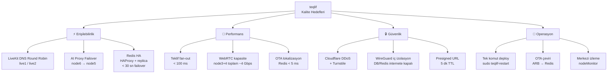
```mermaid
flowchart TB
    Q["teqlif\nKalite Hedefleri"]

    Q --> AVA["⚡ Erişilebilirlik"]
    Q --> PERF["🚀 Performans"]
    Q --> SEC["🔒 Güvenlik"]
    Q --> OPS["🔧 Operasyon"]

    AVA --> A1["LiveKit DNS Round Robin\nlive1 / live2"]
    AVA --> A2["AI Proxy Failover\nnode6 → node5"]
    AVA --> A3["Redis HA\nHAProxy + replica\n< 30 sn failover"]

    PERF --> P1["Teklif fan-out\n< 100 ms"]
    PERF --> P2["WebRTC kapasite\nnode3+4 toplam ~4 Gbps"]
    PERF --> P3["OTA lokalizasyon\nRedis < 5 ms"]

    SEC --> S1["Cloudflare DDoS\n+ Turnstile"]
    SEC --> S2["WireGuard iç izolasyon\nDB/Redis internete kapalı"]
    SEC --> S3["Presigned URL\n5 dk TTL"]

    OPS --> O1["Tek komut deploy\nsudo teqlif-restart"]
    OPS --> O2["OTA çeviri\nARB → Redis"]
    OPS --> O3["Merkezi izleme\nnodeMonitor"]
```

### 10.2 Kalite Senaryoları

| # | Senaryo | Beklenen Davranış | RTO / RPO |
|---|---|---|---|
| S1 | node3 (LiveKit) çöktü | DNS TTL sonrası yeni bağlantılar node4'e; aktif yayınlar kesilir, istemci yeniden bağlanır | RTO: DNS TTL (60 sn) / RPO: 0 |
| S2 | node1 disk arızası | node2 WAL stream ile son noktadan restore; pg_dump yedek var | RTO: ~30–60 dk / RPO: < 1 dk |
| S3 | Teklif patlaması (500 eş zamanlı) | Redis rate limiter + PG `SELECT FOR UPDATE` — sadece ilk geçerli teklif işlenir; yarış koşulu yok | — |
| S4 | Gemini (US) rate limit / çöküş | node6 timeout → node5 Groq fallback; kullanıcı fark etmez | RTO: ~5 sn |
| S5 | node1 Redis çöküşü | HAProxy 3×10 sn check → node2'ye geçiş; auto-promote timer → Telegram bildirim | RTO: ~30 sn / RPO: async replica lag |
| S6 | Yayıncı BWE kongestion | LiveKit `roomDeleted` → `_onRoomTerminatedByServer()` — dialog yok, direkt SellerReport | Kullanıcı fark eder |
| S7 | Redis OTA cache bozulması | Manuel `DEL pack:{lang} version:{lang}` → `sync_main.py` yeniden çalıştırılır | ~1 dk |

---

## 11. Riskler ve Teknik Borç

| # | Risk / Borç | Etki | Mevcut Azaltma | Kalıcı Çözüm |
|---|---|---|---|---|
| R1 | **node1 SPOF (Core)** | node1 HW arızasında API + DB tamamen durur | node2 WAL stream (RPO < 1 dk); ~30 dk manuel failover | Patroni HA — **node2 SSD alana kadar ertelenmiş** (HDD ~440 IOPS yetersiz) |
| R2 | **node2 HDD IOPS Limiti** | PG failover hedefi olarak node1 NVMe (~5000 IOPS) hızına ulaşamaz | Yalnızca son çare olarak kullanılır | node2 SSD yükseltme veya ayrı SSD replica node |
| R3 | **ZAP Hosting Noisy Neighbor** | node5/6 paylaşımlı altyapı; CPU throttling olabilir | node5/6 yalnızca Staging + AI — Core'a etkileri yok | Dedicated VPS'e yükseltme |
| R4 | **Zap Panel Süre Aşımı** | Zap panel 90 günde bir giriş gerektirir; girilmezse erişim kilitlenir | Takvim hatırlatıcısı (sonraki: ~2026-12-10) | — |
| R5 | **MinIO Tek Node** | node1 MinIO çöküşünde medya erişilemez | node2 günlük mc mirror | MinIO dağıtık mod (3+ node) veya object storage replication |
| R6 | **Redis Replica Async Lag** | Failover anında son birkaç yazım kaybı olabilir | Async replica (AOF+RDB node1) | Sync replica + WAIT komutu (latency tradeoff) |
| R7 | **node7 Rolü Belirsiz** | Sunucu temin edildi, 1.9 GB RAM kısıtlı | YABS benchmark alındı; hazır bekliyor | Rol kararı: AI Proxy #3 veya LiveKit #3 (hafif) |

---

## 12. Sözlük

| Terim | Açıklama |
|---|---|
| **teqlik** | teqlif'in yerel sanal para birimi. Kullanıcılar TL yükler, teqlik satın alır; yayıncıya hediye, teklif, AI, reklam için kullanır. Başlangıç bonusu 100 teqlik. |
| **SwipeLive** | TikTok-benzeri dikey kaydırmalı akış arayüzü. PageView + AutomaticKeepAliveClientMixin ile LiveKit bağlantıları evict olmadan ayakta kalır. ALS + Thompson Sampling ile sıralanır. |
| **WAL Streaming** | PostgreSQL Write-Ahead Log anlık aktarımı. node1 → node2 pg_receivewal. RPO < 1 dk sağlar. |
| **LiveKit SFU** | Selective Forwarding Unit. node3 (live1) ve node4 (live2) üzerinde v1.7.2. Flutter SDK v2.5.4. |
| **CQRS** | Command Query Responsibility Segregation. Codebase'de `use_cases/commands/` (yaz) ve `use_cases/queries/` (oku) ayrımı. |
| **WireGuard Mesh** | Tüm node'ların 10.10.0.0/24 üzerinden P2P şifreli haberleştiği tam bağlantılı topoloji. |
| **ARQ** | Python async iş kuyruğu. Redis üzerinde çalışır; iki kuyruk: default (genel) ve critical (ödeme/para). |
| **presigned URL** | MinIO'nun S3 uyumlu geçici upload linki (5 dk TTL). İstemci API'yi bypass ederek doğrudan MinIO'ya yazar. |
| **Metrics Agent** | Her node'da çalışan `teqlif-metrics-agent.service`. Servis sağlığı + kaynak metrikleri → Redis; Telegram alert gönderir. |
| **OTA Lokalizasyon** | ARB → `sync_main.py` → Redis. Uygulama güncellemesi olmadan çeviriler canlı güncellenir. |
| **HAProxy (Redis)** | node1/3/4 üzerinde `127.0.0.1:6379`'u dinler; `balance first` ile node1 Redis'i tercih eder; 3 başarısız check → node2'ye geçer. |
| **auto-promote timer** | node2 `redis-failover.timer`. Her 10 sn çalışır; node1 Redis 3 kez başarısız → `REPLICAOF NO ONE` → master terfi + Telegram. |
| **nodeMonitor** | Merkezi izleme node'u (10.10.0.99, Netcup Karlsruhe). Prometheus + Loki + Grafana + Uptime Kuma + Alertmanager. |
| **teqlif-restart** | Tüm node'larda tek yeniden başlatma komutu. `sudo teqlif-restart`. Sıralı durdur → git pull → alembic → sync_main → başlat. |
| **Unit of Work** | FastAPI'daki transaction yönetim deseni. Birden fazla repository işlemini tek `async with session.begin()` içine alır. |
| **Outbox Pattern** | Güvenilir event yayımlama. DB commit + event kaydı atomik; ARQ worker outbox'tan okuyarak dağıtır. |
| **Thompson Sampling** | SwipeLive'da ML sıralama algoritması. Beta dağılımı bandit; keşfet/istismar dengesi. |
| **MVVM** | Model-View-ViewModel. Flutter'da ViewModel Riverpod `AsyncNotifier`; BuildContext yok; View `ref.watch` ile dinler. |
| **Stalwart** | node2'de çalışan Rust tabanlı mail server. `mail.teqlif.com`. SMTP 25/465/587 + IMAP 993. API'den aiosmtplib ile bağlanır. |
| **Co-host** | Yayıncının davet ettiği ikinci sunum partneri. Kamerası yayında görünür; moderatör yetkisi; davet/kabul/çıkarma akışı. |
| **Hype Meter** | Yayın sohbetinde kalp gönderimlerinden beslenen anlık heyecan göstergesi. Sönümleme döngüsü WebSocket ile yayınlanır. |
| **Direct Sale** | Canlı yayın sırasında açık artırma dışında sabit fiyatlı satış. Başlat/durdur/devam/bitir durum makinesi. |
| **Lead Gen (Sıcak Talep)** | Alıcı, satıcıya doğrudan ilgi bildirimi gönderir; satıcı hedef kitleye push atar. teqlik ile ücretlendirilir. |
| **Blast (Toplu Bildirim)** | Satıcı ilanına ilgi göstermiş hedef kitleye toplu push bildirimi. Kitle tahmini endpointi mevcuttur. |
| **Retargeting** | Tereddütlü alıcılara (görüntüleyip almayan) 06:00'da otomatik bildirim. teqlik ile ücretlendirilir. |
| **PRO** | Premium hesap tipi. Aylık ücretsiz AI fiyatlama, açıklama, öne çıkarma kredisi + yayın analitiği + rakip radar. |
| **pHash** | Perceptual Hash. İlan görselinin algısal parmak izi; kopya ilan tespiti için kullanılır. |
| **BPR** | Bayesian Personalized Ranking. Implisit kullanıcı geri bildiriminden (görüntüleme/beğeni/satın alma) kişiselleştirilmiş sıralama. |
| **ALS** | Alternating Least Squares. Matris çarpanlama tabanlı işbirlikçi filtreleme; Feed ve SwipeLive için ayrı modeller. |
| **FAISS** | Facebook AI Similarity Search. 384 boyutlu embedding'lerde yaklaşık en yakın komşu araması (IVFFlat). |
| **EdgeOrchestrator** | Çoklu ML node orkestrasyon servisi. node1 API'sinin ML iş yüklerini node5/6'ya dağıtmasını koordine eder. |
| **AlertManager** | node1 lifespan'ında çalışan arka plan servisi. 60 sn döngüyle cluster metriklerini denetler; eşik aşımında Telegram bildirimi gönderir; iyileşmede "kurtardı" bildirir. |

---

<div align="center">

*Bu belge, projeye ait V2.1 güncel mimarisini ARC42 standartlarında yansıtmaktadır.*  
*Operasyonel detaylar: `deploy/scale/V2.1/documents/01_architecture.md`*  
*Tüm mimari kararlar: `deploy/scale/V2.1/documents/teqlif_architectural_decisions.md`*

</div>
