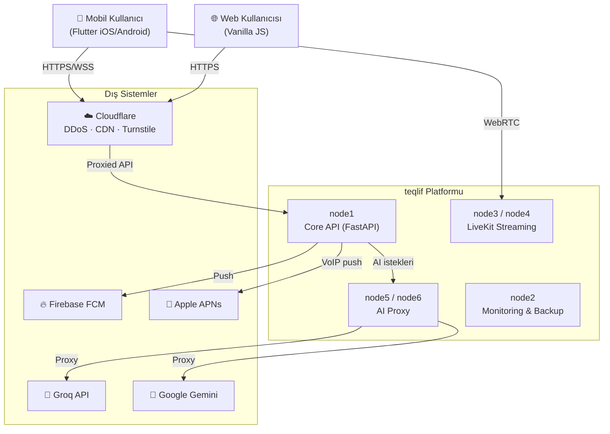
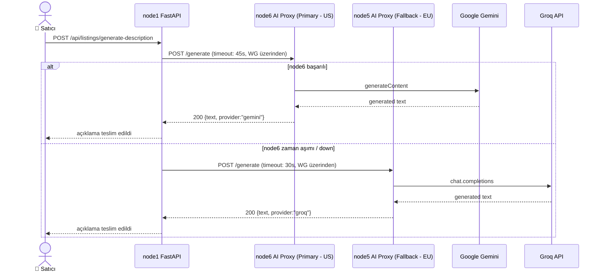
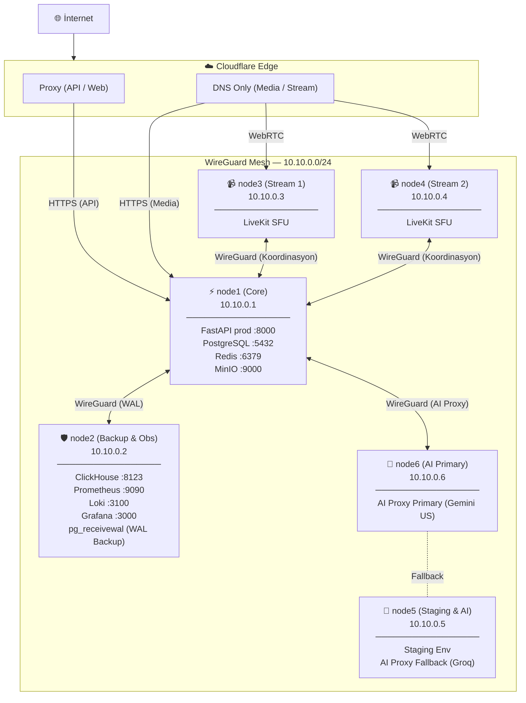

# teqlif

**Canlı yayın tabanlı C2C pazar yeri ve gerçek zamanlı açık artırma motoru**

*ARC42 Mimari Belgesi — Scale V2.1*

---

## İçindekiler

| # | Bölüm |
|---|---|
| 1 | [Giriş ve Hedefler](#1-giriş-ve-hedefler) |
| 2 | [Kısıtlar](#2-kısıtlar) |
| 3 | [Sistem Bağlamı ve Kapsam](#3-sistem-bağlamı-ve-kapsam) |
| 4 | [Çözüm Stratejisi](#4-çözüm-stratejisi) |
| 5 | [Yapı Taşları Görünümü](#5-yapı-taşları-görünümü) |
| 6 | [Çalışma Zamanı Görünümü](#6-çalışma-zamanı-görünümü) |
| 7 | [Dağıtım Görünümü (V2.1)](#7-dağıtım-görünümü-v21) |
| 8 | [Kesişen Kavramlar](#8-kesişen-kavramlar) |
| 9 | [Mimari Kararlar](#9-mimari-kararlar) |
| 10 | [Kalite Gereksinimleri](#10-kalite-gereksinimleri) |
| 11 | [Riskler ve Teknik Borç](#11-riskler-ve-teknik-borç) |
| 12 | [Sözlük](#12-sözlük) |

---

## 1. Giriş ve Hedefler

teqlif, Türkiye pazarına yönelik bir C2C e-ticaret platformudur. TikTok tarzı canlı yayınları, gerçek zamanlı açık artırmaları, birebir görüntülü aramaları, hikâyeleri, doğrudan satışları ve sanal para birimi (Tuci) ile bir sanal ekonomiyi tek bir mobil uygulamada birleştirir.

| Özellik | Açıklama |
|---|---|
| **Canlı Yayın Açık Artırması** | İzleyiciler gerçek zamanlı teklif verir; teklifler WebSocket ile yayınlanır. |
| **SwipeLive** | TikTok-benzeri dikey kaydırma arayüzü ile canlı akışlar arasında ML sıralamalı geçiş. |
| **Birebir Görüntülü Arama** | WebRTC tabanlı VoIP (LiveKit SFU); iOS CallKit / Android ConnectionService. |
| **Tuci Ekonomisi** | Platform içi sanal para; hediye, bahşiş ve açık artırma işlemleri. |
| **AI Açıklama Üretimi** | İlan başlığından otomatik açıklama; Groq/Gemini API üzerinden ABD/EU proxy zinciri. |

---

## 2. Kısıtlar

| Kısıt | Gerekçe |
|---|---|
| **Python 3.12+ / FastAPI** | Mevcut codebase ve güçlü async-native ekosistem. |
| **Altı Node Sabit Altyapı** | V2.1, Kubernetes karmaşası yerine 6 bağımsız node ve WireGuard mesh kullanır. Startup için maliyet ve stabilite optimizasyonudur. |
| **Zap-Hosting UDP Filtresi** | Node5 ve Node6 üzerindeki kurumsal filtreler nedeniyle WireGuard, varsayılan portu yerine 443 portu (HTTPS/QUIC maskesi) üzerinden çalışmak zorundadır. |
| **AI API Bölge Kısıtlamaları** | Gemini vb. LLM sağlayıcılarının AB/TR dışı kısıtlamalarını aşmak için ABD lokasyonlu (Node6) proxy kullanılmalıdır. |

---

## 3. Sistem Bağlamı ve Kapsam

teqlif platformunun V2.1 yapısında dış sistemlerle ilişkisi:

```mermaid
flowchart TB
    MOB["📱 Mobil Kullanıcı\n(Flutter iOS/Android)"]
    WEB["🌐 Web Kullanıcısı\n(Vanilla JS)"]

    subgraph TEQLIF["teqlif Platformu"]
        direction TB
        CORE["node1\nCore API (FastAPI)"]
        LK["node3 / node4\nLiveKit Streaming"]
        AI["node5 / node6\nAI Proxy"]
        OBS["node2\nMonitoring & Backup"]
    end

    subgraph EXT["Dış Sistemler"]
        CF["☁️ Cloudflare\nDDoS · CDN · Turnstile"]
        GROQ["🤖 Groq API"]
        GEM["🤖 Google Gemini"]
        FCM["🔥 Firebase FCM"]
        APNS["🍎 Apple APNs"]
    end

    MOB -->|"HTTPS/WSS"| CF
    WEB -->|"HTTPS"| CF
    CF -->|"Proxied API"| CORE
    MOB -->|"WebRTC"| LK
    CORE -->|"AI istekleri"| AI
    AI -->|"Proxy"| GROQ
    AI -->|"Proxy"| GEM
    CORE -->|"Push"| FCM
    CORE -->|"VoIP push"| APNS
```

---

## 4. Çözüm Stratejisi

| Karar Alanı | Seçilen Yaklaşım | Gerekçe |
|---|---|---|
| Backend mimarisi | **FastAPI monolith + CQRS iç yapı** | Modülerlik + async-native çalışma prensibi. |
| Canlı Yayın (WebRTC) | **Dual LiveKit Node (DNS Round Robin)** | V2.1'de yayın yükünü iki bağımsız node'a (Node3 ve Node4) bölerek yatay ölçekleme sağlandı. Gerekirse Node7, Node8 hızlıca eklenebilir. |
| Veritabanı Eşzamanlılığı | **PostgreSQL row-lock + Unit of Work** | Açık artırma tekliflerinde tutarlılığı ve ACID garantisini sağlamak. |
| Arka plan işler | **ARQ (Genel + Kritik kuyruklar)** | Python-native async; priority isolation; Redis destekli. |
| AI metin üretimi | **ABD/EU IP proxy zinciri** | Coğrafi kısıtları aşmak için istekler Node6'ya (ABD) gider; hata anında Node5'e (EU) devredilir. |

---

## 5. Yapı Taşları Görünümü

Sistem temel olarak dört izole katmandan oluşur:
1. **Core Katmanı (Node1):** İş mantığını çalıştıran API, birincil veri tabanı (PostgreSQL), önbellek (Redis) ve medya deposu (MinIO) burada bulunur. 
2. **Medya / Akış Katmanı (Node3, Node4):** UDP ağırlıklı WebRTC paketlerini yönlendiren sunuculardır.
3. **Servis / Proxy Katmanı (Node5, Node6):** Yapay zeka sağlayıcılarına giden trafiği maskeler ve Staging ortamını barındırır.
4. **Gözlem ve Yedekleme Katmanı (Node2):** Ana veritabanının anlık kopyasını (WAL) tutar ve sistem metriklerini (Grafana, Loki) toplar.

---

## 6. Çalışma Zamanı Görünümü

### AI Proxy Fallback Zinciri (V2.1)

Sistem hatalara (timeout, rate-limit) karşı dayanıklı tasarlanmıştır.

```mermaid
sequenceDiagram
    actor User as 📱 Satıcı
    participant API as node1 FastAPI
    participant N6 as node6 AI Proxy (Primary - US)
    participant N5 as node5 AI Proxy (Fallback - EU)
    participant GEM as Google Gemini
    participant GROQ as Groq API

    User->>API: POST /api/listings/generate-description
    API->>N6: POST /generate (timeout: 45s, WG üzerinden)
    alt node6 başarılı
        N6->>GEM: generateContent
        GEM-->>N6: generated text
        N6-->>API: 200 {text, provider:"gemini"}
        API-->>User: açıklama teslim edildi
    else node6 zaman aşımı / down
        API->>N5: POST /generate (timeout: 30s, WG üzerinden)
        N5->>GROQ: chat.completions
        GROQ-->>N5: generated text
        N5-->>API: 200 {text, provider:"groq"}
        API-->>User: açıklama teslim edildi
    end
```

---

## 7. Dağıtım Görünümü (V2.1)

### 7.1 Altı Node WireGuard Mesh ve Rol Dağılımları

V2.1 mimarisi; tüm node'ları birbiriyle (`10.10.0.0/24`) uçtan uca şifreleyen bir Mesh topolojisi kullanır.

```mermaid
flowchart TB
    INET["🌐 İnternet"]

    subgraph CF_EDGE["☁️ Cloudflare Edge"]
        CF_PROXY["Proxy (API / Web)"]
        CF_DNS["DNS Only (Media / Stream)"]
    end

    subgraph WG_MESH["WireGuard Mesh — 10.10.0.0/24"]
        N1["⚡ node1 (Core)\n10.10.0.1\n─────────────────\nFastAPI prod :8000\nPostgreSQL :5432\nRedis :6379\nMinIO :9000"]
        
        N2["🛡️ node2 (Backup & Obs)\n10.10.0.2\n─────────────────\nClickHouse :8123\nPrometheus :9090\nLoki :3100\nGrafana :3000\npg_receivewal (WAL Backup)"]

        N3["📹 node3 (Stream 1)\n10.10.0.3\n─────────────────\nLiveKit SFU"]
        
        N4["📹 node4 (Stream 2)\n10.10.0.4\n─────────────────\nLiveKit SFU"]

        N5["🧪 node5 (Staging & AI)\n10.10.0.5\n─────────────────\nStaging Env\nAI Proxy Fallback (Groq)"]
        
        N6["🤖 node6 (AI Primary)\n10.10.0.6\n─────────────────\nAI Proxy Primary (Gemini US)"]
    end

    INET --> CF_EDGE
    CF_PROXY -->|"HTTPS (API)"| N1
    CF_DNS -->|"HTTPS (Media)"| N1
    CF_DNS -->|"WebRTC"| N3
    CF_DNS -->|"WebRTC"| N4
    
    N1 <-->|"WireGuard (WAL)"| N2
    N1 <-->|"WireGuard (AI Proxy)"| N6
    N6 -.-|"Fallback"| N5
    N3 <-->|"WireGuard (Koordinasyon)"| N1
    N4 <-->|"WireGuard (Koordinasyon)"| N1
```

### 7.2 Node Envanteri

| Node | WG IP | Public IP | Rol | Sağlayıcı / Lokasyon | Donanım |
|------|-------|-----------|-----|----------------------|---------|
| **node1** | 10.10.0.1 | 193.70.46.74 | Core (App, PG, Redis, MinIO) | OVH Bare Metal / FR | 6c/12t, 32GB RAM, 2x512GB NVMe |
| **node2** | 10.10.0.2 | 135.125.223.43 | Backup, Monitoring, Analitik | OVH Bare Metal / DE | 4c/8t, 32GB RAM, 2x4TB HDD |
| **node3** | 10.10.0.3 | 51.75.74.124 | LiveKit Streaming #1 | OVH VPS / DE | 6 vCPU, 12GB RAM, 2 Gbps |
| **node4** | 10.10.0.4 | 135.125.175.223 | LiveKit Streaming #2 | OVH VPS / DE | 6 vCPU, 12GB RAM, 2 Gbps |
| **node5** | 10.10.0.5 | 45.146.252.165 | Staging + AI Secondary | ZAP VPS / DE | 4 vCPU, 8GB RAM |
| **node6** | 10.10.0.6 | 5.249.165.10 | AI Primary (Gemini US proxy) | ZAP VPS / ABD | 4 vCPU, 4GB RAM |

---

## 8. Kesişen Kavramlar

- **Dış Güvenlik:** Tüm API trafiği Cloudflare CDN ve WAF'ından geçer. Bot koruması (Turnstile) burada yönetilir.
- **İç İzolasyon:** Veritabanı ve önbelleğe (PostgreSQL: 5432, Redis: 6379) internet üzerinden ulaşılamaz; bağlantılar yalnızca `10.10.0.0/24` WireGuard ağıyla yapılır.
- **Gözlemlenebilirlik (Observability):** Node1, Node3, Node4 ve Node5 üzerinden `promtail` aracılığıyla toplanan loglar, Node2'deki Loki'ye yönlendirilir ve Grafana ile görselleştirilir.

---

## 9. Mimari Kararlar

| # | Karar (ADR) | Gerekçe |
|---|---|---|
| ADR-01 | **Gateway'in Kaldırılması (V2.1)** | Doğrudan Cloudflare -> Node1 yönlendirmesi yapılarak latency ve gereksiz tekil hata noktası (SPOF) ortadan kaldırıldı. |
| ADR-02 | **Canlı Yayın Sunucularının Ayrılması** | Node3 ve Node4 yalnızca LiveKit SFU çalıştırır. WebRTC trafiği ana sunucudan tamamen izole edilerek Core API I/O sınırlarından korundu. |
| ADR-03 | **Analitik ve Backup'ın İzole Edilmesi** | Node2 (4TB HDD) sadece ClickHouse analitiği ve WAL backup'larını tutarak IOPS darboğazlarını önler. |
| ADR-04 | **WireGuard'ın Port 443 Kullanması** | Zap-Hosting (node5/6) DDoS koruması UDP/51820'yi kestiğinden, trafik UDP/443 (QUIC kılıfı) üzerinden geçirildi. |

---

## 10. Kalite Gereksinimleri

| Hedef | V2.1 Karşılığı |
|---|---|
| **Yüksek Erişilebilirlik (HA)** | LiveKit streaming DNS Round-Robin ile yedeklidir. AI proxy'ler zincirleme failover kullanır. |
| **Sıfır Veri Kaybı (RPO: 0)** | Node1'deki PostgreSQL verileri, `pg_receivewal` kullanılarak anlık olarak Node2'deki 4TB disklere yazılır. |
| **Düşük Gecikme (Latency)** | Cloudflare edge proxy'si doğrudan Core API'ye bağlandığı için aradaki gateway atlaması sıfırlandı. Ağ içi iletişim WireGuard çekirdek modülü üzerinden geçer. |

---

## 11. Riskler ve Teknik Borç

| Risk / Borç | Etki | Azaltma (V2.1 Çözümü) |
|---|---|---|
| **Node1 SPOF (Tek Nokta Hatası)** | Node1 donanımsal olarak çökerse Core API ve DB durur. | Node2 üzerinde anlık WAL yedeği bulunur. RTO (Kurtarma Süresi) node2 üzerinde manuel başlatma ile ~30dk'ya indirilmiştir. |
| **Bütçe Odaklı Sunucularda Performans** | ZAP Hosting VPS'lerinde *noisy-neighbor* (gürültülü komşu) sorunu yaşanabilir. | V2.1'de bu sunucular (Node5, Node6) yalnızca asenkron AI Proxy ve test ortamı (Staging) için izole edildi. |

---

## 12. Sözlük

| Terim | Açıklama |
|---|---|
| **WAL Streaming** | PostgreSQL anlık log aktarımı. Node1'den Node2'ye kesintisiz veri kurtarma noktası (restore point) sağlar. |
| **LiveKit SFU** | Seçici Yönlendirme Ünitesi (Selective Forwarding Unit); Node3 ve Node4'te çalışan açık kaynaklı WebRTC medya motoru. |
| **CQRS** | Komut ve Sorgu Sorumluluklarının Ayrılması (Command Query Responsibility Segregation). |
| **WireGuard Mesh** | 6 sunucunun internete kapalı olarak kendi aralarında `10.10.0.X` IP blokları ile doğrudan ve şifreli haberleştiği topoloji. |

---

*Bu belge, projeye ait V2.1 güncel mimarisini ARC42 standartlarında yansıtmaktadır.*

