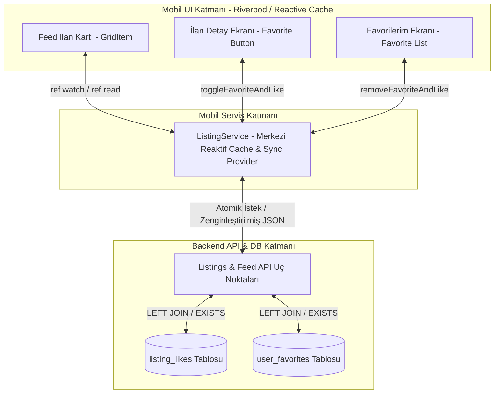

# Favorileme ve Beğeni (Like/Favorite) Senkronizasyon Mimarisi - PLAN

Bu doküman, Teqlif platformunda (Mobil & Backend) **İlanlar (Son İlanlar Feed'i)**, **İlan Detayları** ve **Favorilerim (İlan Ayarları)** ekranları arasındaki favorileme ve beğeni mantığının uçtan uca senkronize edilmesi için hazırlanan endüstri standardı mimari çözüm planıdır.

---

## 1. Problem Tanımı ve Mevcut Mimarinin Analizi

### 1.1 Gözlemlenen Sorun
Kullanıcı, İlanlar sayfasında sergilenen "Son İlanlar" feed'indeki bir ilan kartının sağ üst köşesindeki kalp işaretine tıklayıp favoriye aldığında ilan, "İlan Ayarları -> Favorilerim" listesinde görüntülenmektedir. Ancak kullanıcı geri tuşuna basıp (veya sekmeler arası geçiş yapıp) İlanlar sayfasına döndüğünde, ilgili ilanın üzerindeki kalp ikonu boş (`Icons.favorite_border`) olarak görünmektedir.

### 1.2 Kök Neden Analizi (Root Cause Analysis)
Bu senkronizasyon kaybı, mimarideki 3 temel yapısal ayrımdan kaynaklanmaktadır:

1. **Veritabanı ve API Katmanı (`listing_likes` vs `user_favorites`):**
   - Veritabanında ilan etkileşimleri için iki ayrı tablo bulunur: Beğeniler (`listing_likes`) ve Favoriler (`user_favorites`).
   - `SearchListingsQuery`, `get_personalized_feed` ve genel listeleme uç noktaları yalnızca `listing_likes` tablosunu sorgulayıp JSON çıktısında `is_liked` dönmektedir. API yanıtında `is_favorited` alanı bulunmamaktadır.
   - İlan Detay ekranında yapılan favorileme (`_toggleFavorite`), yalnızca `/favorites/{id}` API'sini çağırıp `user_favorites` tablosunu güncellerken, `listing_likes` tablosuna ve feed API'sinin okuduğu alana etki etmemektedir.
2. **Mobil Önbellek (Cache) Senkronizasyon Eksikliği:**
   - Ana sayfadaki ilan kartı (`_GridItem`), durumunu başlatırken öncelikle merkezi önbellek olan `ListingService.getCachedLike(id)` (`_likeCache` haritası) bilgisine bakmaktadır.
   - İlan Detayı (`listing_detail_screen.dart`) ve Favorilerim (`profile_screen.dart`) ekranlarında favorileme durumu değiştirildiğinde, `ListingService.setLikeCache(id, newStatus)` metodu tetiklenmediği için merkezi önbellek güncellenememektedir.
3. **Flutter UI Yaşam Döngüsü (Lifecycle) ve Statik Durum:**
   - İlan kartı (`_GridItem`), stateful bir widget olarak yerel bir değişken (`late bool _isLiked`) kullanmaktadır.
   - Sayfalar arası geçişlerde (örn: Detaydan veya Favorilerden dönüşte) ana sayfa sıfırdan oluşturulmadığı (rebuild olmadığı) için `initState()` veya `didUpdateWidget()` tekrar çalışmaz. Kart, hafızadaki eski `_isLiked` durumunu sergilemeye devam eder.

---

## 2. Mimari Karar ve Hedef Mimarisi (Target Architecture)

Endüstri standartlarında (Instagram, Airbnb, Zillow modeli) kullanıcı arayüzünde "Kalp" ikonu tek bir görsel sembol olduğu için, sistem genelinde **Atomik ve Tek Kaynaktan Beslenen (Single Source of Truth)** bir mimari tasarlanmalıdır.

### 2.1 Katman 1: Backend API ve Sorgu Katmanı Zenginleştirmesi (Backend Enrichment)
- **Sorgu Birleştirmesi:** `SearchListingsQuery`, `get_personalized_feed`, `get_my_listings` ve `get_listing` (tekil ilan) uç noktalarında SQL sorguları çalıştırılırken, oturum açmış kullanıcı (`current_user`) varsa `user_favorites` tablosu da sorguya `LEFT JOIN` (veya `EXISTS`) edilmelidir.
- **Atomik Yanıt Şeması:** İlan JSON şemalarına (`ListingResponse`, `_listing_dict`, `_row_dict`) `"is_favorited": bool` alanı eklenmeli ve ana kartların kolayca okuyabilmesi için **`is_liked`** değeri mimari olarak `(is_liked OR is_favorited)` şeklinde (hibrit/atomik) hesaplanıp dönülmelidir.
- **Arka Plan Senkronizasyonu:** Backend üzerinde bir ilana `/like` atıldığında veya `/favorites` eklendiğinde/çıkarıldığında, servis katmanında her iki tablo (veya etkileşim kaydı) transaction bütünlüğü içinde senkronize tutulmalıdır.

### 2.2 Katman 2: Mobil Servis Katmanı ve Reaktif Önbellek (Mobile Cache & Service Layer)
- **Merkezi Etkileşim Metodu:** `ListingService` içinde dağınık olan `toggleLike` ve `toggleFavorite` çağrıları birleştirilerek tek bir evrensel servis metodu oluşturulmalıdır: `ListingService.toggleFavoriteAndLike(int listingId, {required bool currentStatus})`.
- **Anlık Önbellek Yazımı:** Bu servis çağrıldığı an, ağ isteği (Network Request) tamamlanmadan önce **Optimistic UI (İyimser Arayüz)** prensibiyle `ListingService.setLikeCache(listingId, !currentStatus)` metodu çalıştırılarak merkezi `_likeCache` haritası anında güncellenmelidir.
- **Reaktif State Notifier (Riverpod Integration):** Statik bir `Map<int, bool>` yerine, mobil uygulamadaki mevcut Riverpod mimarisine entegre bir `StateNotifierProvider` (örn: `listingInteractionCacheProvider`) kurulmalı ve tüm cache değişiklikleri bu provider üzerinden yayınlanmalıdır (Stream/Notify).

### 2.3 Katman 3: Mobil UI ve Ekran Yaşam Döngüsü Senkronizasyonu (Reactive UI & Lifecycle)
- **Kartların Reaktif Yapılandırılması:** `home_screen.dart`, `search_screen.dart` ve diğer listeleme ekranlarındaki ilan kartları (`_GridItem`), statik `_isLiked` değişkeni yerine `ref.watch(listingInteractionCacheProvider(id))` değerini dinlemelidir (`Observer Pattern`).
- **Ekran Dönüşlerinde Anlık Güncellenme:** Böylece kullanıcı İlan Detayı veya Favorilerim ekranında bir ilanın kalbini değiştirdiği an, arka plandaki reaktif provider tetiklenir. Kullanıcı İlanlar sayfasına döndüğünde hiçbir yenileme (pull-to-refresh) yapmasına veya sayfanın rebuild edilmesine gerek kalmadan kartın kalp ikonu doğru durumu yansıtır.

---

## 3. Değişiklik Yapılacak Temel Dosyalar ve Etki Alanı

### 3.1 Backend Katmanı
- `backend/app/use_cases/listings/queries/search_listings_query.py`: SQL sorgusuna `user_favorites` join/exists eklenmesi ve şema eşlemesi.
- `backend/app/use_cases/listings/queries/listing_utils.py`: `_row_dict` ve yardımcı fonksiyonlarda `is_favorited` ve atomik `is_liked` hesaplaması.
- `backend/app/routers/favorites.py` & `backend/app/routers/feed.py`: Yanıt modellerinin güncellenmesi.
- `backend/app/services/like_service.py` & `backend/app/services/favorite_service.py`: Çift yönlü veritabanı senkronizasyonu.

### 3.2 Mobil Katmanı (Flutter / Dart)
- `mobile/lib/services/listing_service.dart`: Reaktif cache provider (`listingInteractionCacheProvider`) ve evrensel `toggleFavoriteAndLike` metodunun uygulanması.
- `mobile/lib/screens/home_screen.dart`: `_GridItemState` bileşeninin reaktif provider dinleyecek şekilde güncellenmesi ve çift API çağrısının sadeleştirilmesi.
- `mobile/lib/screens/listing_detail_screen.dart`: `_toggleFavorite` metodunun merkezi servis ve reaktif cache üzerinden çalıştırılması.
- `mobile/lib/screens/profile_screen.dart`: Favorilerim (`_FavoritesScreen`) listesinden silme işlemlerinin merkezi cache'e bağlanması.

---

## 4. Başarı Kriterleri (Definition of Done)
1. İlanlar (Home) feed'indeki bir ilan favorilendiğinde anında hem Beğeni hem Favori olarak veritabanına ve cache'e işlenmeli.
2. İlan Detayına girilip favori çıkarıldığında/eklendiğinde, geri tuşuna basıldığı an İlanlar feed'indeki kart yenileme gerektirmeden doğru kalp ikonunu (`Icons.favorite` veya `Icons.favorite_border`) göstermeli.
3. Favorilerim (Profile -> Favorites) ekranından bir ilan silindiğinde, İlanlar sayfasına dönüldüğünde o ilanın kalbi anında boş (`Icons.favorite_border`) olmalı.
4. Telemetri ve analitik logları (`listing_favorite`, `listing_like`, `listing_unfavorite`, `listing_unlike`) çift kopya oluşturmadan tekil ve doğru tetiklenmeli.
